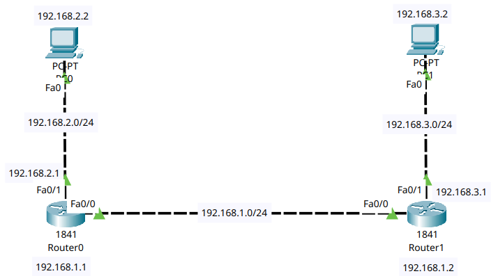

# Static Routing

## Objective
- To understand the concept and working of static routing in a computer network.
- To configure static routes on routers to enable communication between remote networks.
- To verify connectivity between end devices connected to different routers using static routing.

## Theory
### Routing
- Routing is the process of forwarding data packets between different networks.
- It is the process of selecting paths in a network along which data packets travel from a source to a destination.
- In a basic routing configuration, routers are manually configured with IP addresses on their interfaces. Each interface represents a different network segment. 
- When a router receives a packet, it examines the destination IP address and determines whether the destination network is directly connected or reachable through another router.
### Static Routing
- Static routing is a routing technique in which routes are manually configured by a network administrator. 
- In static routing, the administrator explicitly specifies the destination network, subnet mask, and the next-hop IP address or exit interface.
- Static routes are:
    - Simple to configure and understand
    - Suitable for small and stable networks
    - Less resource-intensive compared to dynamic routing protocols
- Static Route Command: In Cisco IOS, a static route is added using the command:
```
    ip route <destination_network> <subnet_mask> <next_hop_ip>
```

## Procedure

<p>Fig 5.1: Network Design</p>

1. Network Configuration
    - In Cisco packet tracer, the network topology was designed as shown above.
    - The basic routing configuration from lab4 were reused, here the configurations were:
        - Two routers were already configured with IP addresses on their interfaces.
        - PCs connected to Router0 and Router1 were assigned static IP addresses and default gateways.
2. Static Router Configuration
    - Static routes were manually configured on both routers to reach the network connected to another router:
        - <ins>Router0</ins>
        ```
            ip route 192.168.3.0 255.255.255.0 192.168.1.2
        ```
        - <ins>Router1</ins>
        ```
            ip route 192.168.2.0 255.255.255.0 192.168.1.1
        ```
3. Testing and Verification
    - Connectivity was tested using the ping command from PC1 to PC2 and vice versa.
    - Successful responses confirmed correct static route configuration.