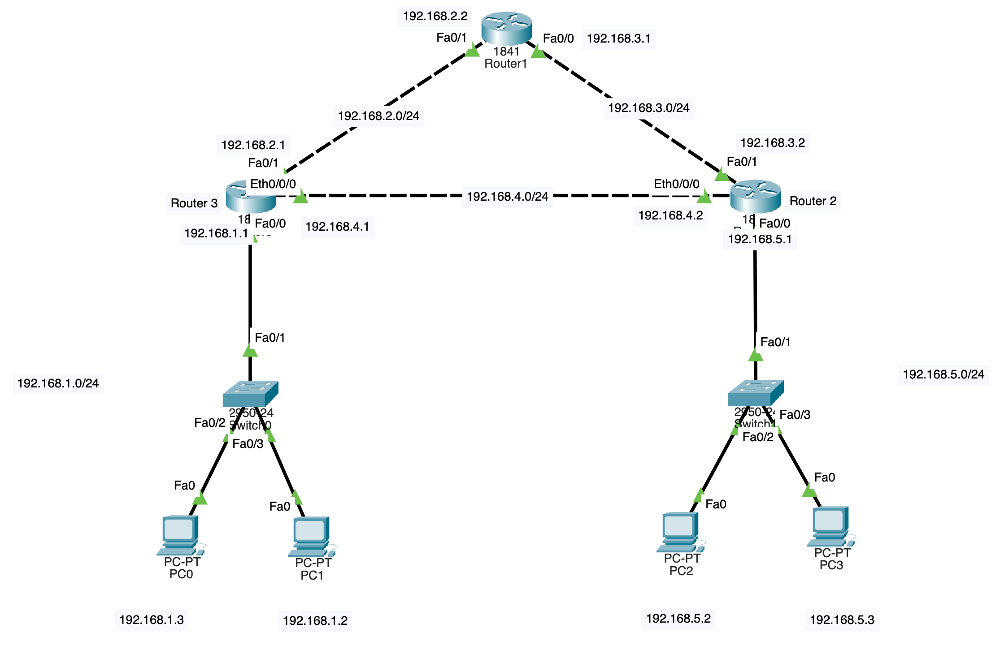

# Dynamic Routing with Routing Information Protocol (RIP)

## Objective
- To understand concept of dynamic routing in computer network.
- To configure Routing Information Protocol on multiple users.
- To configure routers to act as DHCP servers for their respective local networks.
- To enable automatic route discovery and exchange between routers. 

## Theory
### Dynamic Routing
- Dynamic routing is a routing technique in which routers automatically learn and update routing information through routing protocols. 
- Unlike static routing, dynamic routing adapts to network topology changes without manual intervention.
- Some of the common protocols used for dynamic routing:
    - Routing Information Protocol (RIP): Older protocol for smaller network.
    - Open Shotest Path First (OSPF): A link-stable protocol for more complex networks.
    - Border Gateway Protocol (BGP): Used between different networks (Autonomous Systems) on the internet.

### Routing Infromation Protocol (RIP)
- RIP is designed to help routers determine the best path for sending data packets across a network. 
- It uses hop count as its routing metric and is primarily used in small to medium-sized networks due to its scalability limitations.
- It operates at the Network Layer (Layer 3) of the OSI model and maintains routing tables on each router.
- Every 30 seconds, routers exchange their complete routing tables with neighbours using periodic updates.

*Note: RIP supports a maximum hop count of 15, which limits its use in larger networks. A hop count of 16 is considered unreachable.*

## Procedure


<p>Fig 6.1: Network Design</p>

1. Network Configuration
    - In Cisco packet tracer, the network topology was designed as shown above.
    - Router 1 to Router 2 and Router 1 to Router 3 were connected using cross-over cable in fast-ethernet port.
    - In Router 2 and Router 3, ethernet port was extending by interfacing WIC-1ENET (Ethernet Interfacing Card).
    - Router 2 and Router 3 was connected using cross-over cable in ethernet port.
    - A switch with two PCs were added to Router 2 and Router 3 all connected using straight-through cable.

2. Router Configuration
	- Each router was configured with IP addresses on all active interfaces as shown in the figure.
    - Interfaces were enabled to ensure proper connectivity.

3. DHCP Configuration on Routers    
    - Router 2 and Router 3 were configured as DHCP servers.
    - DHCP pool were created through following commands in routers CLI:
    ```c
        Router 2                        Router 3
        // in global configuration mode
        (config)#       ip dhcp pool mypool                 // mypool is the pool name
        (dhcp-config)#  network 192.168.5.0 255.255.255.0


        // kaam chaliraxa ekxin ma complete post garxu 😘

    ```
	**Router 2**
	- enable
	- config terminal
	- ip dhcp pool mypool
	- network 192.168.5.0 255.255.255.0
	- default-router 192.168.5.1

	**Router 3**
	- enable
	- config terminal
	- ip dhcp pool mypool
	- network 192.168.1.0 255.255.255.0
	- default-router 192.168.1.1

4. Set DHCP ip address to pc

5. Dynamic Routing with RIP v2
	**Router 1**
	- enable
	- config terminal
	- router rip 
	- network 192.168.2.0
	- network 192.168.3.0

	**Router 2**
	- enable
	- config terminal
	- router rip 
	- network 192.168.3.0
	- network 192.168.5.0
	- network 192.168.4.0

	**Router 3**
	- enable
	- config terminal
	- router rip 
	- network 192.168.1.0
	- network 192.168.2.0
	- network 192.168.4.0


disadv:
	- only decrease hop not the speed of transfer
	- 300s of wait if any connection is lost (count infinity problem) due to which package may be dropped
	- cannot hop over 15 routers 