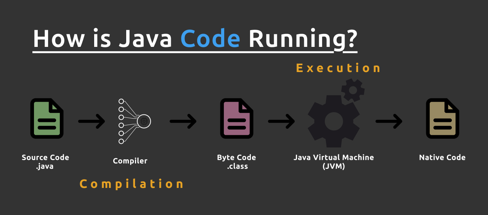
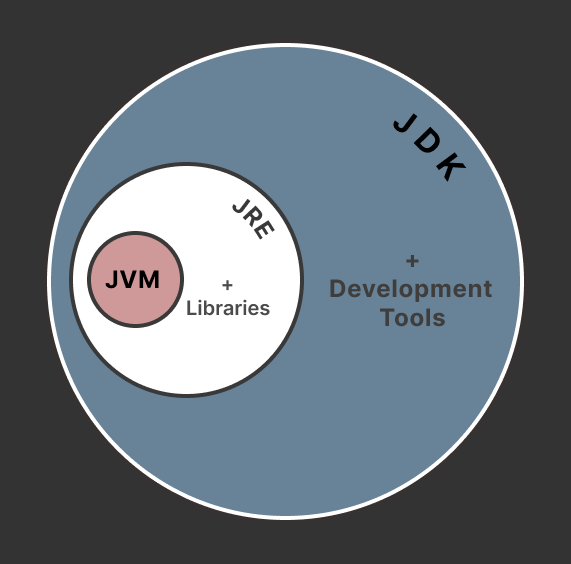

# Java Fundamentals

## 1. Overview of Java ecosystem (JDK, JVM, JRE)

### Java
- Java is a popular programming language, created in 1995.
- It works on different platforms (Windows, Mac, Linux, Raspberry Pi, etc.)
- It is an object oriented language which gives a clear structure to programs and allows code to be reused, lowering development costs.
- It is used for:
    - Mobile Applications (Specially Android apps)
    - Desktop Applications
    - Web Applications
    - Web servers and application servers
    - Games
    - Database connections and much more.
- Boiler Plate code of java
```java
    public class Abc {  // Abc is the name of the file like Abc.java
                        // File name and the public class name should be same
                        // Abc class should be public and it is compulsory. 
        public static void main(String[] args) {
            // If Abc is a standalone executable file it must contain main method,
            // As when file compiled and executed the JVM searches for main method.

            // code here
        }
        // other methods, instance variable ... 
    }
```



### Features of Java 

**1. Simple**
- Java is designed to be easy to learn by avoiding complex features like pointers, operator overloading, and multiple inheritance found in C++.
- Syntax are mostly similar to c++.

**2. Platform Independent or Architecture neutral**
- Java can be refered as platform independent as **the code complied in one system can be run on any system.**
- Example: If Abc.java is compiled in PC-1 which is running Windows OS, the generated Abc.class after being compiled can be executed in another system or PC-2 which could be running any os like Mac, Linux, Android, etc. as long as the system has JVM (Java Virtual Machine).
- This is different for C/C++, where the compiled code usually works only on the system that it is compiled in. *(if compiled in windows only work on windows)*
- **Write Once Run Anywhere (WORA)**

**3. Object Oriented** 
- Java organizes program around classes and objects, making it simpler and faster to execute.
- It also reduces code redundancy, also called **DRY (Don't Repeat Yourself)**.
- It makes the code easier to maintain, modify and debug.
- OOP makes it possible to create full reusable applications with less code and shorter development time

**4. Automatic Memory Management**
- Unlike C++, we don't need to define destructor or delete function to clear the memory space occupied by object or variable.
- There is a built-in Garbage Collector in JVM that clears memory that a variable or object is occupying which is no longer needed.

**5. Secure**
- As there is no requirement of Direct Memory Access (no pointers) which prevents memory corruption and memory access.
- There is byte code verifier which checks the compiled code before running.
- It also has a sandbox environment for running java program protectes against virus and unwanted access.

### JVM

### JRE

### JDK



<hr>

## 2. Evolution of Java
- Java's history began in June 1991 as the "Green Project" at Sun Microsystems.
- It was led by *James Gosling*, *Mike Sheridan*, and *Patrick Naughton*. (Green Team)
- Originally it was intended for digital cable television.
- 