# Web Application Programming

## Unit 1: Introduction

Credit To: [Bidur Sapkota](https://www.bidursapkota.com.np/)

## Table of Contents

1. [Introduction](#introduction)
2. [1.2 Client-Server Architecture, HTTP, HTTPS, URLs, DNS, web browsers](#12-client-server-architecture-http-https-urls-dns-web-browsers)
3. [1.3 HTML](#13-html)
4. [HTML Tags & Attributes](#html-tags-and-attributes)
5. [Text Formatting Tags](#text-formatting-tags)
6. [Comments](#comments)
7. [Links](#links)
8. [Bookmark Links](#bookmark-links)
9. [Semantic Tags](#semantic-tags)
10. [Lists](#lists)
11. [Input Types](#input-types)
12. [Tables](#tables)
13. [Iframes](#iframes)
14. [Adding Images](#adding-images)
15. [Audio](#audio)
16. [Videos](#videos)
17. [Tooltips](#tooltips)
18. [Metadata](#metadata)
19. [1.4 CSS](#14-css)
20. [Adding CSS](#adding-css)
21. [CSS Selectors](#css-selectors)
22. [Colors](#colors)
23. [Height and Width](#height-and-width)
24. [Borders](#borders)
25. [Margin](#margin)
26. [Padding](#padding)
27. [Box Sizing](#box-sizing)
28. [Block vs Inline Elements](#block-vs-inline-elements)
29. [Display Property](#display-property)
30. [Border Radius](#border-radius)
31. [Text Properties](#text-properties)
32. [Font Properties](#font-properties)
33. [Centering Elements](#centering-elements)
34. [Background Images](#background-images)
35. [RGBA and Opacity](#rgba-and-opacity)
36. [Gradients](#gradients)
37. [Shadows](#shadows)
38. [Combinators](#combinators)
39. [Attribute Selectors](#attribute-selectors)
40. [Pseudo Classes](#pseudo-classes)
41. [Transitions](#transitions)
42. [Positioning](#positioning)
43. [Pseudo Elements](#pseudo-elements)
44. [Flexbox Layout](#flexbox-layout)
45. [Grid Layout](#grid-layout)
46. [Media Query Example Guide](#media-query-example-guide)
47. [CSS Variables](#css-variables)
48. [1.5 Bootstrap](#15-bootstrap)
49. [Lab: Portfolio Website](#lab-portfolio-website)

## Introduction

##### 1.1 Overview of Web Applications and Evolution of Web Architecture

**World Wide Web (WWW)**

World Wide Web (WWW), commonly known as the Web, is an **information system enabling information to be shared over the Internet** through simplified ways meant to appeal to users beyond IT specialists and hobbyists, as well as documents and other web resources to be accessed over the Internet **according to specific rules, the Hypertext Transfer Protocol (HTTP).**
<br>

**What are Web Applications?**

- Web applications are software **programs that run on web servers and are accessed through web browsers over a network** (typically the internet).
- Unlike traditional desktop applications, they **don't require installation on the user's device.**

**Key Characteristics:**

- Accessible from any device with a browser
- Centralized data storage and processing
- Automatic updates without user intervention
- Platform-independent operation
  <br>

**Evolution of Web or Rise of the World Wide Web**

**Web 1.0 (1990s - Early 2000s) - Static Web**

- Read-only content
- Static HTML pages
- Limited interactivity
- One-way information flow from server to client
- Examples: Early corporate websites, online brochures (like newspaper with text and images)

**Web 2.0 (Mid 2000s - 2010s) - Dynamic & Social Web**

- User-generated content
- Rich user interfaces with AJAX
- Social networking and collaboration
- Two-way communication
- Corps monetizing your data
- Examples: Facebook, YouTube, Gmail

**Web 3.0 (2010s - Present) - Semantic & Intelligent Web**

- Artificial intelligence integration
- Semantic web technologies (web pages is structured and tagged in such a way that it can be read directly by computers)
- Users monetize their data
- Personalized experiences
- Machine learning and data analytics
- Decentralized applications (emerging)
- Examples: Voice assistants, recommendation systems, blockchain apps

**Modern Web Applications - Current Trends**

- Single Page Applications (SPAs)
- Progressive Web Apps (PWAs)
  - Features—like offline access, push notifications, and installability—that make it behave like a native mobile or desktop app.
- Microservices architecture
- Cloud-native applications taking full advantage of cloud computing's scalability and flexibility. (Google Colab, Google Docs, Figma)
- Real-time collaborative tools
- API-first design

---

**Evolution of Web Architecture**

- **Monolithic Architecture:**

  - The entire application (UI, business logic, data access) is built as a single, unified code base.
  - Easy to develop initially, simple to deploy, easier debugging.
  - Hard to scale (must scale the whole app, not just bottlenecks),
  - A single bug can crash the whole system.
  - Example: Wordpress CMS

- **Microservices:**

  - Breaking the application into small, independent services that communicate via APIs (REST or gRPC). Each service can have its own database and technology stack.
  - Highly scalable, fault-tolerant (if one service fails, the app survives)
  - Enables independent teams to work on different features.
  - High complexity in DevOps, monitoring, and inter-service communication.
  - Example: Netflix, Amazon

- **Event-Driven Architecture (EDA):**

  - Services do not call each other directly (coupling). Instead, they emit "events" (e.g., "Order Placed") to a message broker (like Kafka or RabbitMQ), and other services listen and react.
  - Extreme decoupling, real-time responsiveness, high throughput.
  - Hard to trace the flow of logic; requires complex infrastructure.
  - Example: LinkedIn, Netflix

- **Serverless (FaaS):**
  - Developers write individual functions (e.g., AWS Lambda) triggered by events. The cloud provider manages the servers entirely.
  - Zero server management, pay-only-for-execution.
  - Cold start problem (to boot up containers), vendor lock-in, distributed complexity
  - Example: Netflix, Amazon
    <br>

**Summary Table**

| Evolution Factor | **Past / Traditional** | **Transitional** | **Modern / Cutting Edge**   |
| :--------------- | :--------------------- | :--------------- | :-------------------------- |
| **Generation**   | Web 1.0 (Read)         | Web 2.0 (Social) | Web 3.0 (Decentralized, AI) |
| **Architecture** | Monolithic             | Microservices    | Event-Driven, Serverless    |

---

**The Request/Response Procedure**
<br>

**Basic Request/Response Procedure**

At its most basic level, the request/response process consists of a web browser or other **client asking the web server to send it a web page** and the server sending back the page. The browser then takes care of displaying or rendering the page.

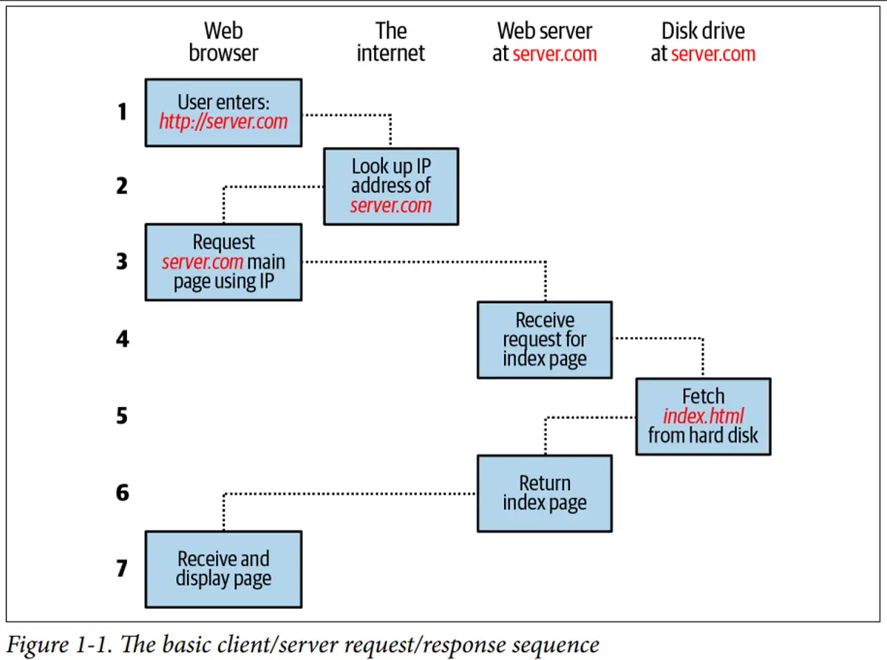

The steps in the request and response sequence are as follows:

1. You enter `http://server.com` into your browser’s address bar.
2. Your browser looks up the Internet Protocol (IP) address for server.com.
3. Your browser issues a request for the home page at server.com.
4. The request crosses the internet and arrives at the server.com web server.
5. The web server, having received the request, looks for the web page on its disk.
6. The web server retrieves the page and returns it to the browser.
7. Your browser displays the web page.

For an average web page, this process also takes place once for each object within the page: a graphic, an embedded video or Flash file, and even a CSS template.
<br>

**Dynamic Request/Response Procedure**

Dynamic web pages work by using PHP to request data from a MySQL database based on what you click. MySQL sends back the needed information, and PHP turns it into HTML, which your browser displays.

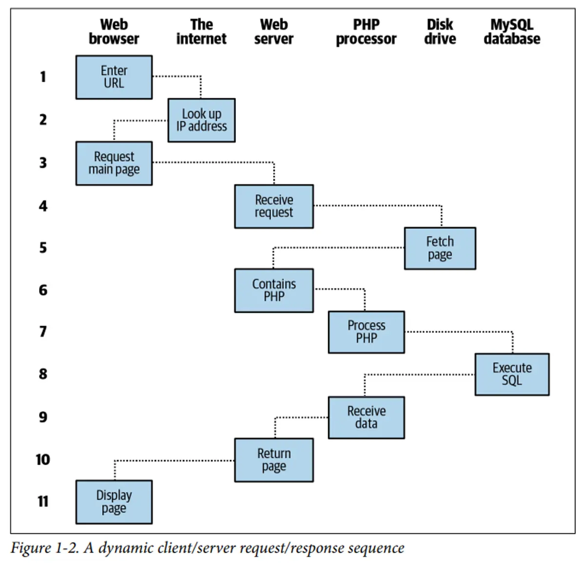

The steps are as follows:

1. You enter `http://server.com` into your browser’s address bar.
2. Your browser looks up the IP address for server.com.
3. Your browser issues a request to that address for the web server’s home page.
4. The request crosses the internet and arrives at the server.com web server.
5. The web server, having received the request, fetches the home page from its hard
   disk.
6. With the home page now in memory, the web server notices that it is a file incor‐
   porating PHP scripting and passes the page to the PHP interpreter.
7. The PHP interpreter executes the PHP code.
8. Some of the PHP contains SQL statements, which the PHP interpreter now
   passes to the MySQL database engine.
9. The MySQL database returns the results of the statements to the PHP interpreter.
10. The PHP interpreter returns the results of the executed PHP code, along with the
    results from the MySQL database, to the web server.
11. The web server returns the page to the requesting client, which displays it.
    <br>

##### 1.2 Client-Server Architecture, HTTP, HTTPS, URLs, DNS, web browsers

Client-server architecture is a distributed computing model where tasks are divided between service providers (servers) and service requesters (clients).

**Components:**

**Client (Frontend):**

- User interface and presentation layer
- Sends requests to server
- Processes and displays responses
- Examples: Web browsers, mobile apps

**Server (Backend):**

- Processes client requests
- Manages business logic
- Handles data storage and retrieval
- Sends responses back to clients
- Examples: Web servers, database servers
  <br>

**Client-server architectures can be categorized into different tiers:**

**Single-tier Architecture(Monolithic Architecture):**

- In a single-tier architecture, the entire application runs on a single machine or server.
- The user interface, application logic, and data storage are all combined into a single unit.
- This architecture is typically used for small-scale applications with limited complexity.

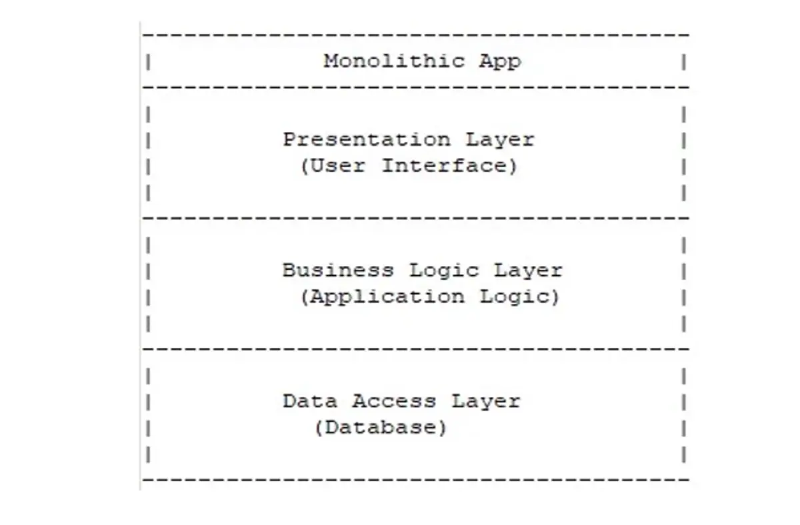

**Two-tier Architecture:**

- In a two-tier architecture, the application is divided into two main tiers: client and server.
- The client tier is responsible for the user interface and user interactions.
- The server tier handles the application logic, data processing, and storage.
- Communication between the client and server occurs directly.

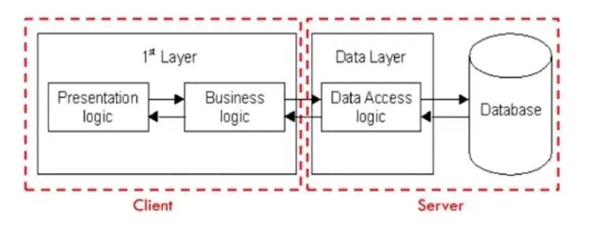

**Multi-tier Architecture:**

- This architecture divides the application into **three or more tiers**, each responsible for specific functionality.
- Common tiers include the **presentation tier (client interface), application tier (business logic), and data tier (data storage and retrieval).**
- Each additional tier represents a distinct set of responsibilities or services.
- Additional tiers can include **caching layers, load balancers**, message queues, microservices, etc.
- This architecture allows for **better scalability, flexibility, and modularity, but also increases complexity.**

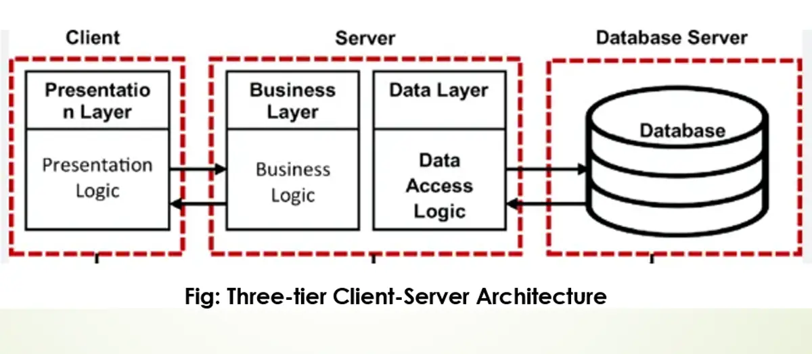

**Advantages of Client-Server Architecture**

- Centralized management simplifies maintenance and security.
- Scalability allows for easy addition of clients and servers.
- Flexibility enables independent development and updating of clients and servers.
- Enhanced security with centralized control and authentication.
- Data recovery and backup process is easier.

**Disadvantages of Client-Server Architecture**

- Single point of failure can disrupt services if the server goes down.
- Network congestion can occur with high demand on the server.
- Complexity in design and maintenance of multi-tier systems.
- Potential cost increase for server infrastructure and maintenance.

---

**HTTP (HyperText Transfer Protocol)**

**What is HTTP?**

- The HTTP protocol, or Hypertext Transfer Protocol, is a fundamental protocol used for communication on the World Wide Web.
- Defines how messages are formatted and transmitted between web browsers and servers.
  <br>

**Key Features**

- **Stateless Protocol:** Each request is independent
- **Request-Response Model:** Client requests, server responds
- **Text-Based:** Human-readable format
- **Port:** Default port 80
  <br>

**HTTP Request**

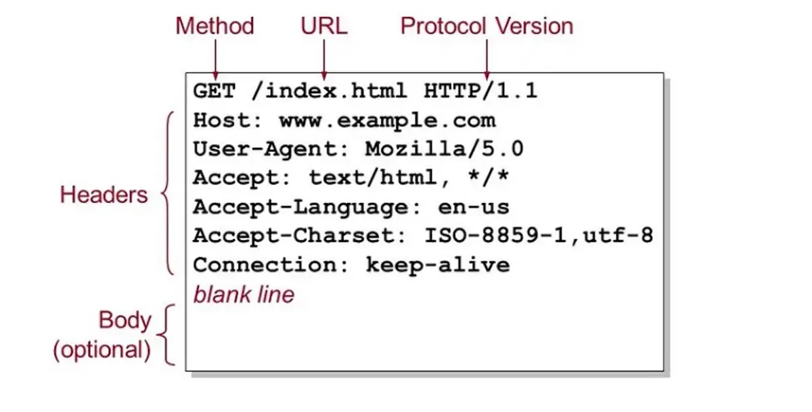
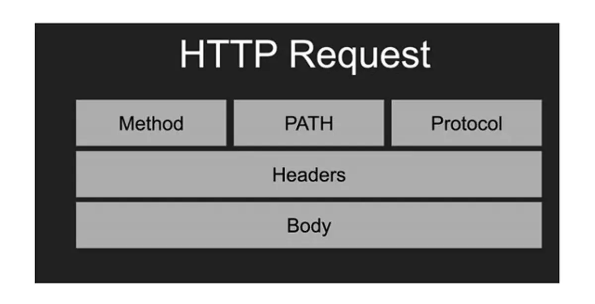

**1. Request Line:** An HTTP request starts with a request line, which includes the following:

- **Method:** This indicates the action to be performed on the resource. Common methods include GET (retrieve a resource), POST (submit data to the server), PUT (update a resource), DELETE (remove a resource), and others.
- **Request URL:** The URL of the resource being requested.
- **HTTP Version:** The version of the HTTP protocol being used.

**2. Request Headers:** Following the request line are headers, which provide additional information about the request. This can include details about the client’s browser, the types of responses that the client will accept, cookies, and more.

**3. Blank Line:** A blank line indicates the end of the headers section.

**4. Request Body (Optional):** Not all requests have a body. Bodies are typically included in POST or PUT requests, where you’re sending data to the server (like form inputs or file uploads). The body contains the data being sent.
<br>

**HTTP Response**

An HTTP response is what a server sends back to the client after receiving and processing an HTTP request. Here’s a breakdown of the components of an HTTP response:

**1. Status Line:** This is the first line of the response and includes:

- **HTTP Version:** Indicates the HTTP protocol version used (e.g., HTTP/1.1).
- **Status Code:** A three-digit number that indicates the outcome of the request. Common status codes include 200 (OK, request succeeded), 404 (Not Found, the resource can’t be found), 500 (Internal Server Error), etc.
- **Status Text:** A brief, human-readable explanation of the status code (e.g., OK, Not Found, Internal Server Error).

**2. Response Headers:** These are key-value pairs providing additional information about the response. They can include details such as the server type, content type, content length, caching policies, set cookies, and other metadata.

**3. Blank Line:** A blank line signifies the end of the header section.

**4. Response Body:** This part of the response contains the actual data or resource that the client requested. For example, it could be an HTML file, JSON data, an image, etc. In some cases, particularly when the response indicates an error (like a 404), the body might contain a message explaining the error.

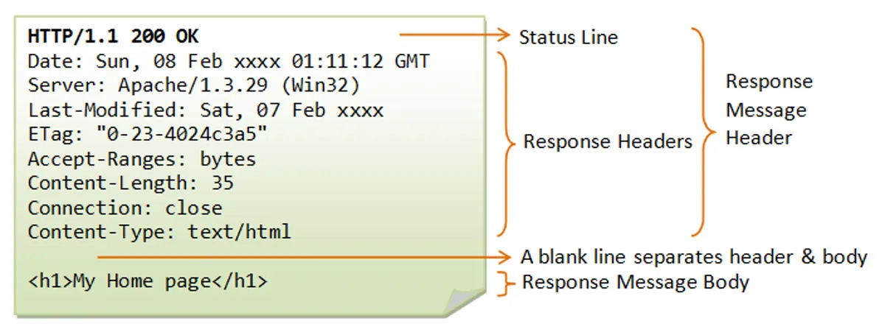

- **Date:** The date and time the response was generated.
- **Server:** Information about the web server software (e.g., Apache/1.3.29).
- **Last-Modified:** The date and time the requested resource was last changed.
- **ETag:** An entity tag, a unique identifier for a specific version of a resource.
- **Accept-Ranges:** Indicates if the server supports partial requests. The server supports range requests, using byte-offsets as the unit. Support Resumable download for large files.
- **Content-Length:** The size of the message body in bytes (e.g., 35).
- **Connection:** How the client should handle the connection after the transaction (e.g., close).
- **Content-Type:** The media type of the resource in the body (e.g., text/html).

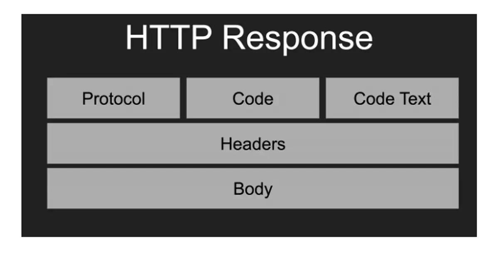
<br>

**HTTP Methods (Verbs)**

| Method  | Purpose        | Description                             |
| ------- | -------------- | --------------------------------------- |
| GET     | Retrieve data  | Requests data from server, read-only    |
| POST    | Submit data    | Sends data to server, creates resources |
| PUT     | Update data    | Updates existing resource completely    |
| PATCH   | Partial update | Updates part of existing resource       |
| DELETE  | Remove data    | Deletes specified resource              |
| HEAD    | Get headers    | Like GET but only retrieves headers     |
| OPTIONS | Get options    | Describes communication options         |

**Head:**

- A web cache can use a HEAD request with conditional headers (`If-Modified-Since` or `If-None-Match`) to ask the origin server if a cached resource is still fresh without requiring the content to be sent if it hasn't changed.
- Checking File Size Before Download and confirm download with user
- Link testing
  <br>

**HTTP Status Codes**

**1xx - Informational:**

- 100 Continue
  - The 100 Continue response indicates that the server has received the initial part of the request (the headers) and is ready for the client to proceed with sending the request body (the payload).
  - The client first sends only the request headers and includes a special header: `Expect: 100-continue`. This is the client asking, "Before I send this huge file, are the headers acceptable?"
- 101 Switching Protocols
  - The most common use of the 101 status code is when establishing a WebSocket connection for real-time, bidirectional communication (like chat applications or live feeds).
  - The client sends an HTTP request (usually a GET) and includes the Upgrade header and the `Connection: Upgrade` header, specifying the desired new protocol (e.g., `Upgrade: websocket`).

**2xx - Success:**

- 200 OK
- 201 Created
- 204 No Content

**3xx - Redirection:**

- 301 Moved Permanently
- 302 Found (Temporary Redirect)
  - A temporary redirect is ideal for short-lived content, such as directing traffic from a permanent URL (e.g., /sales) to a seasonal landing page (e.g., /holiday-sale-2025) for a few weeks.
- 304 Not Modified (caching status)
  - It means the resource requested by the client has not been modified since the version specified by the client in its request headers (like `If-Modified-Since` or `If-None-Match`).

**4xx - Client Errors:**

- 400 Bad Request (invalid user data)
- 401 Unauthorized (not authenticated at all)
- 403 Forbidden (authenticated but not like admin user)
- 404 Not Found
- 429 Too Many Requests

**5xx - Server Errors:**

- 500 Internal Server Error
  - It is the server's way of saying, "Something went wrong, and I don't know exactly what."
  - Common Causes:
    - Application Crashes
    - web server lacks the necessary file permissions to run scripts or access databases.
- 502 Bad Gateway
  - This error often occurs in architectures with multiple layers, such as:
    - A web server (like Nginx or Apache) that acts as a reverse proxy receives a bad or incomplete response from the application server (where the code actually runs).
    - A CDN (Content Delivery Network) receives an error from the origin server.
- 503 Service Unavailable
  - The server is temporarily unable to handle the request due to temporary overloading or scheduled maintenance.
  - The response often includes a Retry-After header, indicating how long the service will be unavailable (e.g., Retry-After: 3600 for one hour).

---

**HTTPS (HTTP Secure)**

**What is HTTPS?**

HTTPS is the secure version of HTTP, using encryption to protect data transmission between client and server.

**Key Features**

- **Encryption:** Data is encrypted in transit
- **Authentication:** Verifies server identity using SSL certificates
- **Data Integrity:** Prevents data tampering
- **Port:** Default port 443
  <br>

**Benefits**

- Protects sensitive data (passwords, credit cards)
- Builds user trust
- SEO benefits (Google ranks HTTPS higher)
- Required for modern web features (geolocation, camera access)

---

**URLs (Uniform Resource Locators)**

**Structure of a URL**

```text
https://www.example.com:443/path/to/myfile.html?key1=val1&key2=val2#SomewhereInTheDocument

Protocol: https://
Subdomain: www
Domain: example
Top-level domain (TLD): .com
Port: :443
Path: /path/to/myfile.html
Query String: ?key1=val1&key2=val2
Fragment: #SomewhereInTheDocument
```

**Components Explained**

**Protocol (Scheme):**

- Defines how to access the resource
- Examples: http, https, ftp, smtp

**Domain Name:**

- subdomain + domain + TLD
- Human-readable address
- Maps to IP address via DNS
- Can include subdomains (www, blog, api)

**Port:**

- Optional, defaults to 80 (HTTP) or 443 (HTTPS)
- Specifies which service on the server to connect to

**Path:**

- Location of specific resource on server
- Organized hierarchically with forward slashes

**Query String:**

- Starts with "?"
- Key-value pairs separated by "&"
- Example: ?id=123&category=books

**Fragment (Hash):**

- Starts with "#"
- Points to specific section within a page
- Not sent to server
  <br>

**URL Encoding**

Special characters must be encoded:

- Space: %20 or +
- &: %26
- =: %3D
- #: %23

---

**DNS (Domain Name System)**

**What is DNS?**

DNS is the internet's phone book, translating human-readable domain names into IP addresses that computers use to communicate.

**How DNS Works**

1. **User enters URL:** www.example.com in browser
2. **Browser checks cache:** Looks for recently resolved IP
3. **Recursive resolver:** ISP's DNS server receives request
4. **Root nameserver:** Directs to TLD nameserver (.com)
5. **TLD nameserver:** Directs to authoritative nameserver
6. **Authoritative nameserver:** Returns IP address
7. **Browser connects:** Uses IP to reach website
   <br>

**DNS Record Types**

| Type  | Purpose                                                                                       | Example                                |
| ----- | --------------------------------------------------------------------------------------------- | -------------------------------------- |
| A     | Maps domain to IPv4 address                                                                   | example.com → 192.0.2.1                |
| AAAA  | Maps domain to IPv6 address                                                                   | example.com → 2001:0db8::1             |
| CNAME | Alias to another domain                                                                       | www → example.com                      |
| MX    | Tells the internet which mail server receives email for your domain.                          | Mail server for email                  |
| TXT   | Store text-based information for verification, email security, ownership, and configurations. | SPF, DKIM, Domain verification records |
| NS    | Nameserver records                                                                            | Define Authoritative DNS servers       |

**SPF (Sender Policy Framework)**

- Specifies which services (like Resend) or IP addresses are authorized to send emails on behalf of your domain (Domain Email).
- Prevents spammers from sending fake emails using your domain.

**DKIM (DomainKeys Identified Mail)**

- Publishes public keys used to verify email signatures. Used by receiver (gmail server) to verify message signed by (resend).
- Improves email deliverability and prevents tampering.

**Domain verification**

- Google Site Verification is the process of proving to Google that you own a domain or website so you can access Google services related to that domain, such as:
  - Google Analytics
  - AdSense, etc
  - Also used by Facebook, Email providers, etc

<br>

**DNS Hierarchy**

```text
Root (.)
  └── Top-Level Domain (.com, .org, .net)
      └── Second-Level Domain (example.com)
          └── Subdomain (www.example.com)
```

`.com.np` is also at TLD level, Country Code TLD i.e. ccTLD

<br>

**DNS Caching**

- **Browser cache:** Short-term local storage
- **OS cache:** System-level DNS cache
- **ISP cache:** Service provider's DNS servers
- **TTL (Time To Live):** Determines cache duration

---

**Search Engines**

**What is a Search Engine?**

A search engine is a software system designed to carry out web searches. They search the World Wide Web in a systematic way for particular information specified in a textual web search query.

**How Search Engines Work**

1. **Crawling:**

- Search engines use bots (spiders/crawlers) to browse the web.
- They follow links from one page to another to discover new content.

2. **Indexing:**

- The discovered pages are analyzed and stored in a massive database (index).
- Content is categorized based on keywords, freshness, and relevance.

3. **Ranking:**

- When a user searches, the engine retrieves matching results.
- Algorithms rank these results based on relevance, authority, and user signals (SEO).

**Popular Search Engines**

- Google (Dominant market share)
- Bing (Microsoft)
- Yahoo
- DuckDuckGo (Privacy-focused)
- Baidu (China)
- Yandex (Russia)

---

**Web Browsers**
<br>

**What is a Web Browser?**

A web browser is a software application that retrieves, presents, and navigates information resources on the World Wide Web.
<br>

**Popular Browsers**

- Google Chrome
- Mozilla Firefox
- Safari
- Microsoft Edge
- Opera
- Brave
  <br>

**Browser Components**

**1. User Interface:**

- Address bar
- Back/forward buttons
- Bookmarks
- Tabs and windows

**2. Browser Engine:**

- Acts as a bridge between the User Interface and the Rendering Engine.
- It handles inputs from the UI (like clicking "Back" or typing a URL) and commands the Rendering Engine to display the correct content.

**3. Rendering Engine:**

- Displays requested content
- Parses HTML and CSS
- Examples: Blink (Chrome), Gecko (Firefox), WebKit (Safari)

**4. Networking:**

- Handles HTTP/HTTPS requests
- Manages cookies
- Implements caching

**5. JavaScript Engine:**

- Parses and executes JavaScript code
- Examples: V8 (Chrome), SpiderMonkey (Firefox)

**6. Data Storage:**

- Cookies
- LocalStorage
- SessionStorage
- IndexedDB
- Cache API
  <br>

**How Browsers Render Pages**

- When a browser receives a web page, it first parses the HTML to create the DOM (Document Object Model), which represents the structure of the content.
- Simultaneously, it parses the CSS to build the CSSOM (CSS Object Model), defining the styles for each element.
- These two trees are then combined into a Render Tree, which contains only the visible elements.
- The browser then performs the Layout (or Reflow) step, calculating the exact position and size of each element on the screen.
- Finally, the browser Paints the pixels for each element onto the screen.
- If the page has complex visual effects (like overlapping elements or 3D transforms), it uses a Composite step to layer these painted parts together correctly for the final display.
  <br>

**Browser Features**

**Developer Tools:**

- Inspect HTML/CSS
- Debug JavaScript
- Monitor network activity
- Analyze performance

**Security Features:**

- Same-origin policy
- HTTPS enforcement
- Pop-up blockers
- Phishing protection

**Modern Capabilities:**

- Progressive Web App support
- WebRTC for real-time communication
- WebAssembly for high-performance code
  - allowing high-performance languages (C++, Rust) to run in the browser for demanding apps like games or video editors.
- Geolocation API
- Notifications API

---

## 1.3 HTML

**1.3 HTML basics: Syntax, tags, attributes, forms and inputs, tables, lists, multimedia elements, HTML5 elements**

HTML (HyperText Markup Language) is the standard markup language used to create web pages. It provides the structure and content of websites using a system of elements and tags. HTML tells the browser how to display text, images, links, and other content on a webpage.

**Question:**

**Write an html code to understand its basic structure.**

### HTML Document Structure

Every HTML document should have a proper structure:

```html
<!DOCTYPE html>
<html lang="en">
  <head>
    <meta charset="UTF-8" />
    <meta name="viewport" content="width=device-width, initial-scale=1.0" />
    <title>My Webpage</title>
    <link rel="icon" href="images/favicon.ico" />
    <style>
      h1 {
        font-size: 100px;
      }
    </style>
  </head>
  <body>
    <h1>Welcome to my webpage</h1>
  </body>
</html>
```

**Structure Breakdown:**

- `<!DOCTYPE html>` - Declares HTML5 document type
- `<html lang="en">` - Root element with language attribute
- `<head>` - Contains metadata (not visible on page)
  - `<meta charset="UTF-8">` - Character encoding
  - `<meta name="viewport"...>` - Responsive design settings
  - `<title>` - Page title shown in browser tab
- `<body>` - Contains all visible content
- `<style>` - Contains CSS styles
- `<link>` - Links to external resources

## HTML Tags and Attributes

HTML uses **tags** to define elements and **attributes** to provide additional information about those elements.

**Attributes**

Provide additional information about elements and are written as `attribute="value"`

### Basic Tags Example:

```html
<p>HTML stands for Hypertext Markup Language and is used to create web pages</p>
<p>
  CSS stands for Cascading Style Sheets and is used to design web pages and make
  them responsive.
</p>

<br /><br /><br /><br /><br /><br />

<p>
  JavaScript is a programming language used to make web pages dynamic and
  interactive.
</p>
<hr />

<input type="number" placeholder="Enter your age" />
```

**Key Elements:**

- `<p>` - Paragraph tag for text content
- `<br/>` - Line break (self-closing tag)
- `<hr/>` - Horizontal rule/line separator
- `<input>` - Form input with attributes:
  - `type="number"` - Specifies input type
  - `placeholder="Enter your age"` - Shows hint text

## Text Formatting Tags

HTML provides various tags for formatting text:

```html
<!DOCTYPE html>
<html lang="en">
  <head>
    <meta charset="UTF-8" />
    <meta name="viewport" content="width=device-width, initial-scale=1.0" />
    <title>Formatting Tags</title>
  </head>
  <body>
    <p>
      <strong>This text is important (strong tag)</strong>
      <br /><br />
      <b>This text is bold (b tag)</b>
      <br /><br />
      <em>This text is emphasized (em tag)</em>
      <br /><br />
      <i>This text is italic (i tag)</i>
      <br /><br />
      <mark>This text is marked (mark tag)</mark>
      <br /><br />
      <del>This text is deleted or invalid (del tag)</del>
      <br /><br />
      <ins>This text is inserted (ins tag)</ins>
    </p>
  </body>
</html>
```

**Formatting Tags Explained:**

- `<strong>` - Important text (semantic emphasis, appears bold)
- `<b>` - Bold text (visual styling only)
- `<em>` - Emphasized text (semantic emphasis, appears italic)
- `<i>` - Italic text (visual styling only)
- `<mark>` - Highlighted/marked text
- `<del>` - Deleted/strikethrough text
- `<ins>` - Inserted/underlined text

### Semantic vs Visual Tags

- **Semantic tags** (`<strong>`, `<em>`) convey meaning and are better for accessibility
- **Visual tags** (`<b>`, `<i>`) only affect appearance

### Self-Closing Tags

Some tags don't need closing tags: `<br/>`, `<hr/>`, ``, `<input/>`

**Question:**

**Create the HTML document with the paragraph using `<p>`,`<h1>`, `<strong>` for the first word for every sentence and `<em>` for all the capital letters.**

```html
<html>
  <head>
    <title>Nepal</title>
  </head>

  <body>
    <h1>My Country Nepal</h1>

    <p>
      <strong><em>M</em>y</strong> country <em>N</em>epal is situated between
      two large countries <em>C</em>hina and <em>I</em>ndia <br />
      <strong><em>I</em>t</strong> is well known for it cultural diversity.<br />
      <strong><em>P</em>eople</strong> around the world visit <em>N</em>epal for
      tourism.<br />
      <strong><em>N</em>epal</strong> is agro-based country.<strong
        ><em>S</em>ixty</strong
      >
      five percentage people completely depend on agriculture in <em>N</em>epal.
    </p>
  </body>
</html>
```

## Comments

HTML comments allow you to add notes in your code that won't be displayed on the webpage.

```html
<!DOCTYPE html>
<html lang="en">
  <head>
    <meta charset="UTF-8" />
    <meta name="viewport" content="width=device-width, initial-scale=1.0" />
    <title>Comments</title>
  </head>
  <body>
    <h1>HTML Comments</h1>

    <!-- TODO: Add login form-->

    <p>This is an example text</p>
    <p>This is another example Text</p>

    <button>Learn More</button>
  </body>
</html>
```

**Comment Syntax:**

- `<!-- Comment text here -->`
- Comments are invisible to users but visible in source code
- Useful for notes, reminders, and temporarily disabling code

## Links

HTML links allow you to navigate between pages and websites using the `<a>` (anchor) tag.

### Basic Link Structure

**Homepage (index.html):**

```html
<!DOCTYPE html>
<html lang="en">
  <head>
    <meta charset="UTF-8" />
    <meta name="viewport" content="width=device-width, initial-scale=1.0" />
    <title>Homepage</title>
  </head>
  <body>
    <h1>Homepage</h1>
    <a href="https://www.youtube.com">This is a link to YouTube</a>
    <br />
    <a href="about_us.html" target="_self">About Us</a>
  </body>
</html>
```

**About Us Page (about_us.html):**

```html
<!DOCTYPE html>
<html lang="en">
  <head>
    <meta charset="UTF-8" />
    <meta name="viewport" content="width=device-width, initial-scale=1.0" />
    <title>About Us</title>
  </head>
  <body>
    <h1>About Us</h1>
    <a href="index.html">Back to homepage</a>
  </body>
</html>
```

### Link Types:

- **External links**: `href="https://www.youtube.com"` - Links to other websites
- **Internal links**: `href="about_us.html"` - Links to other pages in your site
- **Target attribute**: `target="_self"` opens in same tab (default), `target="_blank"` opens in new tab

## Bookmark Links

Bookmark links allow you to jump to specific sections within the same page.

```html
<!DOCTYPE html>
<html lang="en">
  <head>
    <meta charset="UTF-8" />
    <meta name="viewport" content="width=device-width, initial-scale=1.0" />
    <title>Homepage</title>
  </head>
  <body>
    <h1>Homepage</h1>
    <a href="https://www.youtube.com">This is a link to YouTube</a>
    <br />
    <a href="about_us.html" target="_self">About Us</a>
    <br />
    <a href="#my-example-heading">Bookmark Link</a>

    <p>Lorem ipsum dolor sit amet consectetur, adipisicing elit...</p>
    <p>Lorem ipsum dolor sit amet consectetur, adipisicing elit...</p>
    <p>Lorem ipsum dolor sit amet consectetur, adipisicing elit...</p>

    <h2 id="my-example-heading">Hello World</h2>
    <p>This section will be jumped to when the bookmark link is clicked.</p>
  </body>
</html>
```

**Key Points:**

- Use `href="#id-name"` to create bookmark links
- The target element must have a matching `id` attribute
- Great for navigation within long pages

## Semantic Tags

- These tags are used to organize the layout or structure of the webpage.
- Also describe the purpose / meaning of the content to both the browser and developers.
- They improve SEO, accessibility, and code readability.

**Question:**

**Write an html code to understand and use sectioning elements**

```html
<html>
  <head>
    <title>Section Elements</title>
  </head>
  <body>
    <header>
      <h1>Welcome to My Website</h1>
      <nav>
        <ul>
          <li><a href="#home">Home</a></li>
          <li><a href="#about">About</a></li>
          <li><a href="#contact">Contact</a></li>
        </ul>
      </nav>
    </header>

    <main style="display: grid; grid-template-columns: repeat(3, 1fr)">
      <section style="grid-column: 1/3; grid-row: 1/2">
        <h2>Introduction</h2>
        <p>This is an introductory section on my website.</p>
      </section>

      <section style="grid-column: 1/3; grid-row: 2/3">
        <h2>Content</h2>
        <article>
          <h3>Article 1</h3>
          <p>This is an article within the content section.</p>
        </article>
        <article>
          <h3>Article 2</h3>
          <p>This is another article within the content section.</p>
        </article>
      </section>

      <aside style="grid-column: 3/4">
        <h2>Additional Information</h2>
        <p>Here is some additional information relevant to the main content.</p>
      </aside>
    </main>

    <footer style="text-align: center">
      <p>&copy; 2024 My Website. All rights reserved.</p>
    </footer>
  </body>
</html>
```

## Lists

HTML provides two main types of lists: ordered (numbered) and unordered (bulleted).

**List Types:**

- **Ordered List (`<ol>`)**: Numbered list (1, 2, 3...)
- **Unordered List (`<ul>`)**: Bulleted list (•, •, •...)
- **List Items (`<li>`)**: Individual items in both list types
- **Navigation (`<nav>`)**: Semantic element often used with lists for navigation

**Question:**

**What are the attributes of list tag? Explain.**

**Attributes of List Types:**

```html
<ul type="square"></ul>
<ul type="disc"></ul>
<ul type="circle"></ul>

<ol type="1"></ol>
<ol type="I"></ol>
<ol type="i"></ol>
<ol type="A"></ol>
<ol type="a"></ol>
```

**Example:**

```html
<html>
  <head>
    <title>HTML List</title>
  </head>
  <body>
    <ul type="square">
      <li>Ginger</li>
      <li>Potato</li>
      <li>Radish</li>
    </ul>

    <hr />

    <ol type="A">
      <li>Ginger</li>
      <li>Potato</li>
      <li>Radish</li>
    </ol>
  </body>
</html>
```

**List with navigation**

```html
<nav>
  <ul>
    <li><a href="https://bidursapkota.com.np">Bidur</a></li>
    <li>
      <a href="https://bijaysapkota.com.np">Bijay</a>
    </li>
  </ul>
</nav>
```

## Input Types

HTML forms support various input types for different data collection needs.

```html
<!DOCTYPE html>
<html lang="en">
  <head>
    <meta charset="UTF-8" />
    <meta name="viewport" content="width=device-width, initial-scale=1.0" />
    <title>Input Types</title>
  </head>
  <body>
    <form>
      <input type="text" maxlength="5" placeholder="text input field" />
      <br /><br />
      <input type="number" step="10" placeholder="numeric input field" />
      <br /><br />
      <input checked type="checkbox" />
      <br /><br />
      <input type="password" placeholder="password input field" />
      <br /><br />
      <input type="email" placeholder="email input field" />
      <br /><br />
      <input type="submit" />
      <br /><br />
      <input type="reset" />
      <br /><br />
      <label for="male">male</label>
      <input id="male" type="radio" name="gender" /><br />
      <label for="female">female</label>
      <input id="female" type="radio" name="gender" />
      <br /><br />
      <input type="date" />
      <br /><br />
      <input type="time" />
      <br /><br />
      <input type="color" />
      <br /><br />
      <input type="file" />
      <br /><br />
      <input type="search" placeholder="search input field" />
    </form>
  </body>
</html>
```

### Input Types Explained:

- **text**: Basic text input with `maxlength` attribute
- **number**: Numeric input with `step` attribute for increments
- **checkbox**: Can be `checked` by default
- **password**: Hides input text
- **email**: Validates email format
- **submit/reset**: Form control buttons
- **radio**: Grouped by `name` attribute, only one selectable per group
- **date/time**: Date and time pickers
- **color**: Color picker
- **file**: File upload
- **search**: Search input field

**Question:**

**Write an html code to create login form**

```html
<html>
  <head>
    <title>Login Form</title>
    <style>
      form {
        border: 1px solid black;
        padding: 20px;
        width: 300px;
      }
      div {
        margin-bottom: 20px;
      }
      button {
        margin-left: 20px;
      }
    </style>
  </head>
  <body>
    <h2>Login Form</h2>
    <form id="form" name="loginForm">
      <div>
        <label for="username">Username: </label>
        <input type="text" name="username" id="username" />
      </div>
      <div>
        <label for="email">Email: </label>
        <input type="email" name="email" id="email" />
      </div>
      <div>
        <label for="password">Password: </label>
        <input type="password" name="password" id="password" />
      </div>
      <button type="submit">Login</button>
    </form>
  </body>
</html>
```

## Tables

HTML tables organize data in rows and columns.

```html
<!DOCTYPE html>
<html lang="en">
  <head>
    <meta charset="UTF-8" />
    <meta name="viewport" content="width=device-width, initial-scale=1.0" />
    <title>Tables</title>
  </head>
  <body>
    <h1>Tables</h1>
    <table>
      <caption>
        Student Record
      </caption>
      <thead>
        <tr>
          <th>firstname</th>
          <th>lastname</th>
          <th>gender</th>
          <th>year of birth</th>
        </tr>
      </thead>
      <tbody>
        <tr>
          <td>Albert</td>
          <td>Einstein</td>
          <td>male</td>
          <td>1879</td>
        </tr>
        <tr>
          <td>Stephen</td>
          <td>Hawking</td>
          <td>male</td>
          <td>1942</td>
        </tr>
      </tbody>
      <tfoot>
        <tr colspan="4">
          <td>End of data</td>
        </tr>
      </tfoot>
    </table>
  </body>
</html>
```

### Table Structure:

- **`<caption>`**: Title for the table
- **`<table>`**: Container for the entire table
- **`<thead>`**: Table header section
- **`<tbody>`**: Table body section
- **`<tfoot>`**: Table footer section
- **`<tr>`**: Table row
- **`<th>`**: Table header cell
- **`<td>`**: Table data cell

**Question:**

**Write an HTML code to create table Use Id, Name, Adress & Age as Heading. Make 6 empty rows of data**

```html
<html>
  <head>
    <title>Table</title>
    <style>
      table,
      th,
      td {
        border: 1px solid black;
      }
      table {
        border-collapse: collapse;
        width: 100%;
      }
    </style>
  </head>

  <body>
    <table>
      <tr>
        <th>ID</th>
        <th>Name</th>
        <th>Address</th>
        <th>Age</th>
      </tr>

      <tr>
        <td>&nbsp;</td>
        <td>&nbsp;</td>
        <td>&nbsp;</td>
        <td>&nbsp;</td>
      </tr>

      <tr>
        <td>&nbsp;</td>
        <td>&nbsp;</td>
        <td>&nbsp;</td>
        <td>&nbsp;</td>
      </tr>

      <tr>
        <td>&nbsp;</td>
        <td>&nbsp;</td>
        <td>&nbsp;</td>
        <td>&nbsp;</td>
      </tr>

      <tr>
        <td>&nbsp;</td>
        <td>&nbsp;</td>
        <td>&nbsp;</td>
        <td>&nbsp;</td>
      </tr>

      <tr>
        <td>&nbsp;</td>
        <td>&nbsp;</td>
        <td>&nbsp;</td>
        <td>&nbsp;</td>
      </tr>

      <tr>
        <td>&nbsp;</td>
        <td>&nbsp;</td>
        <td>&nbsp;</td>
        <td>&nbsp;</td>
      </tr>
    </table>
  </body>
</html>
```

**Question:**

**Write HTML script for displaying table with following output.**

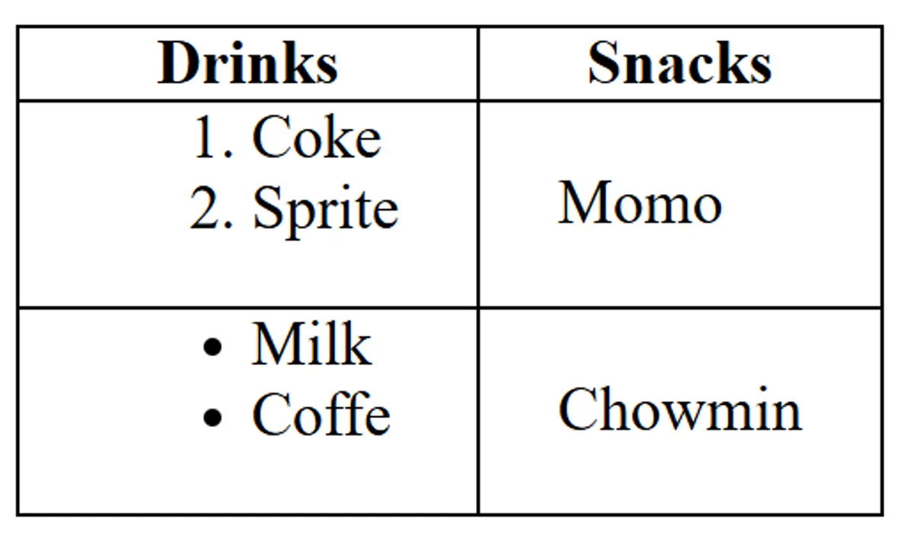

```html
<html>
  <head>
    <title>List inside table</title>
    <style>
      table,
      th,
      td {
        border: 1px solid black;
        border-collapse: collapse;
      }
      th,
      td {
        padding: 0 20px;
      }
    </style>
  </head>

  <body>
    <table>
      <tr>
        <th>Drinks</th>
        <th>Snacks</th>
      </tr>

      <tr>
        <td>
          <ol>
            <li>Coke</li>
            <li>Sprite</li>
          </ol>
        </td>
        <td>Momo</td>
      </tr>

      <tr>
        <td>
          <ul>
            <li>Milk</li>
            <li>Coffe</li>
          </ul>
        </td>
        <td>Chowmin</td>
      </tr>
    </table>
  </body>
</html>
```

## iframe

The `<iframe>` tag specifies an inline frame, which is used to embed another document within the current HTML document.

```html
<iframe
  src="https://www.example.com"
  title="Example Website"
  width="600"
  height="400"
></iframe>
```

### Attributes:

- **`src`**: URL of the document to embed
- **`title`**: Description of the embedded content
- **`width/height`**: Dimensions of the iframe

**Question:**

**Create a HTML page containing iframe within a paragraph. The iframe have source to http://www.tuiost.edu.np and its height and width are 200px and 400px respectively.**

```html
<html>
  <head>
    <title>TU</title>
  </head>
  <body>
    <p>
      Institute of Science and Technology (IoST) is one of the oldest and the
      largest technical institutes in TU with 13 Central Departments,1 School,
      24 constituent campuses and 89 affiliated campuses. For more details visit
      our website:
      <iframe
        src="http://www.tuiost.edu.np"
        width="400px"
        height="200px"
        title="tuiost website"
      >
        Sorry your browser does not support inline frames.
      </iframe>
    </p>
  </body>
</html>
```

## Adding Images

### Basic Image:

```html

```

### Improved Image with Attributes:

```html

```

**Image Attributes:**

- `src` - Path to the image file
- `height` - Sets image height (width adjusts proportionally)
- `alt` - Alternative text for accessibility and SEO

## Audio

The `<audio>` tag is used to embed sound content in an HTML document.

```html
<audio controls>
  <source src="audio.mp3" type="audio/mpeg" />
  Your browser does not support the audio element.
</audio>
```

### Attributes:

- **`controls`**: Adds play, pause, and volume controls
- **`src`**: URL of the audio file
- **`type`**: MIME type of the audio file

**Question:**

**Write a HTML script to insert audio file in a HTML page. Use the controls and autoplay properties**

```html
<html>
  <head>
    <title>Audio</title>
  </head>

  <body>
    <audio controls autoplay loop>
      <source src="sarangi.m4a" type="audio/mpeg" />
      Your browser does not support the audio element.
    </audio>
  </body>
</html>

<!-- type = audio/mpeg  or   audio/ogg   or    audio/wav -->
```

## Videos

### HTML5 Video Element

```html
<video width="320" height="240" controls>
  <source src="movie.mp4" type="video/mp4" />
  <source src="movie.ogg" type="video/ogg" />
  Your browser does not support the video tag.
</video>
```

### Embedding YouTube Videos

```html
<iframe
  width="560"
  height="315"
  src="https://www.youtube.com/embed/VIDEO_ID"
  title="YouTube video player"
  frameborder="0"
  allow="picture-in-picture"
  allowfullscreen
>
</iframe>
```

**Key Points:**

- Use HTML5 `<video>` for self-hosted videos
- Use `<iframe>` for embedded videos from platforms like YouTube
- Always provide fallback text for unsupported browsers
- src=`"https://www.youtube.com/embed/VIDEO_ID?autoplay=1&mute=1&controls=0&start=6&loop=1"`

**Quick Method:**

- Go to the YouTube video
- Click the "Share" button below the video
- Click "Embed"
- Copy the provided iframe code
- Paste it into your HTML

## Tooltips

HTML tooltips provide additional information when hovering over elements.

```html
<p title="This is a tooltip">Hover over this text to see a tooltip</p>


<a href="https://example.com" title="Click to visit Example.com"
  >Link with tooltip</a
>
```

### Tooltip Implementation:

- **`title` attribute**: Built-in HTML tooltip functionality
- **Hover behavior**: Tooltips appear when mouse hovers over element
- **Accessibility**: Provides additional context for screen readers

## Metadata

Metadata provides information about the HTML document itself, such such as character set, page description, keywords, author, and viewport settings. This information is not displayed on the web page but is used by browsers, search engines, and other web services.

```html
<html>
  <head>
    <title>Metadata Example</title>
    <meta charset="UTF-8" />
    <meta name="description" content="This is a metadata example" />
    <meta name="keywords" content="HTML, metadata, example" />
    <meta name="author" content="Bidur Sapkota" />
    <meta name="viewport" content="width=device-width, initial-scale=1.0" />
    <style>
      @media screen and (min-width: 700px) {
        h1 {
          color: red;
        }
      }
    </style>
  </head>
  <body>
    <h1>hello</h1>
  </body>
</html>
<!-- check responsive in mobile mode by adding and removing viewport meta tag -->
```

### Attributes:

- **`charset`**: Specifies the character encoding for the document
- **`name`**: Specifies the name of the metadata
- **`content`**: Specifies the value of the metadata

**Question:**

**Create a HTML page with tags header, article and footer. Insert alink containing mail to info@iost.edu.np in the footer tag. Set the keywords "iost", "csit" using Meta tag in the page.**

```html
<html>
  <head>
    <meta name="keywords" content="iost, csit" />
    <title>IOST</title>
  </head>
  <body>
    <header style="background-color: darkgray; margin-bottom: 2px">
      <nav>
        <a href="#">Home</a>
        <a href="#">About</a>
        <a href="#">Contact</a>
      </nav>
    </header>

    <article>
      <h2>IOST</h2>
      Institute of Science and Technology (IoST) is one of the oldest and the
      largest technical institutes in TU.
    </article>

    <footer
      style="background-color: darkgray; margin-top: 2px; text-align: center"
    >
      <a href="mailto:info@iost.edu.np">Send Email</a>
    </footer>
  </body>
</html>
```

**Write an html code to understand and use value attribute**

```html
<html>
  <head>
    <title>Html Value Attribute</title>
  </head>
  <body>
    <input type="text" value="Default Text" />

    <br /><br />

    <select>
      <option value="Nepal">Nepal</option>
      <option value="India">India</option>
      <option value="USA">USA</option>
    </select>

    <ol start="10">
      <li value="10">Item 10</li>
      <li value="15">Item 15</li>
      <li value="20">Item 20</li>
    </ol>

    <progress value="40" max="100">40%</progress>
  </body>
</html>
```

### More HTML Resources

- [MDN Web Docs - HTML](https://developer.mozilla.org/en-US/docs/Web/HTML)
- [W3Schools HTML Tutorial](https://www.w3schools.com/html/)

---

---

---

## 1.4 CSS

**1.4 CSS basics: Selectors, properties, values, box model**

- CSS (Cascading Style Sheets) is a style sheet language used for describing the look and formatting of a document written in a markup language.
- CSS is used to style and layout web pages, making it possible to create visually appealing and responsive designs.
- It is used to separate the presentation of a document from its content, making it easier to manage and update the design of a website.
- CSS is a key technology of the World Wide Web, alongside HTML and JavaScript.

#### Syntax of CSS

```css
selector {
  property: value;
}
```

## Adding CSS

CSS can be added to HTML documents in three different ways. Each method has its own use cases and priority levels.

### The Three Methods:

1. **Inline CSS**: Applied directly to HTML elements using the `style` attribute
2. **Internal CSS**: Written within `<style>` tags in the HTML document's `<head>` section
3. **External CSS**: Written in separate `.css` files and linked to the HTML document

### Priority Order (Specificity):

Inline CSS > Internal CSS / External CSS
Priority of Internal CSS and External CSS depends on which comes last. Last style overrides previous one.

### Example Code:

**HTML File:**

```html
<!DOCTYPE html>
<html lang="en">
  <head>
    <meta charset="UTF-8" />
    <meta name="viewport" content="width=device-width, initial-scale=1.0" />
    <title>Inline, Internal & External CSS</title>
    <link rel="stylesheet" href="style.css" />
    <style>
      h2 {
        color: green;
        background-color: black;
      }
    </style>
  </head>
  <body>
    <h2>Lorem ipsum, dolor sit amet</h2>
    <h2 style="color: blue; background: yellow;">
      Lorem ipsum, dolor sit amet
    </h2>
    <h2>Lorem ipsum, dolor sit amet</h2>
  </body>
</html>
```

**External CSS File (style.css):**

```css
body {
  background-color: yellow;
}
```

### Explanation:

- The first and third `<h2>` elements will have green text on black background (internal CSS)
- The second `<h2>` will have blue text on yellow background (inline CSS overrides internal CSS)
- The body background will be yellow (external CSS)

---

## CSS Selectors

CSS selectors are used to select and style HTML elements. They allow you to target specific elements for styling.

### Key Selectors:

1. **Element Selector**: Selects elements by their tag name
2. **Class Selector**: Selects elements by their class attribute
3. **ID Selector**: Selects elements by their ID attribute
4. **Universal Selector**: Selects all elements on the page, selected with `*`
5. **Attribute Selector**: Selects elements by their attribute, selected with `input[type="text"]`

- **IDs**: Unique identifiers (should only be used once per page), selected with `#`
- **Classes**: Reusable identifiers (can be used multiple times), selected with `.`
- **Priority**: ID selectors have higher specificity than class selectors. Class selectors have higher specificity than element selectors. Element selectors have higher specificity than attribute selectors.

### Example Code:

```html
<!DOCTYPE html>
<html lang="en">
  <head>
    <meta charset="UTF-8" />
    <meta name="viewport" content="width=device-width, initial-scale=1.0" />
    <title>CSS Selectors</title>
    <style>
      * {
        box-sizing: border-box;
      }
      p {
        color: blue;
      }
      .green-element {
        color: green;
      }
      #red-paragraph {
        color: red;
      }
      input[type="text"] {
        border: 2px solid purple;
        padding: 5px;
      }
    </style>
  </head>
  <body>
    <p>This is a paragraph</p>
    <p class="green-element">This is a paragraph</p>
    <p id="red-paragraph">This is a paragraph</p>
    <input type="text" value="This is an input field" />
  </body>
</html>
```

### Explanation:

- All elements (`*`) will have `box-sizing: border-box` applied
- All `<p>` elements will have blue text by default
- Elements with `class="green-element"` will have green text
- The element with `id="red-paragraph"` will have red text (ID overrides class)
- An `<input>` element with `type="text"` will have a purple border

---

## Colors

CSS offers multiple ways to define colors, giving you flexibility in how you specify color values.

### Color Methods:

1. **Named Colors**: Predefined color names (e.g., `red`, `blue`, `yellow`)
2. **Hexadecimal**: Using hex codes (e.g., `#ff5733`)
3. **RGB**: Using RGB values (e.g., `rgb(255, 87, 51)`)
4. **Other methods**: HSL, RGBA, HSLA (for transparency)

### Example Code:

```html
<!DOCTYPE html>
<html lang="en">
  <head>
    <meta charset="UTF-8" />
    <meta name="viewport" content="width=device-width, initial-scale=1.0" />
    <title>Colors</title>
    <style>
      body {
        color: yellow;
        background-color: #ff5733;
        background-color: rgb(255, 87, 51);
      }
    </style>
  </head>
  <body>
    <h1>This is a heading</h1>
  </body>
</html>
```

### Explanation:

- `color: yellow` sets the text color using a named color
- `background-color: #ff5733` sets background using hexadecimal
- `background-color: rgb(255, 87, 51)` overrides the hex value with RGB
- The RGB value represents the same color as the hex code
- When multiple declarations exist for the same property, the last one takes precedence

---

## Height and Width

Height and width properties control the dimensions of elements. They can be set using various units including pixels, percentages, and other relative units.

### Key Concepts:

- **Pixels (px)**: Absolute unit
- **Percentages (%)**: Relative to parent element
- **Parent-Child Relationships**: Child elements inherit sizing context from parents

### Example Code:

```html
<!DOCTYPE html>
<html lang="en">
  <head>
    <meta charset="UTF-8" />
    <meta name="viewport" content="width=device-width, initial-scale=1.0" />
    <title>Height And Width</title>
    <style>
      .parent-div {
        background-color: green;
        width: 50%;
        height: 200px;
      }
      .child-div {
        background-color: blue;
        height: 50%;
        width: 150px;
      }
      /* div{
      background-color: blue;
      width: 400px;
    } */
    </style>
  </head>
  <body>
    <div class="parent-div">
      <div class="child-div"></div>
    </div>
    <br />
    <!-- <div>Lorem ipsum dolor sit amet</div> -->
  </body>
</html>
```

### Explanation:

- Parent div takes 50% of the viewport width and has a fixed height of 200px
- Child div has a fixed width of 150px and takes 50% of parent's height (100px)
- Percentage heights require the parent to have a defined height
- Commented code shows alternative styling approach

---

## Borders

Borders add visual boundaries around elements. You can control their width, style, and color independently for each side.

### Border Properties:

- **border-width**: Thickness of the border
- **border-style**: Style of the border (solid, dashed, dotted, double, etc.)
- **border-color**: Color of the border
- **Individual sides**: Can be styled separately using directional properties

### Example Code:

```html
<!DOCTYPE html>
<html lang="en">
  <head>
    <meta charset="UTF-8" />
    <meta name="viewport" content="width=device-width, initial-scale=1.0" />
    <title>Border</title>
    <style>
      .borderExercise {
        width: 400px;
        height: 400px;
        background: chocolate;

        border-width: 10px;
        border-left-style: dashed;
        border-top-style: dotted;
        border-right-style: solid;
        border-bottom-style: double;
        border-right-color: cornflowerblue;
      }
    </style>
  </head>
  <body>
    <div class="borderExercise"></div>
  </body>
</html>
```

### Explanation:

- All borders have 10px width
- Each side has a different style: left (dashed), top (dotted), right (solid), bottom (double)
- Right border has a custom color (cornflowerblue)
- Other borders use the default color (usually black)
- This demonstrates the flexibility of border customization

---

## Margin

Margin creates space outside an element, pushing other elements away. It's the outermost layer of the CSS box model.

### Margin Properties:

- **Individual sides**: `margin-top`, `margin-right`, `margin-bottom`, `margin-left`
- **Shorthand**: `margin` can take 1-4 values
  - 1 value: all sides
  - 2 values: top/bottom, left/right
  - 4 values: top, right, bottom, left (clockwise)

### Example Code:

```html
<!DOCTYPE html>
<html lang="en">
  <head>
    <meta charset="UTF-8" />
    <meta name="viewport" content="width=device-width, initial-scale=1.0" />
    <title>Margin</title>
    <style>
      body {
        margin: 0;
      }
      .box {
        background-color: lightgreen;
        height: 50px;
        /* margin-top: 20px;
      margin-bottom: 50px;
      margin-left: 30px;
      margin-right: 30px; */
        margin: 30px 10px;
      }
    </style>
  </head>
  <body>
    <div class="box">This is a box with margin.</div>
    <div class="box">This is a box with margin.</div>
    <div class="box">This is a box with margin.</div>
  </body>
</html>
```

### Explanation:

- `body { margin: 0; }` removes default browser margins
- `margin: 30px 10px` applies 30px to top/bottom and 10px to left/right
- Commented code shows individual margin properties
- Margins create space between the boxes
- Adjacent vertical margins collapse (merge) in normal document flow

---

## Padding

Padding creates space inside an element, between the content and the border. It's part of the element's total size.

### Padding Properties:

- **Individual sides**: `padding-top`, `padding-right`, `padding-bottom`, `padding-left`
- **Shorthand**: `padding` follows the same pattern as margin
- **Effect**: Increases the element's total size (unless using `box-sizing: border-box`)

### Example Code:

```html
<!DOCTYPE html>
<html lang="en">
  <head>
    <meta charset="UTF-8" />
    <meta name="viewport" content="width=device-width, initial-scale=1.0" />
    <title>Padding</title>
    <style>
      body {
        margin: 0;
      }
      .box {
        background-color: lightgreen;
        height: 50px;
        width: 300px;
        margin: 20px;
        padding-top: 100px;
        padding-left: 120px;
        padding-right: 90px;
        padding-bottom: 50px;
        border: 10px solid black;
      }
    </style>
  </head>
  <body>
    <div class="box">This is a box with padding.</div>
    <div class="box">This is a box with padding.</div>
    <div class="box">This is a box with padding.</div>
  </body>
</html>
```

### Explanation:

- Different padding values on each side push the content inward
- The background color extends through the padding area
- Total element width = width + padding-left + padding-right + border-left + border-right
- Total element height = height + padding-top + padding-bottom + border-top + border-bottom
- Content is positioned according to the padding values

---

## Box Sizing

Box-sizing determines how the total width and height of elements are calculated, affecting how padding and borders are included.

**Box Model** - The box model is the structure that defines the size and shape of an element. It is made up of four parts: content, padding, border, and margin.

### Box Sizing Values:

- **Content-box** (default): Width/height applies only to content
- **Border-box**: Width/height includes content, padding, and border

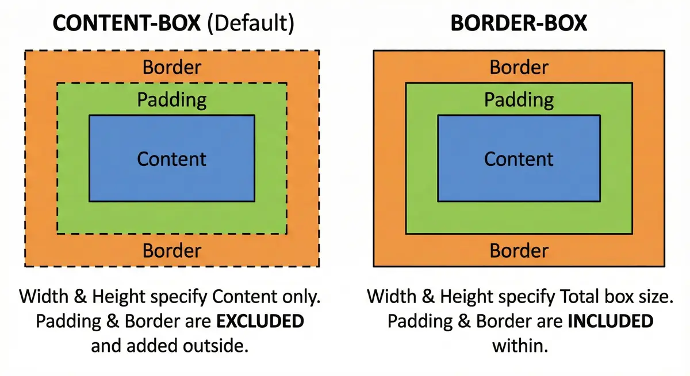

### Example Code:

```html
<!DOCTYPE html>
<html lang="en">
  <head>
    <meta charset="UTF-8" />
    <meta name="viewport" content="width=device-width, initial-scale=1.0" />
    <title>Boxsizing Borderbox</title>
    <style>
      div {
        width: 200px;
        height: 50px;
        margin: 10px;
        background-color: lightblue;
        padding: 20px;
        border: 10px solid black;
      }
      .contentBox {
        box-sizing: content-box;
      }
      .borderBox {
        box-sizing: border-box;
      }
    </style>
  </head>
  <body>
    <div class="contentBox">content-box</div>
    <div class="borderBox">border-box</div>
  </body>
</html>
```

### Explanation:

- **Content-box**: Total width = 200px + 40px (padding) + 20px (border) = 260px
- **Border-box**: Total width = 200px (padding and border included)
- Border-box makes sizing more predictable and is often preferred
- Common practice: Use `* { box-sizing: border-box; }` for all elements

---

## Block vs Inline Elements

HTML elements are categorized into two main display types: **Block** and **Inline** elements. Understanding this distinction is crucial for proper layout design.

### Block Elements

- Take up full width available
- Start on a new line
- Can have width and height set
- Examples: `<div>`, `<h1>-<h6>`, `<p>`, `<li>`, `<hr>`

### Inline Elements

- Only take up as much width as necessary
- Don't start on a new line
- Width and height properties are ignored
- Examples: `<a>`, `<span>`, `<strong>`, ``

### Inline-Block Elements

- Only take up as much width as necessary but Width and height properties can be set
- Combines features of both block and inline elments
- Examples: `<button>`, `<input>`

### Example Code

```html
<!DOCTYPE html>
<html lang="en">
  <head>
    <meta charset="UTF-8" />
    <meta name="viewport" content="width=device-width, initial-scale=1.0" />
    <title>Block and Inline Elements</title>
    <style>
      h2 {
        background-color: lightblue;
        width: 400px;
      }
      a {
        background-color: aqua;
      }
    </style>
  </head>
  <body>
    <h2>Headings are Block Elements</h2>
    <h2>Headings are Block Elements</h2>
    <h2>Headings are Block Elements</h2>
    <div>Div elements are block elements</div>
    <p>Paragraphs elements are block elements</p>
    <li>List-Items are block elements</li>
    <hr />

    <a href="#">Inline Element</a>
    <a href="#">Inline Element</a>
    <a href="#">Inline Element</a>
    <button>Inline Element</button>
    <span>Inline Element</span>
    <strong>Inline Element</strong>
    
  </body>
</html>
```

**Explanation**: Notice how block elements stack vertically and take full width, while inline elements flow horizontally next to each other.

---

## Display Property

The `display` property allows you to change the default behavior of elements. You can make block elements behave like inline elements and vice versa.

### Display Values

- `block`: Makes element behave as block element
- `inline`: Makes element behave as inline element
- `inline-block`: Combines features of both (flows inline but accepts width/height)
- `none`: Hides the element completely

### Example Code

```html
<!DOCTYPE html>
<html lang="en">
  <head>
    <meta charset="UTF-8" />
    <meta name="viewport" content="width=device-width, initial-scale=1.0" />
    <title>Display Property</title>
    <style>
      p {
        border: 3px solid blue;
        margin: 50px;
        padding: 10px;
        display: inline-block;
      }
      div {
        border: 3px solid blue;
        margin: 10px;
        padding: 10px;
        display: inline;
      }
      span {
        border: 3px solid blue;
        margin: 10px;
        padding: 10px;
        display: block;
      }
    </style>
  </head>
  <body>
    <div>Inline-Element</div>
    <div>Inline-Element</div>
    <span>Block-Element</span>
    <span>Block-Element</span>
    <p>Inline-Block</p>
    <p>Inline-Block</p>
  </body>
</html>
```

**Explanation**: The `div` elements now flow inline, `span` elements behave as blocks, and `p` elements combine both behaviors (inline flow with block properties).

---

## Border Radius

The `border-radius` property creates rounded corners on elements. It's essential for modern web design and can transform sharp rectangular elements into circles, ovals, or elements with custom rounded corners.

### Border Radius Syntax

- Single value: `border-radius: 10px` (all corners)
- Four values: `border-radius: 10px 20px 30px 40px` (top-left, top-right, bottom-right, bottom-left)
- Individual corners: `border-top-left-radius`, `border-top-right-radius`, etc.

### Example Code

```html
<!DOCTYPE html>
<html lang="en">
  <head>
    <meta charset="UTF-8" />
    <meta name="viewport" content="width=device-width, initial-scale=1.0" />
    <title>Border Radius</title>
    <style>
      div {
        width: 200px;
        height: 200px;
        margin: 30px;
        background-color: blue;
        /* Individual corner properties:
      border-top-left-radius: 90px;
      border-top-right-radius: 60px;
      border-bottom-left-radius: 5%;
      border-bottom-right-radius: 30px; */
        border-radius: 90px 60px 30px 5%;
      }
    </style>
  </head>
  <body>
    <div></div>
  </body>
</html>
```

**Explanation**: This creates a uniquely shaped element with different radius values for each corner. You can use pixels or percentages for radius values.

---

## Text Properties

CSS provides extensive control over text appearance and alignment. These properties are fundamental for typography and readability.

### Text Alignment

Text alignment controls how text is positioned within its container.

```html
<!DOCTYPE html>
<html lang="en">
  <head>
    <meta charset="UTF-8" />
    <meta name="viewport" content="width=device-width, initial-scale=1.0" />
    <title>Text Alignment</title>
    <style>
      h4 {
        width: 400px;
      }
      .left {
        text-align: left;
      }
      .center {
        text-align: center;
      }
      .right {
        text-align: right;
      }
      p {
        text-align: justify;
      }
    </style>
  </head>
  <body>
    <h4 class="left">text-align: left</h4>
    <h4 class="center">text-align: center</h4>
    <h4 class="right">text-align: right</h4>
    <p>
      Lorem ipsum dolor sit amet consectetur adipisicing elit. Blanditiis ut
      sapiente recusandae facere delectus quia fugiat eos illum ea perspiciatis
      asperiores dolor, corrupti ad odit dicta expedita quos quisquam non! Lorem
      ipsum dolor sit amet consectetur adipisicing elit. Blanditiis ut sapiente
      recusandae facere delectus quia fugiat eos illum ea perspiciatis
      asperiores dolor, corrupti ad odit dicta expedita quos quisquam non! Lorem
      ipsum dolor sit amet consectetur adipisicing elit. Blanditiis ut sapiente
      recusandae facere delectus quia fugiat eos illum ea perspiciatis
      asperiores dolor, corrupti ad odit dicta expedita quos quisquam non! Lorem
      ipsum dolor sit amet consectetur adipisicing elit. Blanditiis ut sapiente
      recusandae facere delectus quia fugiat eos illum ea perspiciatis
      asperiores dolor, corrupti ad odit dicta expedita quos quisquam non!
    </p>
  </body>
</html>
```

### Text Decoration

Text decoration adds visual effects to text like underlines, overlines, and strikethroughs.

```html
<!DOCTYPE html>
<html lang="en">
  <head>
    <meta charset="UTF-8" />
    <meta name="viewport" content="width=device-width, initial-scale=1.0" />
    <title>Text-Decoration</title>
    <style>
      h4 {
        text-decoration: wavy #123456 5px line-through;
      }
      a {
        text-decoration: none;
      }
    </style>
  </head>
  <body>
    <h4>This is a h4</h4>
    <a href="#">This is a link</a>
  </body>
</html>
```

### Text Transform

Text transform changes the capitalization of text without changing the HTML content.

```html
<!DOCTYPE html>
<html lang="en">
  <head>
    <meta charset="UTF-8" />
    <meta name="viewport" content="width=device-width, initial-scale=1.0" />
    <title>Text Transform</title>
    <style>
      p {
        text-transform: uppercase;
      }
    </style>
  </head>
  <body>
    <p>
      Lorem ipsum dolor sit amet consectetur adipisicing elit. Quod quos placeat
      praesentium unde fugit dolores, impedit maxime quisquam minima adipisci
      itaque ratione totam vitae nemo commodi voluptate est repellendus eveniet!
    </p>
  </body>
</html>
```

**Explanation**: Text properties control alignment (left, center, right, justify), decoration (underline, overline, line-through), and transformation (uppercase, lowercase, capitalize).

---

## Font Properties

Font properties control the appearance of text including size, family, and weight. These are crucial for establishing visual hierarchy and brand consistency.

### Font Size with REM Units

REM (Root EM) units are relative to the root element's font size, making them ideal for responsive design.

```html
<!DOCTYPE html>
<html lang="en">
  <head>
    <meta charset="UTF-8" />
    <meta name="viewport" content="width=device-width, initial-scale=1.0" />
    <title>Font-Properties</title>
    <style>
      html {
        font-size: 62.5%;
      }
      h1 {
        font-size: 3rem; /* 3 * 12pt = 36pt */
      }
      h2 {
        font-size: 2rem;
      }
      h3 {
        font-size: 1.5rem;
      }
      p {
        font-size: 1rem; /* 1 * 12pt = 12pt */
      }
    </style>
  </head>
  <body>
    <h1>This is a heading</h1>
    <h2>This is a heading</h2>
    <h3>This is a heading</h3>
    <p>
      Lorem ipsum dolor sit amet consectetur, adipisicing elit. Eligendi
      incidunt veniam consequuntur enim voluptatibus animi saepe obcaecati
      mollitia ea debitis esse non voluptate asperiores nam ullam ratione,
      accusamus praesentium. Dolorum.
    </p>
  </body>
</html>
```

### Font Family and Weight

Font family specifies which fonts to use, while font weight controls the thickness of characters.

```html
<!DOCTYPE html>
<html lang="en">
  <head>
    <meta charset="UTF-8" />
    <meta name="viewport" content="width=device-width, initial-scale=1.0" />
    <link rel="preconnect" href="https://fonts.googleapis.com" />
    <link rel="preconnect" href="https://fonts.gstatic.com" crossorigin />
    <link
      href="https://fonts.googleapis.com/css2?family=Playwrite+CU:wght@100..400&display=swap"
      rel="stylesheet"
    />
    <title>Weight, Family</title>
    <style>
      p {
        font-family: "Playwrite CU", Arial, Helvetica, sans-serif;
        font-weight: lighter;
      }
      h2 {
        font-weight: normal;
      }
      div {
        font-weight: bold;
      }
    </style>
  </head>
  <body>
    <h2>This is a heading</h2>
    <div>
      <p>
        Lorem ipsum dolor sit, amet consectetur adipisicing elit. Deserunt hic
        voluptatum quo sint a, nostrum incidunt necessitatibus deleniti quis
        aperiam corrupti architecto fuga non quasi repellendus accusamus
        eligendi itaque magnam!
      </p>
    </div>
  </body>
</html>

<!-- Arial (sans-serif)
Verdana (sans-serif)
Tahoma (sans-serif)
Trebuchet MS (sans-serif)
Times New Roman (serif)
Georgia (serif)
Garamond (serif)
Courier New (monospace) -->
```

**Explanation**: REM units create scalable typography, Google Fonts provide custom typefaces, and font-weight values (lighter, normal, bold, or numeric values 100-900) control text thickness.

---

## Centering Elements

Centering elements is a common layout requirement. This example demonstrates both horizontal and vertical centering techniques using modern CSS properties.

### Centering Techniques Used

- `margin: 0 auto` for horizontal centering of block elements
- `text-align: center` for centering inline content
- `align-content: center` for vertical centering in containers
- Setting explicit dimensions and using full viewport height

### Example Code

```html
<!DOCTYPE html>
<html lang="en">
  <head>
    <meta charset="UTF-8" />
    <meta name="viewport" content="width=device-width, initial-scale=1.0" />
    <title>Center elements</title>
    <style>
      html {
        height: 100%;
      }
      body {
        align-content: center;
        height: 100%;
        margin: 0;
      }
      div {
        width: 50%;
        height: 300px;
        background-color: lightblue;
        margin: 0 auto;
        align-content: center;
      }
      p {
        width: 50%;
        height: 150px;
        background-color: gray;
        margin: 0 auto;
        text-align: center;
        align-content: center;
      }
    </style>
  </head>
  <body>
    <div>
      <p>This is a paragraph</p>
    </div>
  </body>
</html>
```

**Explanation**: This creates a perfectly centered layout where the outer div is centered horizontally and vertically on the page, and the inner paragraph is centered within the div both horizontally and vertically.

### Key Centering Concepts

- **Horizontal centering**: `margin: 0 auto` for block elements, `text-align: center` for inline content
- **Vertical centering**: `align-content: center` on containers with defined height
- **Full viewport usage**: Setting `html` and `body` to `height: 100%` to use full screen height
- **Nested centering**: Each element can be centered within its parent container

---

## Background Images

Background images allow you to set images as backgrounds for elements. You can control how they repeat, size, and position.

### Key Properties:

- `background-image`: Sets the image
- `background-repeat`: Controls repetition
- `background-size`: Controls sizing
- `background-attachment`: Controls scrolling behavior

### Example Code:

```html
<!DOCTYPE html>
<html lang="en">
  <head>
    <meta charset="UTF-8" />
    <meta name="viewport" content="width=device-width, initial-scale=1.0" />
    <title>Background Image</title>
    <style>
      body {
        background-image: url("building.webp");
        background-repeat: no-repeat;
        background-size: cover;
        background-attachment: fixed;
        height: 100vh;
      }
    </style>
  </head>
  <body>
    <p>Lorem ipsum dolor sit, amet consectetur adipisicing elit...</p>
    <!-- Multiple paragraphs for scrolling effect -->
  </body>
</html>
```

### Background Properties Explained:

- `cover`: Scales image to cover entire container
- `no-repeat`: Image appears only once
- `fixed`: Image stays fixed during scrolling
- `100vh`: Full viewport height

---

## RGBA and Opacity

Transparency in CSS can be achieved through RGBA colors or the opacity property. The key difference is that opacity affects the entire element and its children.

### RGBA vs Opacity:

- **RGBA**: Only affects background color
- **Opacity**: Affects entire element including text and children

### Example Code:

```html
<!DOCTYPE html>
<html lang="en">
  <head>
    <meta charset="UTF-8" />
    <meta name="viewport" content="width=device-width, initial-scale=1.0" />
    <title>Transparent Colors</title>
    <style>
      * {
        margin: 0;
        padding: 0;
        box-sizing: border-box;
      }
      body {
        height: 100vh;
        padding: 50px;
        background-image: url("building.webp");
        background-repeat: no-repeat;
        background-size: cover;
      }
      div {
        width: 300px;
        height: 300px;
        display: inline-block;
        margin-right: 50px;
        border: 5px solid black;
      }
      .alpha {
        background-color: rgba(200, 0, 0, 0.7);
      }
      .opacity {
        background-color: blue;
        opacity: 0.3;
      }
    </style>
  </head>
  <body>
    <div class="alpha">
      <p>Text remains opaque</p>
    </div>
    <div class="opacity">
      <p>Text becomes transparent too</p>
    </div>
  </body>
</html>
```

### RGBA Syntax:

- `rgba(red, green, blue, alpha)`
- Alpha values: 0 (transparent) to 1 (opaque)

---

## Gradients

CSS gradients create smooth transitions between colors. There are two main types: linear and radial gradients.

### Types of Gradients:

- **Linear**: Colors transition in a straight line
- **Radial**: Colors transition from center outward
- The values to top, to bottom, to left, and to right are equivalent to the angles 0deg, 180deg, 270deg, and 90deg, respectively. o deg = bottom to top [ to top ]
- There can be multiple background. (colors, image)

### Example Code:

```html
<!DOCTYPE html>
<html lang="en">
  <head>
    <meta charset="UTF-8" />
    <meta name="viewport" content="width=device-width, initial-scale=1.0" />
    <title>CSS Gradients</title>
    <style>
      div {
        margin: 20px;
        width: 200px;
        height: 200px;
        border: 1px solid black;
      }
      .linear {
        background-image: linear-gradient(
          black 33%,
          red 33%,
          red 67%,
          yellow 67%
        );
        /* linear-gradient(direction, color1 stop1, color2 stop2, ...) */
      }
      .radial {
        background-image: radial-gradient(red, yellow);
      }
    </style>
  </head>
  <body>
    <div class="linear"></div>
    <div class="radial"></div>
  </body>
</html>
```

### Gradient Syntax:

- **Linear**: `linear-gradient(direction, color-stops)`
- **Radial**: `radial-gradient(shape, color-stops)`
- **Color stops**: Percentage or pixel values where colors change

---

## Shadows

CSS box-shadow adds depth and dimension to elements. You can create multiple shadows and even inset shadows.

### Box-Shadow Syntax:

`box-shadow: h-offset v-offset blur spread color inset;`

### Example Code:

```html
<!DOCTYPE html>
<html lang="en">
  <head>
    <meta charset="UTF-8" />
    <meta name="viewport" content="width=device-width, initial-scale=1.0" />
    <title>box-shadow</title>
    <style>
      div {
        margin: 50px;
        width: 300px;
        height: 300px;
        background-color: aqua;
        box-shadow: 5px 5px 5px 0px lightseagreen inset, 5px 5px 3px lightblue;
      }
    </style>
  </head>
  <body>
    <div></div>
  </body>
</html>
```

### Shadow Parameters:

- **h-offset**: Horizontal shadow position
- **v-offset**: Vertical shadow position
- **blur**: Blur radius (optional)
- **spread**: Shadow size (optional)
- **color**: Shadow color
- **inset**: Inner shadow (optional)

---

## Combinators

CSS combinators define relationships between selectors, allowing you to target elements based on their position relative to other elements.

### Types of Combinators:

- **Adjacent Sibling** (`+`): Selects immediate next sibling
- **General Sibling** (`~`): Selects all following siblings
- **Child** (`>`): Direct children only
- **Descendant** (space): All descendants

### Example Code:

```html
<!DOCTYPE html>
<html lang="en">
  <head>
    <meta charset="UTF-8" />
    <meta name="viewport" content="width=device-width, initial-scale=1.0" />
    <title>Combinators</title>
    <style>
      * {
        margin: 0;
      }
      div {
        background-color: bisque;
        padding: 20px;
      }
      h2 {
        color: blue;
      }
      header {
        background-color: beige;
        padding: 20px;
      }
      h2 ~ p {
        font-weight: bold;
        color: violet;
      }
      h2 + p {
        color: green;
      }
    </style>
  </head>
  <body>
    <header>
      <p>Not a subsequent sibling</p>
      <h2>This is a heading</h2>
      <p>This is a paragraph</p>
      <p>This is a paragraph</p>
      <p>This is a paragraph</p>
    </header>
    <div>
      <h2>Another heading</h2>
      <article>
        <p>Lorem ipsum dolor sit amet...</p>
      </article>
    </div>
  </body>
</html>
```

### Combinator Effects:

- `h2 + p`: Only the first paragraph after h2 turns green
- `h2 ~ p`: All paragraphs after h2 become violet and bold

---

## Attribute Selectors

Attribute selectors target elements based on their attributes and values, making them perfect for form styling.

### Attribute Selector Syntax:

- `[attribute]`: Has the attribute
- `[attribute="value"]`: Exact value match
- `[attribute^="value"]`: Starts with value
- `[attribute$="value"]`: Ends with value
- `[attribute*="value"]`: Contains value

### Example Code:

```html
<!DOCTYPE html>
<html lang="en">
  <head>
    <meta charset="UTF-8" />
    <meta name="viewport" content="width=device-width, initial-scale=1.0" />
    <title>Attribute Selector</title>
    <style>
      form {
        padding: 20px;
      }
      input {
        margin: 5px;
        box-sizing: border-box;
      }
      input[type="email"],
      input[type="password"] {
        height: 25px;
        width: 150px;
        border-radius: 30px;
        border: 1px solid black;
        padding-left: 10px;
      }
      input[type="submit"] {
        height: 25px;
        width: 150px;
        background-color: brown;
        border: none;
        border-radius: 10px;
      }
    </style>
  </head>
  <body>
    <form>
      <input type="email" placeholder="Enter your email" /><br />
      <input type="password" placeholder="Enter your password" /><br />
      <input type="submit" value="SIGN IN" />
    </form>
  </body>
</html>
```

### Use Cases:

- Form input styling
- Link targeting (external vs internal)
- File type identification

---

## Pseudo Classes

Pseudo-classes target elements in specific states or positions, adding interactivity and dynamic styling.

### Common Pseudo-Classes:

- `:hover`: Mouse over state
- `:active`: Click state
- `:focus`: Input focus state
- `:visited`: Visited links
- `:first-child`, `:last-child`: Position-based
- `:nth-child()`: Nth position
- `:valid`, `:invalid`: Form validation states
- `input:focus:invalid`: Combine

### Example Code:

```html
<!DOCTYPE html>
<html lang="en">
  <head>
    <meta charset="UTF-8" />
    <meta name="viewport" content="width=device-width, initial-scale=1.0" />
    <title>Pseudo-classes</title>
    <style>
      * {
        margin: 0;
        box-sizing: border-box;
      }
      a {
        margin: 10px;
        width: 250px;
        text-align: center;
        display: inline-block;
        text-decoration: none;
        color: white;
        text-transform: uppercase;
        background-color: tomato;
        padding: 1em;
        border-radius: 10px;
        font-weight: 600;
      }
      a:hover {
        background-color: aqua;
        color: black;
        border: 1px solid brown;
      }
      a:visited {
        background-color: blueviolet;
      }
      a:active {
        background-color: black;
      }
      input:focus {
        background-color: #ccc;
        outline: none;
        border: none;
      }
      input:invalid {
        border: 1px solid red;
      }
      input:valid {
        border: 1px solid green;
      }
      input[type="checkbox"]:checked + span {
        text-decoration: line-through;
        color: #ddd;
      }
      li:first-child {
        border: 2px solid black;
      }
      li:last-child {
        border: 2px solid blue;
      }
      li:nth-child(5) {
        background-color: orange;
      }
      li:nth-child(2n) {
        background-color: grey;
      }
    </style>
  </head>
  <body>
    <a href="#">This is a link</a>
    <input type="email" />
    <input type="checkbox" />
    <span>Todo-Element</span>
    <ol>
      <li>This is a list-item</li>
      <li>This is a list-item</li>
      <li>This is a list-item</li>
      <li>This is a list-item</li>
      <li>This is a list-item</li>
      <li>This is a list-item</li>
      <li>This is a list-item</li>
      <li>This is a list-item</li>
      <li>This is a list-item</li>
      <li>This is a list-item</li>
    </ol>
  </body>
</html>
```

### Advanced Selectors:

- `:nth-child(2n)`: Every even child
- `:nth-child(odd)`: Every odd child
- `:checked + span`: Sibling element after checked checkbox

---

## Transitions

CSS transitions create smooth animations between property changes, enhancing user experience with fluid motion.

### Transition Properties:

- `transition-property`: Which property to animate
- `transition-duration`: How long the animation takes
- `transition-timing-function`: Animation curve
- `transition-delay`: Delay before animation starts

### Example Code:

```html
<!DOCTYPE html>
<html lang="en">
  <head>
    <meta charset="UTF-8" />
    <meta name="viewport" content="width=device-width, initial-scale=1.0" />
    <title>Transitions</title>
    <style>
      div {
        height: 300px;
        width: 300px;
        background-color: brown;
        transition: 800ms ease-in-out;
      }
      div:hover {
        width: 460px;
        height: 460px;
      }
    </style>
  </head>
  <body>
    <div></div>
  </body>
</html>
```

### Timing Functions:

- `ease`: Slow start, fast middle, slow end
- `linear`: Constant speed
- `ease-in-out`: Slow start and end
- `cubic-bezier()`: Custom curves

---

## Positioning

CSS positioning controls how elements are placed and behave on a webpage. There are five main position values: `static`, `relative`, `absolute`, `fixed`, and `sticky`.

### 1. Position: Static (Default)

Elements with `position: static` follow the normal document flow. They cannot be moved using `top`, `right`, `bottom`, or `left` properties.

```css
.static-element {
  position: static;
  /* top, right, bottom, left have no effect */
}
```

```html
<div class="static-element">I'm in normal document flow</div>
```

### 2. Position: Relative

Elements with `position: relative` remain in the normal document flow but can be offset from their original position using `top`, `right`, `bottom`, or `left`.

```css
.relative-element {
  position: relative;
  top: 20px;
  left: 30px;
  background-color: lightblue;
}
```

```html
<div class="relative-element">I'm offset from my original position</div>
```

**Key Points:**

- Element still occupies its original space in the document flow
- Other elements are not affected by the offset
- Creates a positioning context for absolutely positioned children

### 3. Position: Absolute

Elements with `position: absolute` are removed from the normal document flow and positioned relative to their nearest positioned ancestor (or the viewport if none exists).

```css
.container {
  position: relative; /* Creates positioning context */
  width: 300px;
  height: 200px;
  border: 2px solid #333;
}

.absolute-element {
  position: absolute;
  top: 50px;
  right: 20px;
  background-color: lightcoral;
  width: 100px;
  height: 50px;
}
```

```html
<div class="container">
  <div class="absolute-element">I'm absolutely positioned</div>
</div>
```

**Key Points:**

- Removed from document flow (doesn't affect other elements)
- Positioned relative to nearest positioned ancestor
- Can overlap other elements

### 4. Position: Fixed

Elements with `position: fixed` are positioned relative to the viewport and remain in the same position even when scrolling.

```css
.fixed-element {
  position: fixed;
  top: 10px;
  right: 10px;
  background-color: lightgreen;
  padding: 10px;
  z-index: 1000;
}
```

```html
<div class="fixed-element">I stay in place while scrolling</div>
```

**Key Points:**

- Always positioned relative to the viewport
- Stays in place during scrolling
- Removed from document flow
- Common for navigation bars, modals, or floating buttons

### 5. Position: Sticky

Elements with `position: sticky` act like `relative` until they reach a specified scroll position, then become `fixed`.

```css
.sticky-element {
  position: sticky;
  top: 0;
  background-color: lightyellow;
  padding: 10px;
  border-bottom: 2px solid #333;
}
```

```html
<div class="content">
  <div class="sticky-element">I stick to the top when scrolling</div>
  <p>Lots of content here...</p>
</div>
```

**Key Points:**

- Hybrid between `relative` and `fixed`
- Sticks when reaching the specified threshold
- Must specify at least one of: `top`, `right`, `bottom`, or `left`
- Perfect for sticky headers or sidebars

### Complete Example

```html
<!DOCTYPE html>
<html>
  <head>
    <style>
      .demo-container {
        height: 150px;
        border: 2px dashed #ccc;
        position: relative;
        margin: 20px 0;
      }

      .relative-demo {
        position: relative;
        top: 20px;
        left: 50px;
        background: lightblue;
        padding: 10px;
      }

      .absolute-demo {
        position: absolute;
        top: 10px;
        right: 10px;
        background: lightcoral;
        padding: 10px;
      }

      .fixed-demo {
        position: fixed;
        bottom: 20px;
        right: 20px;
        background: lightgreen;
        padding: 10px;
        z-index: 100;
      }

      .sticky-demo {
        position: sticky;
        top: 0;
        background: lightyellow;
        padding: 10px;
        border-bottom: 2px solid #333;
      }
    </style>
  </head>
  <body>
    <div class="demo-container">
      <div class="relative-demo">Relative Position</div>
      <div class="absolute-demo">Absolute Position</div>
    </div>

    <div class="fixed-demo">Fixed Position</div>

    <div style="position: relative">
      <div class="sticky-demo">Sticky Header 1</div>
      <p>lorem-1000</p>
    </div>
    <br /><br /><br /><br /><br /><br /><br /><br /><br /><br /><br /><br /><br /><br /><br /><br /><br /><br /><br /><br />
    <div style="position: relative">
      <div class="sticky-demo">Sticky Header 2</div>
      <p>lorem-1000</p>
    </div>
    <br /><br /><br /><br /><br /><br /><br /><br /><br /><br /><br /><br /><br /><br /><br /><br /><br /><br /><br /><br />
  </body>
</html>
```

---

## Pseudo Elements

Pseudo elements allow you to style specific parts of an element or insert content without adding extra HTML. They use double colons (`::`) in modern CSS.

### What are Pseudo Elements?

Pseudo elements create virtual elements that don't exist in your HTML but can be styled with CSS. They're perfect for adding decorative content, styling specific parts of text, or creating visual effects.

### Common Pseudo Elements

#### 1. ::before and ::after

These create virtual elements before or after an element's content. They require the `content` property to be visible.

```css
.quote::before {
  content: '"';
  font-size: 2em;
  color: #666;
}

.quote::after {
  content: '"';
  font-size: 2em;
  color: #666;
}
```

```html
<p class="quote">This is a quoted text</p>
<!-- Renders as: "This is a quoted text" -->
```

#### 2. ::first-line

Styles the first line of text in a block element.

```css
.article::first-line {
  font-weight: bold;
  color: #333;
  font-size: 1.2em;
}
```

```html
<p class="article">
  This first line will be styled differently. The rest of the paragraph will
  have normal styling.
</p>
```

#### 3. ::first-letter

Styles the first letter of the first line in a block element.

```css
.drop-cap::first-letter {
  font-size: 3em;
  float: left;
  line-height: 1;
  margin-right: 5px;
  color: #c0392b;
}
```

```html
<p class="drop-cap">
  This paragraph has a decorative first letter that stands out.
</p>
```

#### 4. ::selection

Styles the portion of text selected by the user.

```css
::selection {
  background-color: #3498db;
  color: white;
}

/* Firefox compatibility */
::-moz-selection {
  background-color: #3498db;
  color: white;
}
```

```html
<p>Try selecting this text to see the custom selection style!</p>
```

#### 5. ::placeholder

Styles placeholder text in input fields.

```css
input::placeholder {
  color: #999;
  font-style: italic;
  opacity: 0.8;
}
```

```html
<input type="text" placeholder="Enter your name here" />
```

## Complete Example

```html
<!DOCTYPE html>
<html>
  <head>
    <style>
      .demo-container {
        max-width: 600px;
        margin: 20px auto;
        padding: 20px;
        font-family: Arial, sans-serif;
      }

      /* First letter styling */
      .drop-cap::first-letter {
        font-size: 3em;
        float: left;
        line-height: 1;
        margin-right: 8px;
        color: #e74c3c;
        font-weight: bold;
      }

      /* Quote styling */
      .quote {
        font-style: italic;
        margin: 20px 0;
        position: relative;
        display: inline;
      }

      .quote::before,
      .quote::after {
        content: '"';
        font-size: 2em;
        color: #3498db;
        position: absolute;
      }

      .quote::before {
        left: -20px;
        top: -10px;
      }

      .quote::after {
        right: -20px;
        top: -10px;
      }

      /* Custom selection */
      ::selection {
        background: #f39c12;
        color: white;
      }

      /* Placeholder styling */
      input::placeholder {
        color: #95a5a6;
        font-style: italic;
      }

      input {
        padding: 10px;
        border: 2px solid #bdc3c7;
        border-radius: 4px;
        width: 100%;
        margin: 10px 0;
        outline: none;
      }
    </style>
  </head>
  <body>
    <div class="demo-container">
      <p class="drop-cap">
        This paragraph demonstrates the first-letter pseudo element. Notice how
        the first letter is styled differently from the rest. Lorem ipsum dolor
        sit amet, consectetur adipisicing elit. Consequatur perspiciatis commodi
        tenetur nam praesentium nisi quasi laudantium autem aliquid temporibus?
        Tempore ullam voluptatibus nemo ipsam magnam necessitatibus, iure earum
        accusantium.
      </p>

      <p class="quote">
        This is a quoted text that shows before and after pseudo elements.
      </p>

      <input
        type="text"
        placeholder="Try typing here and see the placeholder style"
      />

      <p>
        Try selecting any text on this page to see custom selection styling!
      </p>
    </div>
  </body>
</html>
```

```html
<html lang="en">
  <head>
    <meta charset="UTF-8" />
    <meta name="viewport" content="width=device-width, initial-scale=1.0" />
    <title>Document</title>
    <style>
      h1 {
        position: relative;
        display: inline;
      }
      h1::after {
        content: "";
        position: absolute;
        top: 100%;
        left: 50%;
        transform: translateX(-50%);
        width: 0%;
        height: 2px;
        background: blue;
        transition: all 1s ease-in-out;
      }
      h1:hover::after {
        width: 100%;
      }
    </style>
  </head>
  <body>
    <h1>HOme</h1>
  </body>
</html>
```

---

## Flexbox Layout

Flexbox is a one-dimensional layout method that allows you to arrange items in rows or columns. It's perfect for creating responsive layouts and aligning content efficiently.

### Key Flexbox Concepts

**Flex Container Properties:**

- `display: flex` - Creates a flex container
- `justify-content` - Controls horizontal alignment
- `align-items` - Controls vertical alignment
- `flex-wrap` - Controls whether items wrap to new lines
- `gap` - Sets spacing between flex items

**Common Values:**

- `justify-content: center, flex-start, flex-end, space-between, space-around`
- `align-items: center, flex-start, flex-end, stretch`

### Example Code

```html
<!DOCTYPE html>
<html lang="en">
  <head>
    <meta charset="UTF-8" />
    <meta name="viewport" content="width=device-width, initial-scale=1.0" />
    <title>Flexbox Layout</title>
    <style>
      * {
        margin: 0;
        padding: 0;
      }
      body {
        box-sizing: border-box;
        min-height: 100vh;
        padding: 20px;
        background-color: #0f1016;
        color: white;
        font-family: "Segoe UI", Tahoma, Geneva, Verdana, sans-serif;
        display: flex;
        align-items: center;
        justify-content: center;
      }
      .flex-layout {
        display: flex;
        justify-content: center;
        flex-wrap: wrap;
        gap: 20px;
      }
      .container {
        width: min(350px, 100%);
        box-sizing: border-box;
        background-color: #191a20;
        border: 3px solid #4b4c55;
        border-radius: 10px;
        box-shadow: 0 5px 5px rgba(0, 0, 0, 0.1);
        padding: 30px;
      }
      h2 {
        font-size: 2rem;
      }
      p {
        margin-top: 10px;
      }
    </style>
  </head>
  <body>
    <div class="flex-layout">
      <div class="container">
        <h2>Hello World</h2>
        <p>
          Lorem ipsum dolor sit amet consectetur adipisicing elit. Autem cumque
          recusandae excepturi deleniti, necessitatibus repellat ab at dicta
          quia debitis, illo libero, vero magni suscipit veritatis. Laboriosam
          illum facere earum!
        </p>
      </div>
      <div class="container">
        <h2>Hello World</h2>
        <p>
          Lorem ipsum dolor sit amet consectetur adipisicing elit. Autem cumque
          recusandae excepturi deleniti, necessitatibus repellat ab at dicta
          quia debitis, illo libero, vero magni suscipit veritatis. Laboriosam
          illum facere earum!
        </p>
      </div>
      <div class="container">
        <h2>Hello World</h2>
        <p>
          Lorem ipsum dolor sit amet consectetur adipisicing elit. Autem cumque
          recusandae excepturi deleniti, necessitatibus repellat ab at dicta
          quia debitis, illo libero, vero magni suscipit veritatis. Laboriosam
          illum facere earum!
        </p>
      </div>
      <div class="container">
        <h2>Hello World</h2>
        <p>
          Lorem ipsum dolor sit amet consectetur adipisicing elit. Autem cumque
          recusandae excepturi deleniti, necessitatibus repellat ab at dicta
          quia debitis, illo libero, vero magni suscipit veritatis. Laboriosam
          illum facere earum!
        </p>
      </div>
    </div>
  </body>
</html>
```

### Key Features in This Example:

- **Centering**: Body uses flexbox to center content both horizontally and vertically
- **Responsive Cards**: Cards wrap to new lines when screen space is limited
- **Modern Styling**: Dark theme with subtle shadows and rounded corners
- **Gap Property**: Provides consistent spacing between cards

---

## Grid Layout

CSS Grid is a two-dimensional layout system that allows you to create complex layouts with rows and columns. It's perfect for creating bento-box style layouts and precise positioning.

### Grid Container Properties

- `display: grid` - Creates a grid container
- `grid-template-columns` - Defines column sizes
- `grid-template-rows` - Defines row sizes
- `gap` - Sets spacing between grid items (shorthand for `row-gap` and `column-gap`)
- `grid-template-areas` - Defines named grid areas for easier item placement

### Grid Item Properties

- `grid-row` - Specifies which rows an item spans
- `grid-column` - Specifies which columns an item spans
- `grid-area` - Names a grid area for easier positioning

---

### Alignment Properties

#### Container-Level Alignment

These properties are applied to the **grid container** and affect the positioning of all grid items.

#### `justify-items` (Horizontal Alignment of Items)

Controls how grid items are aligned horizontally **within their grid cells**.

- **`stretch`** (default) - Items stretch to fill the entire width of the cell
- **`start`** - Items align to the left edge of the cell
- **`end`** - Items align to the right edge of the cell
- **`center`** - Items align to the center of the cell

```css
.grid-container {
  display: grid;
  justify-items: center; /* Centers all items horizontally in their cells */
}
```

#### `align-items` (Vertical Alignment of Items)

Controls how grid items are aligned vertically **within their grid cells**.

- **`stretch`** (default) - Items stretch to fill the entire height of the cell
- **`start`** - Items align to the top edge of the cell
- **`end`** - Items align to the bottom edge of the cell
- **`center`** - Items align to the center of the cell

```css
.grid-container {
  display: grid;
  align-items: center; /* Centers all items vertically in their cells */
}
```

#### `place-items` (Shorthand)

A shorthand for setting both `align-items` and `justify-items`.

```css
.grid-container {
  place-items: center; /* Centers items both vertically and horizontally */
  /* Equivalent to: align-items: center; justify-items: center; */
}

.grid-container {
  place-items: start end; /* align-items: start; justify-items: end; */
}
```

---

#### `justify-content` (Horizontal Alignment of Grid)

Controls how the **entire grid** is aligned horizontally within the container (when grid is smaller than container).

- **`start`** - Grid aligns to the left
- **`end`** - Grid aligns to the right
- **`center`** - Grid aligns to the center
- **`stretch`** - Grid stretches to fill the container width
- **`space-between`** - Equal space between columns, no space at edges
- **`space-around`** - Equal space around columns
- **`space-evenly`** - Equal space between and around columns

```css
.grid-container {
  display: grid;
  grid-template-columns: 100px 100px 100px;
  width: 500px;
  justify-content: center; /* Centers the entire grid horizontally */
}
```

#### `align-content` (Vertical Alignment of Grid)

Controls how the **entire grid** is aligned vertically within the container (when grid is smaller than container).

- **`start`** - Grid aligns to the top
- **`end`** - Grid aligns to the bottom
- **`center`** - Grid aligns to the center
- **`stretch`** - Grid stretches to fill the container height
- **`space-between`** - Equal space between rows, no space at edges
- **`space-around`** - Equal space around rows
- **`space-evenly`** - Equal space between and around rows

```css
.grid-container {
  display: grid;
  grid-template-rows: 100px 100px;
  height: 400px;
  align-content: center; /* Centers the entire grid vertically */
}
```

#### `place-content` (Shorthand)

A shorthand for setting both `align-content` and `justify-content`.

```css
.grid-container {
  place-content: center; /* Centers the grid both ways */
  /* Equivalent to: align-content: center; justify-content: center; */
}
```

---

#### Item-Level Alignment

These properties are applied to **individual grid items** and override container-level alignment.

#### `justify-self` (Individual Horizontal Alignment)

Controls how a specific item is aligned horizontally within its cell.

- **`stretch`** (default)
- **`start`** - Align to left
- **`end`** - Align to right
- **`center`** - Align to center

```css
.grid-item {
  justify-self: end; /* This item aligns to the right */
}
```

#### `align-self` (Individual Vertical Alignment)

Controls how a specific item is aligned vertically within its cell.

- **`stretch`** (default)
- **`start`** - Align to top
- **`end`** - Align to bottom
- **`center`** - Align to center

```css
.grid-item {
  align-self: start; /* This item aligns to the top */
}
```

#### `place-self` (Shorthand)

A shorthand for setting both `align-self` and `justify-self`.

```css
.grid-item {
  place-self: center; /* Centers this item in its cell */
  /* Equivalent to: align-self: center; justify-self: center; */
}
```

---

### Example 1: Basic Bento Grid

```html
<!DOCTYPE html>
<html lang="en">
  <head>
    <meta charset="UTF-8" />
    <meta name="viewport" content="width=device-width, initial-scale=1.0" />
    <title>CSS Grid - Bento Layout</title>
    <style>
      body {
        text-align: center;
        align-content: center;
      }
      .bento-grid {
        display: grid;
        grid-template-columns: 250px 250px 250px;
        grid-template-rows: 250px 250px;
        gap: 10px;
      }
      .box {
        background-color: #0071ff;
      }
      #item-1 {
        grid-row: 1 / 3; /* Spans from row 1 to row 3 */
      }
      #item-4 {
        grid-column: 2 / 4; /* Spans from column 2 to column 4 */
      }
    </style>
  </head>
  <body>
    <div class="bento-grid">
      <div id="item-1" class="box"></div>
      <div id="item-2" class="box"></div>
      <div id="item-3" class="box"></div>
      <div id="item-4" class="box"></div>
      <div id="item-5" class="box"></div>
      <div id="item-6" class="box"></div>
      <div id="item-7" class="box"></div>
      <div id="item-8" class="box"></div>
      <div id="item-9" class="box"></div>
      <div id="item-10" class="box"></div>
    </div>
  </body>
</html>
```

### Example 2: Grid Areas

```html
<html>
  <head>
    <title>Grid CSS</title>
    <style>
      * {
        margin: 0;
      }
      .parent {
        display: grid;
        background: yellow;
        height: 100vh;
        grid-template-areas:
          "sidebar header header header"
          "sidebar body body body"
          "sidebar body body body"
          "sidebar body body body"
          "sidebar footer footer footer";
      }
      header {
        grid-area: header;
        background: #c0c0c0;
      }
      nav {
        grid-area: sidebar;
        background: red;
      }
      div {
        grid-area: body;
        background: wheat;
      }
      footer {
        grid-area: footer;
        background: #c0c0c0;
      }
    </style>
  </head>
  <body>
    <div class="parent">
      <header>Heading Section</header>
      <nav>Some Links</nav>
      <div>Some Contents</div>
      <footer>Footer Section</footer>
    </div>
  </body>
</html>
```

### Grid vs Flexbox: When to Use What

**Use Flexbox when:**

- Creating one-dimensional layouts (row or column)
- Aligning items within a container
- Building navigation bars, cards, or simple responsive layouts

**Use Grid when:**

- Creating two-dimensional layouts (rows and columns)
- Building complex page layouts
- Creating bento-box or dashboard-style interfaces
- Need precise control over item positioning

### Advanced Grid Features

**Fractional Units (fr):**

- `1fr` means "take up 1 fraction of available space"
- `repeat(3, 1fr)` creates 3 equal columns

**Auto-sizing:**

- `auto-fit` and `auto-fill` for responsive grids
- `minmax()` function for flexible sizing

**Example of Responsive Grid:**

```css
.responsive-grid {
  display: grid;
  grid-template-columns: repeat(auto-fit, minmax(300px, 1fr));
  gap: 20px;
}
```

This creates a grid that automatically adjusts the number of columns based on available space, with each column being at least 300px wide.

---

## Media Query Example Guide

This guide demonstrates how to use CSS media queries to create responsive designs that adapt to different screen sizes.

### HTML Structure

```html
<!DOCTYPE html>
<html lang="en">
  <head>
    <meta charset="UTF-8" />
    <meta name="viewport" content="width=device-width, initial-scale=1.0" />
    <title>Media Query Example</title>
    <style>
      /* CSS goes here */
    </style>
  </head>
  <body>
    <div class="box"></div>
    <p>Resize your browser window to see the box change:</p>
    <ul>
      <li>Desktop (769px+): Blue, 200x200px</li>
      <li>Tablet (768px and below): Green, 150x150px</li>
      <li>Mobile (600px and below): Red, 100x100px</li>
    </ul>
  </body>
</html>
```

### CSS with Media Queries

#### Base Styles (Desktop)

```css
.box {
  width: 200px;
  height: 200px;
  background-color: blue;
  margin: 20px;
}
```

#### Tablet Styles (768px and below)

```css
@media screen and (max-width: 768px) {
  .box {
    background-color: green;
    width: 150px;
    height: 150px;
  }
}
```

#### Mobile Styles (600px and below)

```css
@media screen and (max-width: 600px) {
  .box {
    background-color: red;
    width: 100px;
    height: 100px;
  }
}
```

### Print

```css
@media print {
  .box {
    background-color: black !important;
    color: white;
  }
  /* Hide navigation, ads, etc. */
  .no-print {
    display: none;
  }
}
```

### Breakpoints Explained

| Device Type | Screen Width | Box Color | Box Size  |
| ----------- | ------------ | --------- | --------- |
| Desktop     | 769px+       | Blue      | 200x200px |
| Tablet      | ≤768px       | Green     | 150x150px |
| Mobile      | ≤600px       | Red       | 100x100px |

### Key Points

1. **Media Query Syntax**: `@media screen and (max-width: XXXpx)`
2. **Cascading**: Smaller screens inherit styles from larger breakpoints, then override specific properties
3. **Mobile-First vs Desktop-First**: This example uses desktop-first approach (starts with desktop styles, then overrides for smaller screens)
4. **Viewport Meta Tag**: Essential for responsive design - `<meta name="viewport" content="width=device-width, initial-scale=1.0">`

---

## CSS Variables

### What are CSS Variables?

CSS Variables (also called CSS Custom Properties) are a powerful feature that allows you to store values in reusable variables.

### Basic Syntax

```css
/* Define variables */
:root {
  --variable-name: value;
}

/* Use variables */
.element {
  property: var(--variable-name);
}

/* Example */
:root {
  --bg-primary: #ffffff;
  --text-primary: #212529;
  --accent-color: #007bff;
}

body {
  background-color: var(--bg-primary);
  color: var(--text-primary);
}
```

---

## 1.5 Bootstrap

**1.5 CSS framework: Bootstrap**

Bootstrap is a free and open-source CSS framework directed at responsive, mobile-first front-end web development. It contains pre-designed responsive, mobile-first front-end components, such as typography, forms, buttons, navigation, and more.

### Key Features:

- Responsive grid system
- Mobile-first approach
- Pre-designed components
- Customizable variables
- Utility classes

### Example Code:

```html
<!DOCTYPE html>
<html lang="en">
  <head>
    <meta charset="UTF-8" />
    <meta name="viewport" content="width=device-width, initial-scale=1.0" />
    <title>Bootstrap Example</title>
    <link
      href="https://cdn.jsdelivr.net/npm/bootstrap@5.3.3/dist/css/bootstrap.min.css"
      rel="stylesheet"
    />
  </head>
  <body>
    <div class="container">
      <h1>Bootstrap Example</h1>
      <button class="btn btn-primary">Primary Button</button>
    </div>
    <script src="https://cdn.jsdelivr.net/npm/bootstrap@5.3.3/dist/js/bootstrap.bundle.min.js"></script>
  </body>
</html>
```

### Explanation:

- `container` class creates a responsive container
- `btn` and `btn-primary` classes create a styled button
- Bootstrap CSS and JS are included via CDN

### Responsive Breakpoints and Container Widths

| Breakpoint  | Class Prefix | Viewport Width | Container Width |
| :---------- | :----------- | :------------- | :-------------- |
| Extra small | `xs` - None  | <576px         | 100%            |
| Small       | `sm`         | ≥576px         | 540px           |
| Medium      | `md`         | ≥768px         | 720px           |
| Large       | `lg`         | ≥992px         | 960px           |
| X-Large     | `xl`         | ≥1200px        | 1140px          |
| XX-Large    | `xxl`        | ≥1400px        | 1320px          |

### Grid System

### Basic Concept of Bootstrap Grid (Simple Explanation)

-Bootstrap uses a **12-column grid system** to create responsive layouts.

- This is not css display grid. Plain CSS grid is given by css utility class `d-grid`
- This is 12 column grid system provided by bootstrap.

  - A **row** is a horizontal group of columns.
  - Inside a row, you place **columns**.
  - The screen width is divided into **12 equal columns**.
  - You decide how many columns an element should span (e.g., 6 = half width).
  - Grid automatically adjusts for different screen sizes.

Bootstrap supports responsive breakpoints:

- `col-` → extra small (mobile)
- `col-sm-` → small (tablets)
- `col-md-` → medium (laptops)
- `col-lg-` → large (desktops)
- `col-xl-` → extra large

---

#### Basic Grid Example (Two Columns)

```html
<div class="container">
  <div class="row">
    <div class="col-6 bg-primary text-white">Column 1 (6/12)</div>
    <div class="col-6 bg-success text-white">Column 2 (6/12)</div>
  </div>
</div>
```

- Each column takes **6 out of 12**, so they split the row evenly.

---

#### Three Equal Columns

```html
<div class="container">
  <div class="row">
    <div class="col bg-warning">Column 1</div>
    <div class="col bg-info">Column 2</div>
    <div class="col bg-secondary text-white">Column 3</div>
  </div>
</div>
```

- Bootstrap automatically divides space equally.

---

#### Responsive Grid Example

```html
<div class="container">
  <div class="row">
    <div class="col-12 col-md-4 bg-dark text-white">Sidebar</div>
    <div class="col-12 col-md-8 bg-danger text-white">Main Content</div>
  </div>
</div>
```

- **Mobile**: Both take full width (`col-12`)
- **Medium+ screens**: 8/12 + 4/12 layout

---

#### Multiple Rows

```html
<div class="container">
  <!-- Row 1 -->
  <div class="row">
    <div class="col-6 bg-primary text-white">Row 1 - Col 1</div>
    <div class="col-6 bg-success text-white">Row 1 - Col 2</div>
  </div>

  <!-- Row 2 -->
  <div class="row mt-3">
    <div class="col-4 bg-warning">Row 2 - Col 1</div>
    <div class="col-4 bg-info">Row 2 - Col 2</div>
    <div class="col-4 bg-secondary text-white">Row 2 - Col 3</div>
  </div>

  <!-- Row 3 -->
  <div class="row mt-3">
    <div class="col-12 bg-dark text-white text-center">Row 3 - Full Width</div>
  </div>
</div>
```

---

## Lab: Portfolio Website

A comprehensive guide to building a professional responsive mobile first portfolio website from scratch using HTML and CSS.


---

### Project Structure:

```text
project/
├── index.html
├── css/
│   ├── globals.css
│   ├── common.css
│   ├── sidebar.css
│   ├── hero.css
│   ├── about.css
│   ├── work-count.css
│   ├── skills.css
│   └── contact.css
└── images/
    ├── profile.png
    ├── bg.jpg
    └── photo.jpg
```

---

### Project Setup & Global Styles

#### HTML Setup

Create `index.html` with basic structure:

```html
<html lang="en">
  <head>
    <meta charset="UTF-8" />
    <meta name="viewport" content="width=device-width, initial-scale=1.0" />
    <title>Bidur Sapkota - Portfolio</title>

    <!-- Google Fonts -->
    <link rel="preconnect" href="https://fonts.googleapis.com" />
    <link rel="preconnect" href="https://fonts.gstatic.com" crossorigin />
    <link
      href="https://fonts.googleapis.com/css2?family=Playfair+Display:wght@400;500;600;700&family=Quicksand:wght@300;400;500;600;700&display=swap"
      rel="stylesheet"
    />

    <!-- Font Awesome -->
    <link
      rel="stylesheet"
      href="https://cdnjs.cloudflare.com/ajax/libs/font-awesome/6.5.1/css/all.min.css"
    />

    <!-- Stylesheets -->
    <link rel="stylesheet" href="css/globals.css" />
  </head>
  <body>
    <h1>Hello World!</h1>
  </body>
</html>
```

#### CSS - globals.css

Create `css/globals.css`:

```css
html {
  scroll-behavior: smooth;
}

body {
  font-family: "Quicksand", sans-serif;
  margin: unset;
}

a {
  text-decoration: none;
}

h1,
h2,
h3,
p {
  all: unset;
  display: block;
}

ul,
li {
  all: unset;
}
```

---

### Hero Section

#### HTML

Add inside `<body>`:

```html
<section id="hero">
  <h1 class="hero__job">
    Hi! <br />
    I am Bidur, <br />
    Full Stack Developer
  </h1>
  <h2 class="hero__edu">Electronics, Communication and Information Engineer</h2>
  <button class="hero__btn">Download CV <i class="fa fa-download"></i></button>
</section>
```

#### CSS - hero.css

Create `css/hero.css`:

Add to `index.html` head:

```html
<link rel="stylesheet" href="css/hero.css" />
```

```css
#hero {
  background-color: #efe7ec;
  background-image: url("../images/photo.jpg");
  background-repeat: no-repeat;
  background-position: right bottom;
  background-size: contain;
  height: 100vh;
  display: flex;
  flex-direction: column;
  justify-content: center;
  align-items: flex-start;
  padding: 0 30px;
}
.hero__job {
  font-family: "Playfair Display", serif;
  font-size: 28px;
  line-height: 1.3;
  font-weight: 700;
  margin-bottom: 20px;
}

.hero__edu {
  font-family: "Quicksand", sans-serif;
  line-height: 1.5;
  margin-bottom: 50px;
  font-weight: 300;
  color: black;
}

.hero__btn {
  width: 300px;
  font-size: 12px;
  letter-spacing: 2px;
  font-weight: normal;
  padding: 10px 15px;
  text-transform: uppercase;
  font-family: "Quicksand", sans-serif;
  border-radius: 2px;
  border: 1px solid black;
  cursor: pointer;
  background-color: transparent;
}
```

---

### Skills Section

#### HTML

Add after work count section:

```html
<section id="skills" class="section">
  <span class="section__title">my speciality</span>
  <span class="section__subtitle">my skills</span>

  <p>
    Lorem ipsum dolor sit amet consectetur adipisicing elit. Sunt maiores
    ducimus id consequatur? Natus obcaecati.
  </p>

  <div class="skill__box">
    <div class="skill">
      <span>Photoshop</span>
      <div class="skill__percent__box">
        <div class="skill__percent">
          <span>75%</span>
        </div>
      </div>
    </div>

    <div class="skill">
      <span>React Js</span>
      <div class="skill__percent__box">
        <div
          class="skill__percent"
          style="width: 60%; background: #ec5453; color: #ec5453"
        >
          <span>60%</span>
        </div>
      </div>
    </div>

    <div class="skill">
      <span>HTML5</span>
      <div class="skill__percent__box">
        <div
          class="skill__percent"
          style="width: 85%; background: #f9bf3f; color: #f9bf3f"
        >
          <span>85%</span>
        </div>
      </div>
    </div>

    <div class="skill">
      <span>CSS3</span>
      <div class="skill__percent__box">
        <div
          class="skill__percent"
          style="width: 90%; background: #a84cb8; color: #a84cb8"
        >
          <span>90%</span>
        </div>
      </div>
    </div>

    <div class="skill">
      <span>Wordpress</span>
      <div class="skill__percent__box">
        <div
          class="skill__percent"
          style="width: 70%; background: #2fa499; color: #2fa499"
        >
          <span>70%</span>
        </div>
      </div>
    </div>

    <div class="skill">
      <span>SEO</span>
      <div class="skill__percent__box">
        <div
          class="skill__percent"
          style="width: 80%; background: #4054b2; color: #4054b2"
        >
          <span>80%</span>
        </div>
      </div>
    </div>
  </div>
</section>
```

---

#### Skills Section - CSS Styling

#### Reusable Section Styles

#### CSS - common.css

Create `css/common.css`:

Add to `index.html` head:

```html
<link rel="stylesheet" href="css/common.css" />
```

```css
.section {
  margin-top: 100px;
  padding: 15px;
}

.section__title {
  display: block;
  margin-bottom: 15px;
  font-size: 10px;
  text-transform: uppercase;
  color: #999999;
  font-weight: 500;
  letter-spacing: 5px;
}

.section__subtitle {
  margin-bottom: 45px;
  font-size: 18px;
  font-weight: 700;
  text-transform: uppercase;
  letter-spacing: 5px;
  line-height: 1.8;
  color: black;
  font-family: "Playfair Display", serif;
}
```

#### Non-Reusable Section Styles

#### CSS - skills.css

Create `css/skills.css`:

Add to `index.html` head:

```html
<link rel="stylesheet" href="css/skills.css" />
```

```css
#skills > p {
  font-family: "Quicksand", sans-serif;
  color: rgba(0, 0, 0, 0.7);
  font-weight: normal;
  line-height: 1.8;
  margin-top: 50px;
  margin-bottom: 15px;
}

.skill {
  margin-bottom: 20px;
}

.skill > span {
  font-size: 16px;
  font-family: "Quicksand", sans-serif;
  margin-bottom: 10px;
  color: black;
  font-weight: normal;
  display: block;
}

.skill__percent__box {
  background: #f2f3f7;
  border-radius: 8px;
}

.skill__percent {
  width: 75%;
  height: 6px;
  background: #2c98f0;
  border-radius: 8px;
  position: relative;
  color: #2c98f0;
}

.skill__percent::after {
  content: "";
  position: absolute;
  right: 0;
  top: -2px;
  width: 10px;
  height: 10px;
  border-radius: 50%;
  background: inherit;
}

.skill__percent > span {
  position: absolute;
  top: -22px;
  right: 0;
  color: inherit;
  font-size: 12px;
  line-height: 1.2;
  font-weight: 600;
}
```

---

### About Section

#### HTML

Add after hero section:

```html
<section id="about" class="section">
  <span class="section__title">about us</span>
  <h2 class="section__subtitle">who am i?</h2>

  <p class="about__description">
    <strong>Hi! I am Your Name</strong>
    Lorem ipsum dolor sit amet consectetur adipisicing elit. Voluptatum, sint
    dolorem. Animi nemo officia dolores harum.
  </p>

  <p class="about__description">
    Lorem ipsum dolor sit amet consectetur adipisicing elit. Eius soluta
    laudantium, illo iusto aliquid recusandae.
  </p>

  <div class="about__skills">
    <div class="about__box">
      <i class="fa-solid fa-ear-listen"></i>
      <h3>Graphic design</h3>
    </div>
    <div class="about__box">
      <i class="fa-solid fa-globe"></i>
      <h3>web design</h3>
    </div>
    <div class="about__box">
      <i class="fa-solid fa-database"></i>
      <h3>Software</h3>
    </div>
    <div class="about__box">
      <i class="fa-solid fa-mobile"></i>
      <h3>application</h3>
    </div>
  </div>

  <div class="about__happy">
    <h2>I am happy to know you that 300+ projects done successfully!</h2>
    <button>hire me</button>
  </div>
</section>
```

---

#### CSS - about.css

Create `css/about.css`:

Add to `index.html` head:

```html
<link rel="stylesheet" href="css/about.css" />
```

```css
.about__description {
  font-family: "Quicksand", sans-serif;
  font-weight: normal;
  line-height: 1.8;
  color: rgba(0, 0, 0, 0.7);
  font-size: 16px;
  margin-bottom: 10px;
}

.about__description:last-of-type {
  margin-bottom: 40px;
}

.about__box {
  color: #fff;
  border-bottom: 2px solid #2c98f0;
  padding: 24px;
  box-shadow: 0px 0px 56px -8px rgba(0, 0, 0, 0.17);
  margin-bottom: 50px;
}

.about__box > i {
  margin-bottom: 20px;
  color: #2c98f0;
  font-size: 30px;
}

.about__box > h3 {
  font-size: 16px;
  font-family: "Quicksand", sans-serif;
  font-weight: 500;
  color: #000;
  margin-bottom: 30px;
  text-transform: capitalize;
}

.about__box:nth-child(2) {
  border-color: #ec5453;
}

.about__box:nth-child(2) > i {
  color: #ec5453;
}

.about__box:nth-child(3) {
  border-color: #f9bf3f;
}

.about__box:nth-child(3) > i {
  color: #f9bf3f;
}

.about__box:last-child {
  border-color: #a84cb8;
}

.about__box:last-child > i {
  color: #a84cb8;
}

.about__happy {
  padding: 30px;
  background: #f9bf3f;
}

.about__happy > h2 {
  font-family: "Playfair Display", serif;
  color: black;
  font-weight: normal;
  margin-bottom: 30px;
  line-height: 1.5;
  font-size: 30px;
}

.about__happy > button {
  font-family: "Quicksand", sans-serif;
  font-size: 16px;
  font-weight: normal;
  color: #000;
  text-transform: uppercase;
  letter-spacing: 1px;
  border: 1px solid black;
  padding: 2px 10px;
  background: transparent;
}
```

---

### Work Statistics Section

#### HTML

Add after about section:

```html
<section id="work__count">
  <span>309</span>
  <span>cups of coffee</span>
  <span>356</span>
  <span>projects</span>
  <span>30</span>
  <span>clients</span>
  <span>10</span>
  <span>partners</span>
</section>
```

#### CSS - work-count.css

Create `css/work-count.css`:

Add to `index.html` head:

```html
<link rel="stylesheet" href="css/work-count.css" />
```

```css
#work__count {
  background-image: url("../images/bg.jpg");
  background-attachment: fixed;
  background-size: cover;
  background-position: center;
  background-repeat: no-repeat;
  padding: 70px 15px;
  margin-top: 100px;
  position: relative;
}

#work__count::after {
  content: "";
  position: absolute;
  top: 0;
  left: 0;
  right: 0;
  bottom: 0;
  background: rgba(0, 0, 0, 0.4);
  z-index: 0;
}

#work__count > span {
  display: block;
  text-align: center;
  z-index: 1;
  position: relative;
}

#work__count > :nth-child(odd) {
  font-size: 40px;
  font-family: "Quicksand", sans-serif;
  font-weight: 700;
  margin-bottom: 20px;
  color: white;
}

#work__count > :nth-child(even) {
  font-size: 14px;
  letter-spacing: 5px;
  text-transform: uppercase;
  font-family: "Quicksand", sans-serif;
  font-weight: normal;
  margin-bottom: 40px;
  color: rgba(255, 255, 255, 0.7);
}
```

---

### Contact Form Section

#### HTML

Add after skills section:

```html
<section id="contact" class="section">
  <span class="section__title">get in touch</span>
  <h2 class="section__subtitle">contact</h2>

  <form
    action=""
    id="contactForm"
    class="contact__form"
    onsubmit="submitForm(event);"
  >
    <input
      type="text"
      placeholder="Name"
      id="name"
      name="name"
      class="contact__input"
    />
    <textarea
      id="message"
      class="contact__textarea"
      name="message"
      placeholder="Message"
      rows="4"
    ></textarea>
    <button class="contact__button" type="submit">Send Message</button>
  </form>
</section>
```

#### CSS - contact.css

Create `css/contact.css`:

Add to `index.html` head:

```html
<link rel="stylesheet" href="css/contact.css" />
```

```css
.contact__input,
.contact__textarea {
  height: 54px;
  width: 100%;
  font-family: "Quicksand", serif;
  font-size: 16px;
  font-weight: normal;
  padding: 10px 20px;
  line-height: 1.4;
  margin-bottom: 15px;
  background-color: #f2f3f7;
  border: none;
  outline: none;
}

.contact__textarea {
  resize: vertical;
  height: 130px;
}

.contact__button {
  cursor: pointer;
  background: #2c98f0;
  color: #fff;
  margin-bottom: 100px;
  font-size: 12px;
  text-transform: uppercase;
  font-weight: normal;
  font-family: "Quicksand", sans-serif;
  letter-spacing: 1px;
  border-radius: 2px;
  padding: 8px 15px;
  border: none;
}
```

---

### Sidebar Navigation - HTML Structure

#### HTML

Add at beginning of `<body>` tag:

```html
<nav class="sidebar">
  <i id="hamburger" class="fa-solid fa-bars sidebar__hamburger"></i>

  <div class="sidebar__content">
    
    <h1 class="sidebar__name">Bidur Sapkota</h1>
    <h2 class="sidebar__job">Developer <span>in Nepal</span></h2>

    <ul class="sidebar__list">
      <li class="sidebar__list__item">
        <a href="#hero">home</a>
      </li>
      <li class="sidebar__list__item">
        <a href="#about">about</a>
      </li>
      <li class="sidebar__list__item">
        <a href="#skills">skills</a>
      </li>
      <li class="sidebar__list__item">
        <a href="#contact">contact</a>
      </li>
    </ul>

    <p class="sidebar__copyright">
      &copy; 2024 All rights reserved | Made with &#128150; by
      <span>Bidur</span>
    </p>
  </div>
</nav>
```

- HTML entities (&copy;), there are others too. Search HTML entities in google.
- Search html emoji codes for heart emoji and other emojis.

---

#### CSS - sidebar.css

Create `css/sidebar.css`:

Add to `index.html` head:

```html
<link rel="stylesheet" href="css/sidebar.css" />
```

```css
.sidebar__hamburger {
  padding: 30px 15px;
  position: fixed;
  top: 0;
  left: 0;
  cursor: pointer;
  transition-duration: 500ms;
  z-index: 50;
  font-size: 24px;
}

.sidebar__hamburger__translate {
  transform: translateX(300px);
}

.sidebar__content {
  width: 300px;
  height: 100vh;
  background: #f2f3f7;
  position: fixed;
  top: 0;
  left: -300px; /* initially 0 for dev*/
  overflow-y: scroll;
  transition-duration: 500ms;
  display: flex;
  flex-direction: column;
  align-items: center;
  z-index: 50;
}

.sidebar__hamburger__translate + .sidebar__content {
  transform: translateX(300px);
}

.sidebar__image {
  width: 150px;
  height: 150px;
  object-fit: cover;
  border-radius: 50%;
  margin-top: 50px;
  margin-bottom: 30px;
}

.sidebar__name {
  font-size: 22px;
  color: black;
  margin-bottom: 7.5px;
  font-family: "Playfair Display", serif;
  font-weight: bold;
  text-transform: capitalize;
}

.sidebar__job {
  font-size: 12px;
  font-weight: normal;
  color: #2c98f0;
  text-transform: uppercase;
}

.sidebar__job > span {
  color: rgba(0, 0, 0, 0.7);
}

.sidebar__list {
  display: flex;
  flex-direction: column;
  align-items: center;
  margin-top: 30px;
  margin-bottom: 50px;
}

.sidebar__list__item {
  font-size: 12px;
  letter-spacing: 1px;
  padding: 2px;
  margin-bottom: 10px;
  text-transform: uppercase;
  color: rgba(0, 0, 0, 0.7);
  position: relative;
  cursor: pointer;
}

.sidebar__list__item::after {
  content: "";
  width: 0px;
  height: 1px;
  background: #2c98f0;
  position: absolute;
  top: calc(100% + 2px);
  left: 50%;
  transform: translateX(-50%);
  transition: all ease 0.2s;
}

.sidebar__list__item:hover::after {
  width: 120%;
}

.sidebar__copyright {
  padding: 0 20px;
  margin-bottom: 30px;
  color: rgba(0, 0, 0, 0.5);
  text-align: center;
  font-size: 12px;
  line-height: 2;
}

.sidebar__copyright > span {
  color: #2c98f0;
}
```

---

#### Sidebar JavaScript Functionality

Add before closing `</body>` tag:

```html
<script>
  const hamburger = document.getElementById("hamburger");
  hamburger.addEventListener("click", () => {
    hamburger.classList.toggle("sidebar__hamburger__translate");
  });
</script>
```

### Responsive Design

Update about.css

```css
/* ....... */
/* ....... */
@media screen and (min-width: 768px) {
  .about__skills {
    display: flex;
    justify-content: space-between;
    gap: 30px;
  }
  .about__box {
    flex-grow: 1;
  }
}
```

Update skills.css

```css
@media screen and (min-width: 768px) {
  .skill__box {
    display: grid;
    grid-template-columns: repeat(2, 1fr);
    gap: 30px;
  }
}
```

Update sidebar.css

```css
@media screen and (min-width: 768px) {
  body {
    margin-left: 300px;
  }
  .sidebar__hamburger {
    display: none;
  }
  .sidebar__content {
    left: 0 !important;
    transform: unset !important; /*edge case for mobile to desktop mode switch, while sidebar visible*/
  }
}
```