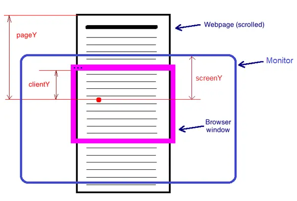
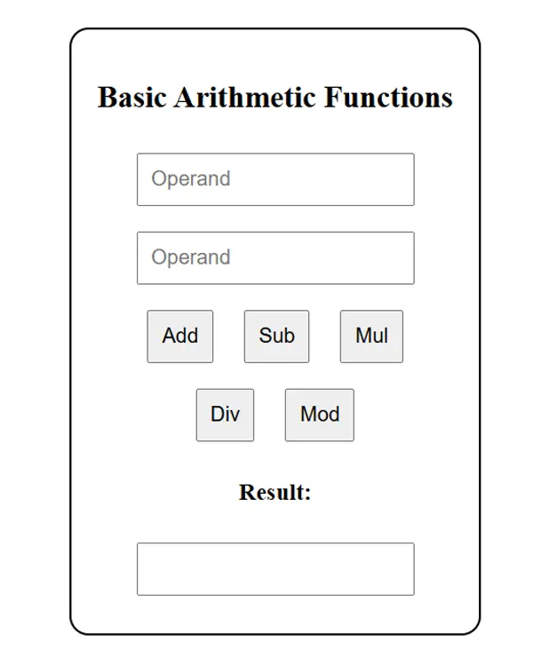
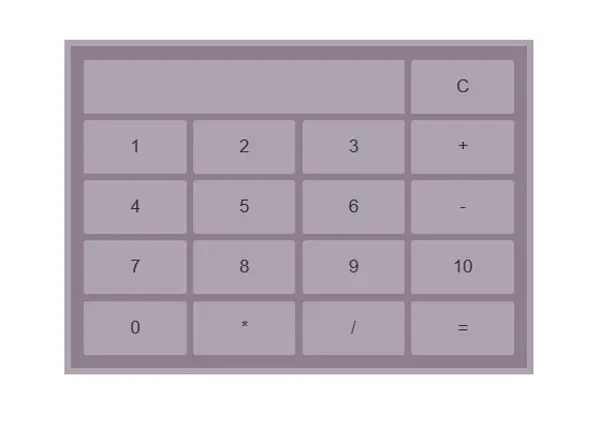

# Web Application Programming

### Unit 2: JavaScript and Client-Side Programming

Credit To: [Bidur Sapkota](https://www.bidursapkota.com.np/)

## Table of Contents

1. [Introduction](#introduction)
2. [Need of Client Side Scripting Language](#need-of-client-side-scripting-language)
3. [Formatting and Coding Conventions](#formatting-and-coding-conventions)
4. [Embedding JavaScript in HTML](#embedding-javascript-in-html)
5. [JavaScript Modules](#javascript-modules)
6. [NoScript Tag](#noscript-tag)
7. [Comments](#comments)
8. [Some Important Basics](#some-important-basics)
9. [Operators](#operators)
10. [Control Structures](#control-structures)
11. [Arrays and For Each Loop](#arrays-and-for-each-loop)
12. [Defining and Invoking Functions](#defining-and-invoking-functions)
13. [Objects](#objects)
14. [Built-in Objects](#built-in-objects)
15. [Date Objects](#date-objects)
16. [Interacting With The Browser](#interacting-with-the-browser)
17. [Windows & Frames](#windows--frames)
18. [Document Object Model (DOM)](#document-object-model-dom)
19. [Event Handling](#event-handling)
20. [Forms and Client Side Validation](#forms-and-client-side-validation)
21. [Callback](#callbacks)
22. [Promise, then, async / await](#promise-then-async--await)
23. [JavaScript Execution Model](#javascript-execution-model)
24. [Cookies](#cookies)
25. [Session Storage](#session-storage)
26. [Local Storage](#local-storage)
27. [Regular Expressions](#regular-expressions)
28. [Client Side Form Validation with Regular Expression](#client-side-form-validation-with-regular-expression)
29. [Questions - JavaScript](#questions---javascript)
30. [Lab: CRUD with JavaScript](#lab-crud-with-javascript)
31. [jQuery Basics](#jquery-basics)
32. [Questions - jQuery](#questions---jquery)
33. [Lab: CRUD with jQuery](#lab-crud-with-jquery)

---


## Introduction

**What is Scripting?**

Scripting refers to writing programs (scripts) that automate tasks, manipulate data, or add interactivity to applications. Unlike compiled languages, scripting languages are typically interpreted at runtime, making them flexible and quick to develop with.

**Common scripting languages:**

- JavaScript (web browsers, Node.js)
- Python (general-purpose automation)
- Bash/Shell (system administration)
- PHP (server-side web development)

**Key characteristics of scripting:**

- Interpreted execution - code runs line-by-line without pre-compilation
- Dynamic typing - variable types determined at runtime

**Question**

**What is JavaScript? What are the potential platforms where JavaScript can be used?**

**Explain features of JavaScript?**

JavaScript is a high-level, interpreted programming language that enables interactive web pages. It's an essential part of web applications alongside HTML and CSS.

### Platforms Where JavaScript Can Be Used

JavaScript has evolved far beyond its web browser origins and can now run on numerous platforms:

**Web Development:**

- Client-side scripting in web browsers
- Server-side development with Node.js
- Progressive Web Applications (PWAs)
- Single Page Applications (SPAs)

**Mobile Development:**

- Cross-platform mobile apps with React Native
- Hybrid apps using frameworks like Cordova or Ionic
- Native mobile development with NativeScript

**Desktop Applications:**

- Cross-platform desktop apps with Electron (like VS Code, Discord, Slack)
- Windows apps with Windows Script Host
- macOS automation with JXA (JavaScript for Automation)

**Server and Backend:**

- Web servers and APIs with Node.js
- Serverless functions on platforms like AWS Lambda, Vercel, Netlify
- Microservices architecture

**Machine Learning**

- TensorFlow.js: The most prominent JavaScript ML library, developed by Google.

  **It allows you to:**

- Run pre-trained models in browsers and Node.js
- Train models directly in JavaScript
- Convert models from Python TensorFlow to JavaScript
- Leverage GPU acceleration through WebGL
- Can run ml on browser, server, mobile apps, desktop apps

**Key features / characteristics:**

- **Dynamic typing:** Variables don't need explicit type declarations
- **Interpreted:** Code is executed directly without compilation
- **Event-driven:** Responds to user interactions like clicks, form submissions
- **Cross-platform:** Code can run on any device with a JavaScript engine. Runs in browsers, servers (Node.js), mobile apps, and desktop applications
- **Regular Expression Support:** Built-in support for pattern matching and text manipulation through regular expressions.
- **Extensive Ecosystem:** Massive library and framework ecosystem through npm, providing solutions for virtually any development need.
- **Asynchronous Programming:** Native support for handling asynchronous operations through callbacks, promises, and async/await syntax.
- **Automatic Memory Management:** Built-in garbage collection handles memory allocation and deallocation automatically.
- **Event-Driven Programming:** Excellent support for handling user interactions and asynchronous events through event listeners and callbacks.

### Structure of JavaScript Program

- **Comments:**
  Comments are used to add explanatory notes to your code. They are not executed by the JavaScript interpreter and are often used to provide information about the code's purpose, author, or usage.
- **Variables:**
  Declare variables to store data. JavaScript is loosely typed, so you don't need to specify the data type when declaring variables.
- **Functions:**
  Functions are reusable blocks of code that perform a specific task. They can take parameters and return values
- **Conditional Statements:**
  Use conditional statements to make decisions in your code. The most common conditional statements are if, else if, and else.
- **Loops:**
  Loops allow you to execute a block of code repeatedly. Common types of loops in JavaScript are for, while, and do...while.
- **Event Handling:**
  In web development, JavaScript is often used to handle events triggered by user interactions (e.g., clicking a button, submitting a form). Event handlers are functions that respond to these events.
- **Objects and Classes:**
  JavaScript supports object-oriented programming. You can define objects and classes to represent data and behavior.
- **Error Handling:**
  JavaScript provides mechanisms for handling errors gracefully using try...catch blocks.
- **Modules and Imports (ES6):**
  In modern JavaScript (ES6 and later), you can use modules to organize your code into reusable pieces. You can export and import functions, classes, or variables from one module to another.
- **Execution:**
  Finally, your JavaScript code needs to be executed. In web development, this is often done within HTML documents by including script tags or through external JavaScript files linked to HTML.

---

## Need of Client Side Scripting Language

**Question**

**What is need for client side scripting?**

Client-side scripting allows code to run in the user's browser, providing:

- **Interactivity:** Enhances user experience by making web pages interactive.
- **Validation:** Performs form validation before data is sent to the server.
- **Manipulation:** Allows manipulation of the DOM (Document Object Model) to change content and structure of web pages dynamically.
- **Performance:** Reduces server load by handling tasks locally on the user's device.
- **Asynchronous Communication:** Enables asynchronous data exchange with the server using technologies like AJAX.

```javascript
// Example: Dynamic content without server request
document.getElementById("demo").innerHTML =
  "Content changed without page reload!";
```

---

## Formatting and Coding Conventions

Good JavaScript follows these conventions:

- Use camelCase for variables and functions
- variable names should start with a letter, underscore (\_), or dollar sign ($), avoid reserved keywords, and be descriptive and meaningful.
- Use PascalCase for constructors
- Use meaningful names
- Proper indentation and Consistent spacing
- Semicolons to separate statements is considered good practice, but they are not always required
- Use curly braces to indicate code blocks
- Use comments to explain your code and improve its readability
- Include error handling in your code to prevent crashes and unexpected behavior. Use try/catch statements to handle errors gracefully.

```javascript
// Good formatting
let userName = "John";
let userAge = 25;

function calculateTotal(price, tax) {
  let total = price + price * tax;
  return total;
}

// Bad formatting (avoid this)
let n = "John";
let a = 25;
function calc(p, t) {
  return p + p * t;
}
```

---

## Embedding JavaScript in HTML

**Question**

**What are different way to include JavaScript in HTML document?**

### 1. Inline JavaScript

- You can write JavaScript directly within HTML elements using event attributes:

```html
<button onclick="alert('Hello!')">Click me</button>
<body onload="console.log('Page loaded')"></body>
```

### 2. Internal JavaScript with `<script>` tags

- **Script tag:** To include a JavaScript file in an HTML document, you can use a `<script>` tag and specify the file's URL in the `src` attribute.

```html
<script>
  function myFunction() {
    console.log("Hello from internal script");
  }
  myFunction();
</script>
```

- **Loading order:** JavaScript files are loaded and executed in the order they appear in the HTML document, from top to bottom.

### 3. External JavaScript files

- **File extension:** JavaScript files typically have a .js file extension.
- Link to separate .js files using the src attribute:

```html
<script src="script.js"></script>
```

- **External vs Internal vs Inline scripts:** External scripts are preferred for larger scripts, while Internal / Inline scripts are used for smaller scripts or scripts that require specific HTML elements.

### Advantage of external JavaScript Files

- It makes the code more modular and easier to manage.
- It allows the browser to cache the JavaScript file, which can improve website performance.
- It reduces the size of the HTML file, which can improve website loading times.

---

## JavaScript Modules

JavaScript modules let you split code into separate files, making it reusable, maintainable, and easier to manage.

A module is a JavaScript file that:

- Has its own scope
- Can export variables, functions, or classes
- Can import from other modules
- By default, variables in a module are not global

**Exporting from a module**

**Named export**

```js
// math.js
export const add = (a, b) => a + b;
export const sub = (a, b) => a - b;
```

Importing:

```js
import { add, sub } from "./math.js";

console.log(add(2, 3));
```

---

**Default export**

Only one default export per file

```js
// greet.js
export default function greet(name) {
  return `Hello ${name}`;
}
```

Importing:

```js
import greet from "./greet.js";

console.log(greet("Bidur"));
```

---

**Mixed exports**

```js
// user.js
export const role = "admin";

export default function getUser() {
  return { name: "Bidur", role };
}
```

```js
import getUser, { role } from "./user.js";
```

**Rename imports**

```js
import { add as sum } from "./math.js";
```

**Import everything**

```js
import * as math from "./math.js";

math.add(2, 3);
```

## Why use modules?

- Code reusability
- Avoid global pollution
- Better project structure
- Easier testing & maintenance

---

## NoScript Tag

Provides fallback content when JavaScript is disabled.

```html
<!DOCTYPE html>
<html>
  <body>
    <script>
      document.write("JavaScript is enabled!");
    </script>

    <noscript>
      <p>
        JavaScript is disabled in your browser. Please enable it for full
        functionality.
      </p>
    </noscript>
  </body>
</html>
```

---

## Comments

Comments help document code and are ignored during execution.

```javascript
// Single line comment
let x = 5; // End of line comment

/*
Multi-line comment
This spans multiple lines
*/
let y = 10;
```

---

## Some Important Basics

### Data Types

**A. Primitive Data Types:**

- **Number**
  Represents numeric values, both integers and floating-point numbers.
- **String**
  Represents text. Strings are enclosed in single (' ') or double (" ") quotes.
- **Boolean**
  Represents true or false values.
- **Undefined**
  Represents a variable that has been declared but not assigned a value.
- **Null**
  Represents the intentional absence of any object or value.
- **Symbol (ES6)**
  Represents a unique and immutable value, often used as object property keys.

**B. Composite Data Types:**

- **Object**
  Represents a collection of key-value pairs, where values can be of any data type, including other objects.
- **Array**
  Represents an ordered list of values, often of the same data type. Arrays are indexed starting from 0.
- **Function**
  Functions are a special type of object in JavaScript that can be invoked to perform a specific task. They can also be assigned to variables and passed as arguments to other functions.

```js
// ////////////////////////////////////
// Primitive Data Types
// ////////////////////////////////////

// Number
let num1 = 42;
let num2 = 3.14;

// String
let greeting = "Hello, World!";

// Boolean
let isJavaScriptFun = true;

// Undefined
// A variable that has been declared but not assigned a value.
let unassigned;
console.log(unassigned);

// Null
// Represents the intentional absence of any object value.
let emptyValue = null;

// Symbol
// Introduced in ES6, it is a unique and immutable value.
let key1 = Symbol("key");
let key2 = Symbol("key");
console.log(key1 == key2);

const email = Symbol("Email");

const employee = {
  name: "Aalu",
  age: 30,
  [email]: "a@b.c",
};

console.log(Object.keys(employee));
console.log(employee.name);
console.log(employee["name"]);
console.log(employee[email]);

for (let key in employee) {
  console.log(employee[key]);
}

// logs all symbol properties of employee object
console.log(Object.getOwnPropertySymbols(employee));

// ////////////////////////////////////
// Non Primitive Data Types (Object, Array, Functions)
// ///////////////////////////////////

// Object
// Used to store collections of data and more complex entities.
let person = {
  name: "John",
  age: 30,
};
console.log(person);

// Array
// A special type of object used for storing ordered collections.
let arr = [1, 2, 3, 4, 5, "s", 1.2];
console.log(arr);

// Function
// Also an object, represents a block of code designed to perform a particular task.
function add(a, b) {
  return a + b;
}

// Adding a custom property to the function
add.description = "This function adds two parameters.";
add.string = function (a, b) {
  return `${a}${b}`;
};
// Note: The syntax `${a}${b}` is called a template literal (also known as template string) in JavaScript.

console.log(add(2, 3));
console.log(add("2", 3));
console.log(add(2, "3"));
console.log(add.description);
console.log(add.string(2, 3));

// Functions as Constructors
// Functions can be used as constructors to create objects
function Person(name, age) {
  this.name = name;
  this.age = age;

  this.greet = function () {
    return `Hi!, I am ${this.name}`;
  };
}

const john = new Person("John", 30);
console.log(john.name);
console.log(john);
console.log(john.greet());

class Person2 {
  name;
  age;

  constructor(name, age) {
    this.name = name;
    this.age = age;
  }

  greet() {
    return `Hello, my name is ${this.name} and I am ${this.age} years old.`;
  }
}

const ram = new Person2("John", 30);
console.log(ram.greet());
```

### Statement, Expression and Keywords

- A statement is a piece of code that performs an action or a task.
- An expression is a piece of code that evaluates to a value.
- Set of reserved words that have special meanings within the language is called keywords.
- A block is a set of statements enclosed within curly braces {}.

```js
// declaration statement
let x;
let y = 5;

// assignment statement
x = 10;
x = y + 2;

// conditional statement
if (x > y) {
  console.log("X is greater than Y");
} else if (x === y) {
  console.log("x is equal to y");
} else {
  console.log("x is less than y");
}

// switch statement
switch (x) {
  case 5:
    console.log("x is 5");
    break;
  case 10:
    console.log("x is 10");
    break;
  default:
    console.log("x is something else");
}

// function declaration statement
// return statement
function greet(name) {
  return "Hello " + name + "!";
}

// loop statement
for (let i = 0; i < 5; i++) {
  console.log(i);
}

let i = 0;
while (i < 5) {
  console.log(i);
  i++;
}

i = 0;
do {
  console.log(i);
  i++;
} while (i < 5);

// Break and Continue Statements
for (let i = 0; i < 10; i++) {
  if (i === 5) {
    // break;
    continue;
  }
  console.log(i);
}

// Expression Statement
let z = x + y;
z = x % 3;
console.log(z);
console.log(greet("ram"));

// ternary expression
let age = 16;
let isAdult = age >= 18 ? "Yes" : "No";
console.log(isAdult);

// Try...Catch Statement
try {
  let result = riskyOperation();
  console.log(result);
} catch (error) {
  console.log("An error occurred", error);
  if (error instanceof ReferenceError) {
    throw new Error("Reference Error");
  }
} finally {
  console.log("This will always run");
}

// Object and Array Initializer Expressions
let person = {
  myfirstName: "John",
  mylastName: "Doe",
  myage: 30,
};

let numbers = [1, 2, 3, 4, 5];

// Property Access Expressions
let firstName = person.myfirstName; // "John"
let lastNumber = numbers[4]; // 5

// Destructuring Expressions
let [first, second] = numbers; // first is 1, second is 2
let { myfirstName, myage } = person; // name is "Bob", age is 25

console.log(first, second);
console.log(myfirstName, myage);
```

### Var, let and const

```js
// you can redeclare variable with same name with var
// weird
var myname = "aalu";
console.log(myname);
myname = "pidalu";
console.log(myname);
var myname = "aarko aalu";
console.log(myname);

// you cannot redeclare variable with same name with let
let mysurname = "aalu";
console.log(mysurname);
mysurname = "pidalu";
console.log(mysurname);
//   let mysurname = "aarko aalu"; //  <------------------- error
//   console.log(mysurname);

// var is not scoped within block
// block means within curly braces like of for loops

var gods = ["ram", "laxman", "krishna"];
var weapons = ["bow", "arrow", "sudarsan"];

for (var item of gods) {
  // make it let
  console.log(item);
  for (var item of weapons) {
    // make it let
    //
  }
  console.log(item);
}

const mymiddlename = "aalu";
console.log(mymiddlename);
//   mymiddlename = "pidalu"; //  <----------------- error
//   console.log(mymiddlename);

const myarray = ["apple", "ball"];
console.log(myarray);
myarray.push("cat");
console.log(myarray);
myarray.pop();
console.log(myarray);

const myarray2 = Array(5);
console.log(myarray2);
myarray2[0] = "apple";
console.log(myarray2);
```

---

## Operators

- Operators are special symbols or keywords used to perform operations on operands.
- Operands can be variables, values, or expressions, and operators determine how these operands are manipulated or compared.

### Arithmetic Operators

```javascript
let a = 10,
  b = 3;

console.log(a + b); // Addition: 13
console.log(a - b); // Subtraction: 7
console.log(a * b); // Multiplication: 30
console.log(a / b); // Division: 3.333...
console.log(a % b); // Modulus: 1
console.log(a ** b); // Exponentiation: 1000
```

### Assignment Operators

```javascript
let x = 5;
x += 3; // x = x + 3 = 8
x -= 2; // x = x - 2 = 6
x *= 4; // x = x * 4 = 24
x /= 3; // x = x / 3 = 8
```

### Comparison Operators

```javascript
let num1 = 5,
  num2 = "5";

console.log(num1 == num2); // true (value comparison)
console.log(num1 === num2); // false (strict comparison)
console.log(num1 != num2); // false
console.log(num1 !== num2); // true
console.log(num1 > 3); // true
console.log(num1 <= 5); // true
```

### Logical Operators

```javascript
let isTrue = true,
  isFalse = false;

console.log(isTrue && isFalse); // AND: false
console.log(isTrue || isFalse); // OR: true
console.log(!isTrue); // NOT: false
```

### typeof Operator

```js
let a = 1;

const type = typeof a;
console.log(type);
console.log(typeof type);
```

### Spread Operator

```js
// spread operator
const originalArray = [1, 2, 3];
const copyarr1 = originalArray;
copyarr1[1] = 5;
console.log(copyarr1, originalArray);

const copyarr2 = [...originalArray];
copyarr2[1] = 7;
console.log(copyarr2, originalArray);

const array1 = [1, 2, 3];
const array2 = [4, 5, 6];
const concatenatedArray = [...array1, ...array2];
console.log(concatenatedArray);

const array = [1, 2, 3];
const newArray = [0, ...array, 4];
console.log(newArray);

const person1 = {
  name: "Ram",
  age: 24,
};
const person2 = person1;
person2.address = "Lalitpur";
console.log(person2);
console.log(person1);

const person3 = { ...person1 };
person3.address = "Kathmandu";
console.log(person3);

const person4 = { ...person1, address: "Bhaktapur", isDead: false };
console.log(person4);

const obj1 = { a: 1, b: 2 };
const obj2 = { c: 3, d: 4 };
const mergedObject = { ...obj1, ...obj2 };
console.log(mergedObject);

const numbers = [1, 2, 3];
const add1 = (a, b, c) => a + b + c;
console.log(add1(...numbers));

const add2 = (...args) => args[0] + args[1] + args[2];
console.log(add2(1, 2, 3));
console.log(add2(...numbers));

function add3(...args) {
  return arguments[0] + arguments[1] + arguments[2];
  // return args[0] + args[1] + args[2];
}
console.log(add3(1, 2, 3));
console.log(add3(...numbers));

const str = "hello";
const chars = [...str];
console.log(chars); // ['h', 'e', 'l', 'l', 'o']
```

**Question**

**Write a program which includes a function sum(). This function sum() should be designed to add an arbitrary list of parameters. (For e.g., if you call the function sum() as sum(1, 2) it should return the result 3 and if again you call the function sum() as sum(1, 3, 4) it should return the result 8).**

```js
// Function that sums any number of arguments
function sum(...numbers) {
  let total = 0;
  for (let num of numbers) {
    // can use forEach too
    total += num;
  }
  return total;
}

// Test examples
console.log(sum(1, 2)); // Output: 3
console.log(sum(1, 3, 4)); // Output: 8
console.log(sum(10, 20, 30)); // Output: 60
console.log(sum()); // Output: 0 (no input)
```

#### Using arguments (older way):

```js
function sum() {
  let total = 0;
  for (let i = 0; i < arguments.length; i++) {
    total += arguments[i];
  }
  return total;
}

console.log(sum(1, 2)); // 3
console.log(sum(1, 3, 4)); // 8
```

#### For Interviews (reduce, filter, find, map, forEach, ...)

```js
const sum = (...numbers) => numbers.reduce((acc, val) => acc + val, 0);
```

---

## Control Structures

### If-Else Statement

```javascript
let age = 18;

if (age >= 18) {
  console.log("You can vote!");
} else if (age >= 16) {
  console.log("You can get a driver's license!");
} else {
  console.log("You're too young for both!");
}
```

### Switch Statement

```javascript
let day = 3;
let dayName;

switch (day) {
  case 1:
    dayName = "Monday";
    break;
  case 2:
    dayName = "Tuesday";
    break;
  case 3:
    dayName = "Wednesday";
    break;
  default:
    dayName = "Unknown day";
}

console.log(dayName); // Wednesday
```

### Loops

#### For Loop

```javascript
// Basic for loop
for (let i = 1; i <= 5; i++) {
  console.log("Count: " + i);
}

// For loop with array
let colors = ["red", "green", "blue"];
for (let i = 0; i < colors.length; i++) {
  console.log(colors[i]);
}
```

#### While Loop

```javascript
let count = 1;
while (count <= 3) {
  console.log("While loop count: " + count);
  count++;
}
```

#### Do-While Loop

```javascript
let num = 1;
do {
  console.log("Do-while count: " + num);
  num++;
} while (num <= 3);
```

---

## Arrays and For Each Loop

### Array Creation and Manipulation

```javascript
// Creating arrays
let fruits = ["apple", "banana", "orange"];
let numbers = [1, 2, 3, 4, 5];
let mixed = ["text", 42, true, null];

// Array methods
fruits.push("grape"); // Add to end
fruits.unshift("mango"); // Add to beginning
fruits.shift("mango"); // Remove to beginning
let removed = fruits.pop(); // Remove from end
fruits.splice(1, 1); // Remove at index 1 --- splice(start, deleteCount)

console.log(fruits); // ["mango", "banana", "orange"]
console.log("Length: " + fruits.length);
```

### For Each Loop

```javascript
let animals = ["cat", "dog", "bird"];

// forEach method
animals.forEach(function (animal, index) {
  console.log(index + ": " + animal);
});

// Arrow function version
animals.forEach((animal, index) => {
  console.log(`${index}: ${animal}`);
});

// For-in loop
for (let index in animals) {
  console.log(index + ": " + animals[index]);
}

// For-of loop
for (let animal of animals) {
  console.log(animal);
}
```

**Question**

**Write JavaScript code to print smallest and largest numbers among 10 elements of an array.**

```js
// Sample array with 10 numbers
const numbers = [15, 3, 22, 7, 8, 19, 27, 4, 1, 12];

// Initialize smallest and largest to the first element
let smallest = numbers[0];
let largest = numbers[0];

// Loop through the array
for (let i = 1; i < numbers.length; i++) {
  if (numbers[i] < smallest) {
    smallest = numbers[i];
  }
  if (numbers[i] > largest) {
    largest = numbers[i];
  }
}

console.log("Array:", numbers);
console.log("Smallest number:", smallest);
console.log("Largest number:", largest);
```

#### Using Math

```js
// Sample array with 10 numbers
const numbers = [15, 3, 22, 7, 8, 19, 27, 4, 1, 12];

// Find smallest and largest using Math functions
const smallest = Math.min(...numbers);
const largest = Math.max(...numbers);

console.log("Array:", numbers);
console.log("Smallest number:", smallest);
console.log("Largest number:", largest);
```

---

## Defining and Invoking Functions

### Function Declaration

```javascript
// Function declaration
function greet(name) {
  return "Hello, " + name + "!";
}

// Function call
let message = greet("John");
console.log(message); // Hello, John!
```

### Function Expression

```javascript
// Function expression
let multiply = function (a, b) {
  return a * b;
};

let result = multiply(4, 5);
console.log(result); // 20
```

### Arrow Functions

```javascript
// Arrow function
let add = (a, b) => a + b;
let square = (x) => x * x;

console.log(add(3, 4)); // 7
console.log(square(5)); // 25
```

### Function with Default Parameters

```javascript
function introduce(name = "Guest", age = 0) {
  return `Hi, I'm ${name} and I'm ${age} years old.`;
}

console.log(introduce()); // Hi, I'm Guest and I'm 0 years old.
console.log(introduce("Alice", 25)); // Hi, I'm Alice and I'm 25 years old.
```

### Anonymous Functions

```html
<button onclick="(function(){console.log('button clicked');})();">Click</button>
```

### Normal function vs Arrow function

```js
function normalFunction(a, b) {
  return a + b;
}

// Or as a function expression:
const normalFun = function (a, b) {
  return a + b; // requires return keyword to retrun value
};

const arrowFunction = (a, b) => a + b; // does not require return

// Normal fn has its own 'this' context
// which is dynamically scoped based on how the function is called.
const obj1 = {
  value: 10,
  normalFunction: function () {
    console.log(this.value); // `this` refers to `obj1`
  },
};

obj1.normalFunction(); // logs 10

// Arrow function does not have its own 'this' context
const obj = {
  value: 10,
  arrowFunction: () => {
    console.log(this.value); // `this` refers to the outer scope, not `obj`
  },
};

obj.arrowFunction(); // logs `undefined`

function OuterContext() {
  this.value = 20;

  const obj = {
    value: 10,
    arrowFunction: () => {
      console.log(this.value); // `this` refers to `OuterContext`'s `this`
    },
  };

  obj.arrowFunction(); // Output: 20
}

new OuterContext();

// Normal function have arguments object
// that contains all the arguments passed to the function
function normalFunction() {
  console.log(arguments);
}
normalFunction(1, 2, 3); // logs [1, 2, 3]

// Arrow function does not have arguments objects
const arrowFunction2 = (...args) => {
  console.log(args);
};

arrowFunction2(1, 2, 3); // logs [1, 2, 3]

// Normal function can be used as constructor
function Employee(name) {
  this.name = name;
}

const person = new Employee("Ram");
console.log(person);

// Hoisting
// Normal Function declarations are hoisted, meaning they can be called before they are defined in the code.
sayHello("Alice");
// sayHi("Alice");
// sayHi2("Alice");
function sayHello(name) {
  console.log("Hello, " + name + "!");
}

const sayHi = function (name) {
  console.log("Hello, " + name + "!");
};
sayHi("Alice");

const sayHi2 = (name) => {
  console.log("Hello, " + name + "!");
};
sayHi2("Alice");
```

**Question**

**What is arrow function? Write JavaScript code to calculate factorial of given number using arrow function.**

- An arrow function is a shorter syntax for writing functions in JavaScript. It was introduced in ES6 (ECMAScript 2015).
- Have a cleaner, shorter syntax.
- Do not have their own this, arguments, or super.

#### Syntax

```js
const functionName = (parameters) => {
  // function body
};
```

#### Example

```js
const add = (a, b) => a + b;
console.log(add(2, 3)); // Output: 5
```

#### Factorial Using Arrow Function

```js
const factorial = (n) => {
  if (n < 0) return "Invalid input";
  let result = 1;
  for (let i = 2; i <= n; i++) {
    result *= i;
  }
  return result;
};

const number = 5;
const fact = factorial(number);
console.log(`Factorial of ${number} is ${fact}`);
```

---

---

---

## Objects

### Class

```js
class Vehicle {
  // Public
  color;

  // "Protected" by convention (underscore prefix)
  _engine;

  // Private (truly private)
  #serialNumber;

  constructor(color, engine) {
    this.color = color;
    this._engine = engine; // "Protected"
    this.#serialNumber = Math.random().toString(36); // Private
  }

  // Protected method by convention
  _startEngine() {
    console.log(`${this._engine} engine starting...`);
  }

  showDetails() {
    console.log(`${this.#serialNumber} car with color ${color} is ready`);
  }
}

class Car extends Vehicle {
  constructor(color, engine, doors) {
    super(color, engine);
    this.doors = doors;
  }

  start() {
    // Can access "protected" properties from parent
    // console.log(`Car with ${this._engine} engine`);

    // Can call "protected" method from parent
    this._startEngine();

    // Cannot access private properties from parent
    // console.log(this.#serialNumber); // Error!

    super.showDetails();
  }
}

// Usage Examples
const car1 = new Car("red", "V6", 4);
car1.start();

// "Protected" properties are still accessible (by convention only)
console.log("Accessing 'protected':", car1._engine); // V6 (works but shouldn't be used)
```

### Different ways to create objects

```js
const person = {
  name: "Ram",
  age: 23,
  address: {
    district: "Lalitpur",
    country: "Nepal",
  },
  kill: function () {
    this.isDead = true;
  },
};
console.log(person);
person.age = 33;
console.log(person.age);
console.log(person["age"]);
person.isAlive = true;
person["isDead"] = false;
console.log(person);
console.log(person.isAlive);
delete person.isAlive;
console.log(person.isAlive);
person.kill();
console.log(person);

function Person(name, age) {
  this.name = name;
  this.age = age;
}
const person2 = new Person("Ram", 50);
person2.isAlive = true;
console.log(person2);

const person3 = new Object({
  name: "aalu",
  surname: "pidalu",
  age: 1,
});

console.log(person3.age);
person3.age = 2;
person3.address = "karkalo";
person3["root"] = "soil";
console.log(person3.age);
console.log(person3);
```

---

## Built-in Objects

### String Object

```javascript
let str = "hello, world!   ";
let str2 = new String("Hello, world!   ");
let str3 = String("hello, world!   ");
console.log(str);
console.log(str2);
console.log(str3);

console.log(str.length);
console.log(str2.length);
console.log(str2.charAt(1));
console.log(str2.includes("world"));
console.log(str2.includes("world", 7));
console.log(str2.indexOf("world"));
console.log(str2.indexOf("o"));
console.log(str2.lastIndexOf("o"));
console.log(str2.slice(7, 12));
console.log(str2.slice(7, -4)); // -ve counts from last. -1 = last, -2 = 2nd last
console.log(str.substring(7, 12));
console.log(str.substring(12, 7)); //if a> b, swaps
console.log(str.substring(7, -1));
console.log(str.split(","));
console.log(str.toUpperCase());
console.log(str);
console.log(str.trim());
console.log(str.trim().length);
console.log(str.replace("world", "javascript"));
console.log(str);
console.log(str.startsWith("hello"));
console.log(str.endsWith(" "));
console.log(str.endsWith("world"));
console.log(str.endsWith("world", 12));

let country = "Nepal";
let city = "Lalitpur";
let address = city.concat(", ", country, "!");
console.log(address);

let num = "2";
console.log(num.padStart(3, "0")); // 002
console.log(num.padEnd(4, "0")); // 2000
```

### Number Object

```javascript
let num1 = Number(13);
let num2 = new Number(13);
let num3 = 13;

console.log(num1);
console.log(num2);
console.log(num3);

console.log(Number("42")); // Output: 42
console.log(Number(true)); // Output: 1
console.log(Number(false)); // Output: 0
console.log(Number(null)); // Output: 0
console.log(Number("aalu")); // Output: NaN
console.log(Number(undefined)); // Output: NaN

console.log(Number.MAX_VALUE); // Output: 1.7976931348623157e+308
console.log(Number.MIN_VALUE); // Output: 5e-324
console.log(Number.POSITIVE_INFINITY); // Output: Infinity
console.log(Number.NEGATIVE_INFINITY); // Output: -Infinity
console.log(Number.NaN); // Output: NaN

console.log(Number.isFinite(42)); // Output: true
console.log(Number.isFinite(Infinity)); // Output: false

console.log(Number.isInteger(42)); // Output: true
console.log(Number.isInteger(42.1)); // Output: false

console.log(Number.isNaN(NaN)); // Output: true.   does not work with string and undefined
console.log(Number.isNaN(42)); // Output: false

console.log(Number.parseFloat("42.42")); // Output: 42.42
console.log(Number.parseFloat("42")); // Output: 42

console.log(Number.parseInt("42.42")); // Output: 42
console.log(Number.parseInt("42")); // Output: 42

let num = 123.456;

console.log(num.toFixed(2)); // 123.46
console.log(num.toPrecision(4)); // 123.5
```

**Question**

**What is NaN in JavaScript?**

- NaN stands for "Not a Number".
- It is a special value in JavaScript that indicates a value that is not a valid number — even though it is technically of the type number.

- When does NaN occur?

  - When you try to perform a numerical operation on a non-numeric value.

  - When parsing a string that doesn't contain a valid number using parseInt, parseFloat, etc.

### Example

```js
console.log(0 / 0); // NaN
console.log("hello" - 5); // NaN
console.log(parseInt("abc")); // NaN

console.log(typeof NaN); // "number" (Yes, it's strange!)
```

### Checking NaN

```js
console.log(isNaN("hello")); // true
console.log(Number.isNaN(NaN)); // true
```

---

### Math Object

```javascript
// Constants
console.log(Math.PI); // 3.141592653589793
console.log(Math.E); // 2.718281828459045

// Common functions
console.log(Math.abs(-5)); // 5
console.log(Math.round(4.7)); // 5
console.log(Math.floor(4.7)); // 4
console.log(Math.ceil(4.2)); // 5
console.log(Math.max(1, 3, 2)); // 3
console.log(Math.min(1, 3, 2)); // 1
console.log(Math.random()); // Random number between 0 and 1
console.log(Math.sqrt(25)); // 5
console.log(Math.pow(2, 3)); // 8
console.log(Math.sign(-5)); // -1
console.log(Math.sign(5)); // 1
```

---

## Date Objects

```javascript
// Creating date objects
let now = new Date();
let specificDate = new Date(2024, 0, 15); // January 15, 2024
let fromString = new Date("2024-01-15");

console.log(now); // Current date and time

// Getting date components
console.log(now.getFullYear()); // Current year
console.log(now.getMonth()); // Month (0-11)
console.log(now.getDate()); // Day of month
console.log(now.getDay()); // Day of week (0-6)
console.log(now.getHours()); // Hours
console.log(now.getMinutes()); // Minutes
console.log(now.getSeconds()); // Seconds

// Setting date components
now.setFullYear(2025);
now.setMonth(11); // December
now.setDate(25); // Christmas

console.log(now.toDateString()); // Formatted date string
console.log(now.toTimeString()); // Formatted time string
```

**Question**

**Write a program that displays the continuous time in the web page. The time should be in the format of HH:MM:SS.**

```html
<html>
  <head>
    <title>Live Clock</title>
    <style>
      #clock {
        text-align: center;
        margin-top: 100px;
      }
    </style>
  </head>
  <body>
    <h3 id="clock">--:--:--</h3>

    <script>
      function updateClock() {
        const now = new Date();

        // Get hours, minutes, seconds
        let hours = now.getHours().toString().padStart(2, "0");
        let minutes = now.getMinutes().toString().padStart(2, "0");
        let seconds = now.getSeconds().toString().padStart(2, "0");

        // Format: HH:MM:SS
        const timeString = `${hours}:${minutes}:${seconds}`;

        // Display in the page
        document.getElementById("clock").textContent = timeString;
      }

      // Update clock immediately
      updateClock();

      // Update every 1000ms (1 second)
      setInterval(updateClock, 1000);
    </script>
  </body>
</html>
```

---

## Interacting With The Browser

### Window Object

```javascript
// Window properties
console.log(window.innerWidth); // Browser window width
console.log(window.innerHeight); // Browser window height
console.log(window.location.href); // Current URL

// Window methods
window.alert("This is an alert!");
let userResponse = window.confirm("Do you want to continue?");
let userInput = window.prompt("Enter your name:");

// Navigation
// window.open("https://example.com", "_blank");
// window.close(); // Close current window
// window.location.href = "https://example.com"; // Navigate to URL
```

### Example

```html
<html>
  <head>
    <title>Window Object</title>
  </head>
  <body>
    <h1>Window Object Example</h1>
    <button id="openWindow">Open New Window</button>
    <button id="changeLocation">Change Location</button>
    <div style="height: 200vh"></div>
    <script>
      console.log(
        "Window inner size: " + window.innerWidth + "x" + window.innerHeight
      );

      // Handling button clicks
      document.getElementById("openWindow").addEventListener("click", () => {
        window.open("https://www.apple.com");
      });

      document
        .getElementById("changeLocation")
        .addEventListener("click", () => {
          window.location.href = "https://www.apple.com";
        });

      // Handling window events
      window.addEventListener("resize", () => {
        console.log(
          "Window resized to: " + window.innerWidth + "x" + window.innerHeight
        );
      });

      window.addEventListener("scroll", () => {
        console.log("Window scrolled. Scroll position: " + window.scrollY);
      });

      // Storing a string
      localStorage.setItem("username", "John Doe");

      //   window.localStorage.removeItem("username");
      // Storing an object
      const user = {
        name: "John Doe",
        age: 30,
        email: "johndoe@example.com",
      };
      localStorage.setItem("user", JSON.stringify(user));

      // Retrieving a string
      const username = localStorage.getItem("username");
      console.log(username); // Output: John Doe

      // Retrieving an object
      const userRetrived = JSON.parse(localStorage.getItem("user"));
      console.log(user); // Output: { name: 'John Doe', age: 30, email: 'johndoe@example.com' }
    </script>
  </body>
</html>
```

### Popup Example

**Question**

**What is dialog box? Explain different dialog boxes with suitable example in JavaScript.**

- A dialog box in JavaScript is a pop-up window that allows you to interact with the user. It's commonly used for:
  - Showing messages
  - Asking for confirmation
  - Taking input
- These are built-in methods of the window object and work in all browsers.

#### **Types:**

- The alert() method displays a simple message to the user in an alert box.
- The confirm() method displays a confirmation dialog box with two buttons: OK and Cancel.
- The prompt() method displays a dialog box with a text input field where the user can enter data.

#### Simple Example

```html
<html>
  <head>
    <title>Document</title>
  </head>
  <body>
    <button onclick="showMessage()">Show Message</button>
    <button onclick="confirmFromUser()">Confirm Delete</button>
    <button onclick="inputName()">Input Name</button>

    <script>
      function showMessage() {
        alert("This is your message");
      }

      function confirmFromUser() {
        let isConfirmed = confirm("Are your Sure to delete?");
        isConfirmed ? alert("Deleted") : alert("Cancelled");
      }

      function inputName() {
        let name = prompt("Enter your name");
        name ? alert(`Your name is ${name}`) : alert("Empty");
      }
    </script>
  </body>
</html>
```

#### Integrated Example

```html
<html>
  <head>
    <title>Pop Up</title>
  </head>
  <body>
    <h1>Project 1</h1>
    <button onclick="deleteProject()">Delete Project</button>
    <script>
      function deleteProject() {
        const isConfirmed = confirm("Are you sure to delete?");
        if (isConfirmed) {
          const projectName = prompt("Type Project Name to Verify Deletion");
          if (projectName == "Project 1") {
            document.body.removeChild(document.getElementsByTagName("h1")[0]);
          } else {
            alert("Project Name did not match");
          }
        } else {
          alert("Deleteion Cancelled");
        }
      }
    </script>
  </body>
</html>
```

---

### Screen Object

- screen object is inside window object too i.e. window.screen.width

```javascript
console.log(screen.width); // Screen width
console.log(screen.height); // Screen height
console.log(screen.availWidth); // Available screen width
console.log(screen.availHeight); // Available screen height
console.log(screen.colorDepth); // Color depth
```

### Navigator Object

- navigator object is inside window object too

```javascript
console.log(navigator.userAgent); // Browser information
console.log(navigator.platform); // Operating system
console.log(navigator.language); // Browser language
console.log(navigator.onLine); // Online status
console.log(navigator.cookieEnabled); // Cookie support
```

---

## Windows & Frames

### Working with Windows

```javascript
// Open new window
let newWindow = window.open("", "myWindow", "width=400,height=300");
newWindow.document.write("<h1>New Window Content</h1>");

// Close window
// newWindow.close();
```

### Working with Frames

```html
<!-- HTML with frames -->
<iframe id="myFrame" src="about:blank" width="300" height="200"></iframe>

<script>
  // Access frame content
  let frame = document.getElementById("myFrame");

  // Write to frame
  frame.src = "data:text/html,<h1>Frame Content</h1>";

  // Change iframe source
  // iframe.src = 'https://apple.com';
  // iframe.src = 'example.html';
</script>
```

---

## Document Object Model (DOM)

**Question**

**Explain the concept structure and importance of DOM.**

#### What is the DOM?

- The Document Object Model (DOM) is a programming interface for web documents. It represents the structure of an HTML or XML document as a tree of nodes.

- Each element in the HTML (like `<html>`, `<body>`, `<ul>`, `<li>`, etc.) becomes a node in this tree. These nodes are related to each other as parents, children, siblings, etc.

#### Structure of the DOM


**Root Node:**

- `<html>` is the root of the DOM tree.
- It contains all other elements.

**Nodes:**

- All tags like `<head>`, `<body>`, `<nav>`, etc., are nodes.
- Nodes can be elements, text, attributes, or comments.

**Parent-Child Relationship:**

- For example, `<ul>` is the parent of its `<li>` children.
  `<body>` is the parent of `<nav>` and `<section>`.

**Leaves:**

- A leaf is a node without children (e.g., `` or individual `<li>`'s).

**Branches:**

- Intermediate nodes with children (e.g., `<nav>`, `<ul>`).

#### Structure of the DOM

```html
<html>
  <head>
    <title>My Page</title>
  </head>
  <body>
    <h1>Welcome</h1>
    <p>This is some text.</p>
  </body>
</html>
```

#### Why is the DOM Important?

**Dynamic Content:**

- JavaScript can access and modify the DOM to update web pages without reloading, enabling dynamic content.

**Interactivity:**

- DOM lets scripts respond to user interactions (clicks, keypresses, etc.).

**Structure and Organization:**

- It provides a hierarchical representation of content, making it easier for developers and browsers to work with.

**Foundation for Frameworks:**

- Modern JavaScript frameworks like React, Angular, and Vue.js are built upon the DOM, providing higher-level abstractions and tools to efficiently manage and manipulate the DOM for complex applications.

#### Example: JavaScript DOM Manipulation

```js
const newLi = document.createElement("li");
const textNode = document.createTextNode("New Item");
newLi.appendChild(textNode);
document.querySelector("ul").appendChild(newLi);
// ---------------
// ------OR-------
// ---------------
const newLi = document.createElement("li");
newLi.textContent = "New Item"; // newLi.innerText also works (behind the scenes, browser creates text node)
document.querySelector("ul").appendChild(newLi);

// See topics below for more examples
```

### Selecting Elements

**Question**

**Explain different method that are available to access DOM element using id, class, name and selector with suitable example.**

```javascript
// Select by ID
let elementById = document.getElementById("myId");

// Select by class name
// returns HTMLCollection
// does not have forEach builtin
let elementsByClass = document.getElementsByClassName("myClass");

// Select by tag name
// returns HTMLCollection
let elementsByTag = document.getElementsByTagName("p");

// Query selector (CSS selector)
let firstMatch = document.querySelector(".myClass");
// returns NodeList
// has forEach
let allMatches = document.querySelectorAll(".myClass");
```

#### Side Note:

- document.getElementsByClassName returns a **HTMLCollection**, not a true JavaScript array
- document.getElementsByClassName returns a **NodeList**, supports forEach
- forEach is an Array method, so HTMLCollection doesn't have it
- for...of works with any iterable object, and HTMLCollection implements the iterable protocol

```html
<html>
  <head>
    <title>Selecting Elements</title>
  </head>
  <body>
    <h1 id="myId">Hello</h1>
    <h1 class="myClass">Hi</h1>
    <h1 class="myClass">Hi</h1>
    <p>Hello</p>
    <p>Hello</p>
    <script>
      window.onload = () => {
        let elementById = document.getElementById("myId");
        let elementsByClass = document.getElementsByClassName("myClass");
        let elementsByTag = document.getElementsByTagName("p");
        let firstMatch = document.querySelector(".myClass");
        let allMatches = document.querySelectorAll(".myClass");

        elementById.style.color = "green";

        // [...elementsByClass].forEach()
        for (let element of elementsByClass) {
          element.style.background = "yellow";
        }

        for (let element of elementsByTag) {
          element.style.background = "pink";
        }

        firstMatch.style.color = "red";

        allMatches.forEach((element) => {
          element.style.fontStyle = "italic";
        });
      };
    </script>
  </body>
</html>
```

### Manipulating Elements

```javascript
// Change content
document.getElementById("demo").innerHTML = "<b>New HTML content</b>";
document.getElementById("demo").textContent = "New text content";

// Change attributes
let image = document.getElementById("myImage");
image.src = "new-image.jpg";
image.alt = "New image description";

// Change styles
let element = document.getElementById("myElement");
element.style.color = "red";
element.style.fontSize = "20px";
element.style.display = "none";

// Add/remove classes
element.classList.add("newClass");
element.classList.remove("oldClass");
element.classList.toggle("toggleClass");
```

### Creating and Removing Elements

```javascript
// Create new element
let newParagraph = document.createElement("p");
newParagraph.textContent = "This is a new paragraph";
newParagraph.className = "highlight";

// Append to document
document.body.appendChild(newParagraph);

// Insert before specific element
let existingElement = document.getElementById("existing");
document.body.insertBefore(newParagraph, existingElement);

// Remove element
let elementToRemove = document.getElementById("remove-me");
elementToRemove.parentNode.removeChild(elementToRemove);

// Modern remove method
// elementToRemove.remove();
```

---

## Event Handling

**Question**

**What is JavaScript Event?**

A **JavaScript Event** is an action or occurrence that happens in the browser, like:

- A user clicks a button
- A web page loads
- A form is submitted
- A key is pressed

- You can write **JavaScript code to "listen" and "respond"** to these events.

## Common Event Types

```javascript
// Click Event
element.addEventListener("click", function () {
  /* code */
});

// Keyboard Events
element.addEventListener("keyup", function (event) {
  /* code */
});
element.addEventListener("keydown", function (event) {
  /* code */
});

// Mouse Events
element.addEventListener("mouseenter", function () {
  /* code */
});
element.addEventListener("mouseleave", function () {
  /* code */
});

// Form Events
form.addEventListener("submit", function (event) {
  /* code */
});
input.addEventListener("change", function () {
  /* code */
});
```

#### Side Note

```html
<!-- Focusable h1 -->
<!-- Now key up down event is supported -->
<!-- any value >= 0 -->
<h1 tabindex="0">Focusable Heading</h1>

<!-- Contenteditable h1 -->
<h1 contenteditable="true">Editable Heading</h1>
```

### Inline Event Handlers

```html
<button onclick="alert('Button clicked!')">Click Me</button>
<input type="text" onchange="console.log('Input changed')" />
```

### Event Listeners

```javascript
// Add event listener
document.getElementById("myButton").addEventListener("click", function () {
  alert("Button was clicked!");
});

// Event listener with named function
function handleClick(event) {
  console.log("Button clicked!");
  console.log("Event type:", event.type);
  console.log("Target element:", event.target);
}

document.getElementById("myButton").addEventListener("click", handleClick);

// Multiple event types
let input = document.getElementById("myInput");
input.addEventListener("focus", function () {
  console.log("Input focused");
});
input.addEventListener("blur", function () {
  console.log("Input lost focus");
});
input.addEventListener("keyup", function (e) {
  console.log("Key pressed:", e.key);
});
```

### Event Object

In **JavaScript**, an **Event Object** is an object that is automatically passed to an event handler when an event occurs (like a click, keypress, mouseover, etc.).
It contains useful information about the event, such as:

- **Type of event** (`click`, `keydown`, etc.)
- **Target element** that triggered the event
- **Mouse coordinates** (for mouse events)
- **Key pressed** (for keyboard events)
- **Methods** to control event flow (like `preventDefault()`, `stopPropagation()`)

---

### Example 1: Click Event

```html
<html>
  <body>
    <button id="myBtn">Click Me</button>

    <script>
      let btn = document.getElementById("myBtn");

      btn.addEventListener("click", function (event) {
        console.log("Event Type: " + event.type); // "click"
        console.log("Target Element: " + event.target); // <button> element
        console.log("Mouse X: " + event.clientX); // X coordinate
        console.log("Mouse Y: " + event.clientY); // Y coordinate
      });
    </script>
  </body>
</html>
```

When you click the button, the **event object** provides details about the click.



- `pageX/Y` coordinates are relative to the top left corner of the whole rendered page (including parts hidden by scrolling),

- while `clientX/Y` coordinates are relative to the top left corner of the visible part of the page, "seen" through browser window.

- `screenX/Y` are relative to the physical screen.

---

### Example 2: Key Press Event

```html
<html>
  <body>
    <input type="text" id="myInput" placeholder="Type something..." />

    <script>
      let input = document.getElementById("myInput");

      input.addEventListener("keydown", function (event) {
        console.log("Key pressed: " + event.key); // The actual key (e.g., "a", "Enter")
        console.log("Key code: " + event.keyCode); // Deprecated but still seen
        console.log("Event type: " + event.type); // "keydown"
      });
    </script>
  </body>
</html>
```

### Example 3: Submit Event and preventDefault method

```html
<html>
  <body>
    <form id="myForm">
      <input type="text" placeholder="Type something..." />
      <button type="submit">Submit</button>
    </form>

    <script>
      let form = document.getElementById("myForm");

      form.addEventListener("submit", function (event) {
        event.preventDefault(); // Prevents page reload
        console.log("Form submission prevented!");
      });
    </script>
  </body>
</html>
```

**Question**

**Illustrate how an event handler response particular event in web page.**

```html
<html>
  <head>
    <title>Event Handling Example</title>
  </head>
  <body>
    <h2>Click the button to see the message:</h2>

    <button onclick="showMessage()">Click Me</button>

    <p id="message"></p>

    <script>
      // This function will run when button is clicked
      function showMessage() {
        document.getElementById("message").textContent = "Button was clicked!";
      }
    </script>
  </body>
</html>
```

---

## Forms and Client Side Validation

##### Create a form to input Name, gender, hobbies, appointment date & time, country, resume, Email, password and confirm Password. All fields are required. Appointment date cannot be in past. Resume should be either pdf or image. File size should be less than 2MB. Email field must include @. Password must be at least 6 character long. Password and confirm password should match.

```html
<html lang="en">
  <head>
    <meta charset="UTF-8" />
    <meta name="viewport" content="width=device-width, initial-scale=1.0" />
    <title>Document</title>
  </head>
  <body>
    <form onsubmit="handleSubmit(event)" name="myForm">
      <label for="name">Name: </label>
      <input type="text" id="name" name="name" placeholder="Name" required />
      <br /><br />
      <label>Gender: </label>
      <input type="radio" name="gender" id="male" value="M" required />
      <label for="male">Male</label>
      <input type="radio" name="gender" id="female" value="F" />
      <label for="female">Female</label>
      <input type="radio" name="gender" id="other" value="O" />
      <label for="other">Other</label>
      <br /><br />
      <label>Hobbies: </label>
      <input type="checkbox" name="hobbies" value="football" id="football" />
      <label for="football">Football</label>
      <input
        type="checkbox"
        name="hobbies"
        value="tableTennis"
        id="tableTennis"
      />
      <label for="tableTennis">Table Tennis</label>
      <input
        type="checkbox"
        name="hobbies"
        value="basketball"
        id="basketball"
      />
      <label for="basketball">Basketball</label>
      <br /><br />
      <label for="appointment">Appointment Date & Time: </label>
      <input
        type="datetime-local"
        id="appointment"
        name="appointment"
        required
      />
      <br /><br />
      <label for="country">Country: </label>
      <select id="country" name="country" required>
        <option value="">-- Select --</option>
        <option value="Nepal">Nepal</option>
        <option value="India">India</option>
        <option value="USA">USA</option>
      </select>
      <br /><br />
      <label for="email">Email: </label>
      <input
        type="email"
        id="email"
        name="email"
        placeholder="Email"
        required
      />
      <br /><br />
      <label for="resume">Upload Resume (PDF / Image only): </label>
      <input
        type="file"
        id="resume"
        name="resume"
        accept="application/pdf,image/jpeg,image/png"
        required
      />
      <br /><br />
      <label for="password">Password: </label>
      <input
        type="password"
        id="password"
        name="password"
        placeholder="Password"
        required
      />
      <br /><br />
      <label for="confirmPassword">confirm Password: </label>
      <input
        type="password"
        id="confirmPassword"
        name="confirmPassword"
        placeholder="Confirm Password"
        required
      />
      <br /><br />
      <button type="submit">Submit</button>
    </form>

    <script>
      function handleSubmit(event) {
        event.preventDefault();

        const form = document.forms["myForm"];
        const formData = new FormData(form);

        const name = formData.get("name").trim();
        const gender = formData.get("gender");
        const hobbies = formData.getAll("hobbies");
        const appointment = formData.get("appointment");
        const country = formData.get("country");
        const resume = formData.get("resume");
        const email = formData.get("email").trim();
        const password = formData.get("password").trim();
        const confirmPassword = formData.get("confirmPassword").trim();

        if (!name) {
          alert("Name is required");
          return;
        }

        if (!gender) {
          alert("Please select gender");
          return;
        }

        if (!hobbies.length) {
          alert("Please select at least one hobby");
          return;
        }

        if (!appointment) {
          alert("Please select appointment");
          return;
        }

        const now = new Date();
        const selectedDate = new Date(appointment);
        if (selectedDate < now) {
          alert("Appointment date & time cannot be in the past");
          return;
        }

        if (!country) {
          alert("Please select gender");
          return;
        }

        if (!email) {
          alert("Email is required");
          return;
        }

        if (!email.includes("@")) {
          alert("Please enter a valid email");
          return;
        }

        if (!resume.name) {
          alert("Please upload resume");
          return;
        }

        const allowedTypes = ["application/pdf", "image/jpeg", "image/png"];
        if (!allowedTypes.includes(resume.type)) {
          alert("Unsupported file format");
          return;
        }

        // Check file size (less than 2MB)
        const maxSize = 2 * 1024 * 1024; // 2 MB in bytes
        if (resume.size > maxSize) {
          alert("File size should be less than 2MB");
          return;
        }

        if (!password) {
          alert("Password is required");
          return;
        }

        if (password !== confirmPassword) {
          alert("Password and Confirm Password did not match");
          return;
        }

        if (password.length < 6) {
          alert("Password must be at least 6 characters");
          return;
        }

        console.log("Form data:", {
          name,
          gender,
          hobbies,
          appointment,
          resume,
          country,
          email,
          password,
          confirmPassword,
        });
        alert("Form submitted successfully!");
      }
    </script>
  </body>
</html>
```

### Alternative way to access data

```html
<!-- ..... -->
<script>
  function handleSubmit(event) {
    event.preventDefault();

    const name = document.querySelector("#name").value;
    const gender = document.querySelector(
      "input[name='gender']:checked"
    )?.value;
    const hobbies = [
      ...document.querySelectorAll("input[name='hobbies']:checked"),
    ].map((hobby) => hobby.value);
    const country = document.querySelector("#country").value;

    // ....
  }
</script>
```

---

## Callbacks

Callbacks in JavaScript are functions that are passed as arguments to another function and are executed later, usually after some operation finishes.

**Why callbacks are needed**

- JavaScript is single-threaded, but many tasks are asynchronous:
  - API calls
  - File reading
  - Timers
  - Event handling
- Callbacks let JS continue running and execute code after the task completes.

```js
console.log("Start");

function slowTask() {
  // imagine this takes 5 seconds
}

slowTask();

console.log("End");

// This would block execution — bad for UI & performance.
```

**Callback Examples**

```js
console.log("Start");

setTimeout(function callback() {
  console.log("Executed later");
}, 2000);

console.log("End");
```

**Event listeners**

```js
button.addEventListener("click", () => {
  console.log("Button clicked");
});
```

**Real like Example**

```js
function fetchData(dataIdentifier, getNextData) {
  setTimeout(() => {
    console.log("data of ", dataIdentifier);
    if (getNextData) {
      getNextData();
    }
  }, 2000);
}

fetchData("user", () => {
  fetchData("post", () => {
    fetchData("comment");
  });
});
```

**Callback Hell (problem)**

When callbacks are nested deeply:

```js
fetchData("user", () => {
  fetchData("post", () => {
    fetchData("comment");
  });
});
```

This becomes:

- Hard to read
- Hard to debug
- Hard to maintain

[Also see example of sending http request using ajax that use callback](#ajax-with-jquery)

**Solutions to callback hell**

- Promises
- async / await

**Complex Callback Example**

```js
function fetchData(dataIdentifier, callback) {
  console.log(`Fetching ${dataIdentifier}...`);

  setTimeout(() => {
    const error = Math.random() < 0.3;

    if (error) {
      callback(`Error fetching ${dataIdentifier}`, null);
      return;
    }

    callback(null, `Data of ${dataIdentifier}`);
  }, 2000);
}

fetchData("user", (err, data) => {
  if (err) return console.error(err);
  console.log(data);

  fetchData("post", (err, data) => {
    if (err) return console.error(err);
    console.log(data);

    fetchData("comment", (err, data) => {
      if (err) return console.error(err);
      console.log(data);
    });
  });
});
```

---

## Promise, then, async / await

- A Promise represents the eventual completion (or failure) of an asynchronous operation.

```js
function fetchData(dataIdentifier) {
  return new Promise((resolve, reject) => {
    setTimeout(() => {
      resolve(`data of ${dataIdentifier}`);
    }, 4000);
  });
}

console.log("fetching user....");
let p1 = fetchData("user");
console.log(p1);
p1.then((res) => {
  console.log(p1);
  console.log(res);

  // stop to teach
  console.log("fetching posts created by user....");
  let p2 = fetchData("post");
  p2.then((res) => {
    console.log(res);
  });
});
```

**You dont have to create p1 and p2 variables**

```js
console.log("fetching user....");
fetchData("user").then((res) => {
  console.log(res);
  console.log("fetching posts by user....");
  fetchData("post").then((res) => {
    console.log(res);
    console.log("fetching comments of post....");
    fetchData("comment").then((res) => {
      console.log(res);
    });
  });
});
```

**Promise Chaining: Solution to callback hell**

```js
fetchData("user")
  .then((res) => {
    console.log(res);
    return fetchData("post");
  })
  .then((res) => {
    console.log(res);
    return fetchData("comment");
  })
  .then((res) => {
    console.log(res);
    console.log("success");
  });
```

**Complete Example**

```js
function fetchData(dataIdentifier) {
  return new Promise((resolve, reject) => {
    setTimeout(() => {
      const error = Math.random() < 0.3;
      if (error) {
        reject(`Error fetching ${dataIdentifier}`);
      } else {
        resolve(`data of ${dataIdentifier}`);
      }
    }, 4000);
  });
}

fetchData("user")
  .then((res) => {
    console.log(res);
    return fetchData("post");
  })
  .then((res) => {
    console.log(res);
    return fetchData("comment");
  })
  .then((res) => {
    console.log(res);
    console.log("All data fetched successfully");
  })
  .catch((err) => {
    console.error("Something went wrong");
    console.error(err);
  })
  .finally(() => {
    console.log("Request completed (success or failure)");
  });
```

---

**Async / Await**

- Async/await is syntactic sugar that makes working with Promises more readable and synchronous-looking.

```js
async function fetchAllData() {
  const user = await fetchData("user");
  console.log(user);
  const posts = await fetchData("post");
  console.log(posts);
  const comments = await fetchData("comment");
  console.log(comments);
}

fetchAllData();
```

**With IIFE (Immediately Invoked Function Expression) for executing asynchronous code immediately**

```js
(async function () {
  const user = await fetchData("user");
  console.log(user);
  const posts = await fetchData("post");
  console.log(posts);
  const comments = await fetchData("comment");
  console.log(comments);
})();
```

**With try catch**

```js
(async function () {
  try {
    const user = await fetchData("user");
    console.log(user);
    const posts = await fetchData("post");
    console.log(posts);
    const comments = await fetchData("comment");
    console.log(comments);
  } catch (err) {
    console.error("Something went wrong!");
    console.error(err);
  }
})();
```

**Multiple async await requests in parallel**

```js
(async function () {
  try {
    const [result1, result2, result3] = await Promise.all([
      fetchData("user"),
      fetchData("post"),
      fetchData("comment"),
    ]);
    console.log(result1, result2, result3);
  } catch (error) {
    console.log(error);
  }
})();
```

**Real example with fetch**

```js
(async function () {
  try {
    const res = await fetch("https://jsonplaceholder.typicode.com/posts/1");
    const data = await res.json();
    console.log(data.title);
  } catch (error) {
    console.error("Error fetching posts:", error);
  }
})();
```

---

## JavaScript Execution Model

JavaScript has a unique execution model that's essential to understand for writing effective code, especially for web applications.

**1. Single-Threaded Execution**

JavaScript runs on a **single thread**, meaning it can only execute one piece of code at a time. Despite this, it handles asynchronous operations efficiently through its event-driven architecture.

```javascript
console.log("First");
console.log("Second");
console.log("Third");
// Output: First, Second, Third (sequential)
```

**2. The Call Stack**

The **call stack** is where JavaScript keeps track of function execution. It works on a Last-In-First-Out (LIFO) principle.

```javascript
function multiply(a, b) {
  return a * b;
}

function square(n) {
  return multiply(n, n);
}

function printSquare(n) {
  const result = square(n);
  console.log(result);
}

printSquare(4);
```

**Call stack progression:**

1. `printSquare(4)` pushed onto stack
2. `square(4)` pushed onto stack
3. `multiply(4, 4)` pushed onto stack
4. `multiply` completes, popped off
5. `square` completes, popped off
6. `printSquare` completes, popped off

**3. Event Loop**

The event loop is JavaScript's mechanism for handling asynchronous operations without blocking the main thread.

**Components:**

- **Call Stack** - executes synchronous code
- **Web APIs** - browser-provided APIs (setTimeout, fetch, DOM events)
- **Callback Queue** - holds callbacks ready to execute
- **Event Loop** - monitors stack and queue, moving callbacks to stack when empty

```javascript
console.log("Start");

setTimeout(() => {
  console.log("Timeout");
}, 0);

console.log("End");

// Output: Start, End, Timeout
```

**Why this order?**

1. `console.log('Start')` executes immediately
2. `setTimeout` sent to Web API, callback queued
3. `console.log('End')` executes immediately
4. Call stack empty, event loop moves callback to stack
5. `console.log('Timeout')` executes

**4. Asynchronous Patterns**

**Callbacks:**

```javascript
function fetchData(dataIdentifier, callback) {
  console.log(`Fetching ${dataIdentifier}...`);

  setTimeout(() => {
    callback(`Data of ${dataIdentifier}`);
  }, 2000);
}

fetchData("user", (data) => {
  console.log(data);
});
```

**Promises:**

```javascript
function fetchData(dataIdentifier) {
  return new Promise((resolve, reject) => {
    setTimeout(() => {
      resolve(`data of ${dataIdentifier}`);
    }, 4000);
  });
}

fetchData("user").then((res) => {
  console.log(res);
});
```

**Async/Await:**

```javascript
(async function () {
  const user = await fetchData("user");
  console.log(user);
})();
```

**5. Microtasks vs Macrotasks**

JavaScript has two types of task queues:

**Microtasks** (higher priority):

- Promise callbacks
- MutationObserver

**Macrotasks** (lower priority):

- setTimeout, setInterval
- I/O operations

```javascript
console.log("1");

setTimeout(() => console.log("2"), 0);

Promise.resolve().then(() => console.log("3"));

console.log("4");

// Output: 1, 4, 3, 2
```

**6. Execution Context**

Every time code runs, JavaScript creates an execution context containing:

- **Variable environment** - variables and function declarations
- **Scope chain** - access to outer variables
- **`this` binding** - reference to current object

**Types:**

- **Global Execution Context** - created when script loads
- **Function Execution Context** - created for each function call

This execution model is what enables JavaScript to power interactive web applications despite running on a single thread.

##### Complex complete example to understand JavaScript execution model with microtask and macrotask priority

```js
console.log("Script start");

setTimeout(() => {
  console.log("Timeout 1");
  Promise.resolve().then(() => {
    console.log("Promise in Timeout 1");
  });
}, 0);

Promise.resolve().then(() => {
  console.log("Promise 1.1");
  Promise.resolve().then(() => {
    console.log("Promise 1.2");
  });
});

Promise.resolve().then(() => {
  console.log("Promise 2.1");
  Promise.resolve().then(() => {
    console.log("Promise 2.2");
  });
});

setTimeout(() => {
  console.log("Timeout 2");
}, 0);

console.log("Script end");
```

**Output:**

```text
Script start
Script end
Promise 1.1
Promise 2.1
Promise 1.2
Promise 2.2
Timeout 1
Promise in Timeout 1
Timeout 2
```

**Execution Breakdown:**

**1. Synchronous code executes:**

```text
Call Stack: [Global Execution Context (GEC) with active code]
Output: "Script start", "Script end"
Microtask Queue: [Promise 1.1 callback, Promise 2.1 callback]
Macrotask Queue: [Timeout 1, Timeout 2]
```

**2. Synchronous code done, check microtasks:**

```text
Call Stack: [GEC - idle]
Execute: Promise 1.1 callback
Output: "Promise 1.1"
Microtask Queue: [Promise 2.1 callback, Promise 1.2 callback] ← Promise 1.2 added
```

**3. More microtasks? Yes! Continue:**

```text
Call Stack: [GEC - idle]
Execute: Promise 2.1 callback
Output: "Promise 2.1"
Microtask Queue: [Promise 1.2 callback, Promise 2.2 callback] ← Promise 2.2 added
```

**4. Continue processing microtasks:**

```text
Call Stack: [GEC - idle]
Execute: Promise 1.2 callback
Output: "Promise 1.2"
Microtask Queue: [Promise 2.2 callback]
```

**5. Last microtask:**

```text
Call Stack: [GEC - idle]
Execute: Promise 2.2 callback
Output: "Promise 2.2"
Microtask Queue: [empty]
```

**6. All microtasks done, get next macrotask:**

```text
Call Stack: [GEC with Timeout 1]
Output: "Timeout 1"
Microtask Queue: [Promise in Timeout 1] ← Added
Macrotask Queue: [Timeout 2]
```

**7. Timeout 1 done, check microtasks again:**

```text
Call Stack: [GEC - idle]
Execute: Promise in Timeout 1
Output: "Promise in Timeout 1"
Microtask Queue: [empty]
```

**8. Finally, next macrotask:**

```text
Call Stack: [GEC with Timeout 2]
Execute: Timeout 2
Output: "Timeout 2"
Macrotask Queue: [empty]
```

**The Rule:** All microtasks must complete before any macrotask executes. Nested promises are added to the end of the microtask queue.

So when "call stack is empty," that means "the current synchronous execution is complete and control can return to the event loop".

---

## Cookies

- A cookie is a **key–value pair (plus** optional attributes like **expiration, path**, domain, security flags) stored by the browser and associated with a specific domain.

- A cookie is a **small piece of data that a web server sends to a user's browser**. The **browser stores it and sends it back with future requests** to the same server, allowing the server to remember information about the user across pages or visits.

- Cookies have a **size limit (~4 KB per cookie, ~20 per domain)**.

- **Cookies are sent to the server on every request\*\*** → don’t put sensitive or heavy data in them.

- **For bigger/complex JSON, better to use localStorage** or IndexedDB instead of cookies.

### Types of Cookies

#### Based on How They Are Managed

| Type                   | Description                                                             | Example                                  |
| ---------------------- | ----------------------------------------------------------------------- | ---------------------------------------- |
| **HTTP-managed**       | Created by the server via `Set-Cookie` header                           | `Set-Cookie: sessionId=abc123; HttpOnly` |
| **JavaScript-managed** | Created/modified by client-side JS (`document.cookie` or `cookieStore`) | `document.cookie = "theme=dark"`         |

#### Based on Lifetime

| Type           | Description                                                    | Example                                     |
| -------------- | -------------------------------------------------------------- | ------------------------------------------- |
| **Session**    | Exists only until the browser is closed                        | `Set-Cookie: sessionId=abc123` (no Expires) |
| **Persistent** | Remains after browser closes, until a specific expiration date | `Set-Cookie: theme=dark; Expires=...`       |

#### Based on Domain Relationship

| Type            | Description                                                         | Example                                    |
| --------------- | ------------------------------------------------------------------- | ------------------------------------------ |
| **First-party** | Belongs to the same domain as the website the user is visiting      | `Domain=example.com`                       |
| **Third-party** | Belongs to a different domain than the website the user is visiting | Ads or analytics cookies (`Domain=ad.com`) |

### Creating, Reading and Deleting JavaScript-managed Cookies

##### Modern Way: Using Cookie Store API

```html
<script type="module">
  // Set cookie
  await cookieStore.set({
    name: "username",
    value: "john_doe",
    path: "/",
    expires: new Date(Date.now() + 7 * 24 * 60 * 60 * 1000), // 7 days
  });

  // Get cookie
  const cookie = await cookieStore.get("username");
  console.log(cookie?.value);

  // Delete cookie
  await cookieStore.delete("username");
</script>
```

##### Side Note: Older way - Using document.cookie

```javascript
// Set cookie
function setCookie(name, value, days) {
  let expires = "";
  if (days) {
    let date = new Date();
    date.setTime(date.getTime() + days * 24 * 60 * 60 * 1000);
    expires = "; expires=" + date.toUTCString();
  }
  document.cookie = name + "=" + value + expires + "; path=/";
}

// Get cookie
function getCookie(name) {
  let nameEQ = name + "=";
  let cookies = document.cookie.split(";");
  for (let i = 0; i < cookies.length; i++) {
    let cookie = cookies[i];
    while (cookie.charAt(0) === " ") {
      cookie = cookie.substring(1, cookie.length);
    }
    if (cookie.indexOf(nameEQ) === 0) {
      return cookie.substring(nameEQ.length, cookie.length);
    }
  }
  return null;
}

// Delete cookie
function deleteCookie(name) {
  document.cookie = name + "=; expires=Thu, 01 Jan 1970 00:00:00 UTC; path=/;";
}

// Example usage
setCookie("username", "john_doe", 7); // Set for 7 days
console.log(getCookie("username")); // john_doe
deleteCookie("username");
```

---

---

---

## Session Storage

`sessionStorage` is a Web Storage API that lets you store data temporarily in the browser for a single tab/session.

- Stores key–value pairs (strings only)
- Data persists until the tab or browser is closed
- Different tabs = different sessionStorage
- Capacity ≈ 5 MB
- Synchronous API

**Syntax**

```js
sessionStorage.setItem("key", "value");
sessionStorage.getItem("key");
sessionStorage.removeItem("key");
sessionStorage.clear();
```

**Store a string**

```js
sessionStorage.setItem("username", "Bidur");
```

**Read data**

```js
const name = sessionStorage.getItem("username");
console.log(name);
```

**Remove one item**

```js
sessionStorage.removeItem("username");
```

**Clear all data**

```js
sessionStorage.clear();
```

**Storing objects / arrays**

`sessionStorage` only stores strings, so use JSON.

```js
const user = {
  id: 1,
  role: "admin",
};

sessionStorage.setItem("user", JSON.stringify(user));
```

Read it back:

```js
const userData = JSON.parse(sessionStorage.getItem("user"));
console.log(userData.role);
```

---

## Local Storage

localStorage is a Web Storage API that lets you store data permanently in the browser (until explicitly cleared).

- Stores key–value pairs (strings only)
- Data persists even after browser or system restart
- Shared across all tabs/windows of the same origin
- Capacity ≈ 5–10 MB
- Synchronous API

**Syntax**

```js
localStorage.setItem("key", "value");
localStorage.getItem("key");
localStorage.removeItem("key");
localStorage.clear();
```

**Examples**

```js
// Storing a string
localStorage.setItem("username", "John Doe");

//   window.localStorage.removeItem("username");
// Storing an object
const user = {
  name: "John Doe",
  age: 30,
  email: "johndoe@example.com",
};
localStorage.setItem("user", JSON.stringify(user));

// Retrieving a string
const username = localStorage.getItem("username");
console.log(username); // Output: John Doe

// Retrieving an object
const userRetrived = JSON.parse(localStorage.getItem("user"));
console.log(user); // Output: { name: 'John Doe', age: 30, email: 'johndoe@example.com' }
```

**`sessionStorage` vs `localStorage`**

| Feature       | sessionStorage           | localStorage       |
| ------------- | ------------------------ | ------------------ |
| Lifetime      | Until tab closes         | Permanent          |
| Tab-specific  | Yes                      | No                 |
| Use case      | Login session, temp data | Preferences, theme |
| Storage limit | ~5MB                     | ~5–10MB            |

---

---

---

## Regular Expressions

- Regular expressions (regex) are powerful patterns used to match and manipulate text.
- They're essential for validation, searching, and text processing.

### Creating Regular Expressions

There are two ways to create regular expressions in JavaScript:

#### Literal Notation

```javascript
let regex1 = /pattern/flags;
```

#### Constructor Notation

```javascript
let regex2 = new RegExp("pattern", "flags");
```

#### Common Flags

- `g` - Global (find all matches, not just the first)
- `i` - Case insensitive
- `m` - Multiline (^ and $ match line breaks)

**Example:**

```javascript
let text = `hello Hello HELLO hello
hello`;
let globalMatch1 = text.match(/hello/g); // ["hello", "hello", "hello"] - only lowercase
let caseInsensitive = text.match(/hello/gi); // all five
let globalMatchStart = text.match(/^hello/g); // ["hello"]
let multiline = text.match(/^hello/gm); // ["hello", "hello"]
console.log(globalMatch1, caseInsensitive, globalMatchStart, multiline);
```

## Pattern Matching Methods

### `.test()` - Check if pattern exists

```javascript
let text = "The quick brown fox";
let hasQuick = /quick/i.test(text);
console.log(hasQuick); // true
```

### `.match()` - Find matches

```javascript
let text = "The quick brown fox jumps over the lazy dog";
let matches = text.match(/the/gi);
console.log(matches); // ["The", "the"]
```

### `.replace()` - Replace with regex

```javascript
let text = "The quick brown fox jumps over the lazy dog";
let newText = text.replace(/the/gi, "a");
console.log(newText); // "a quick brown fox jumps over a lazy dog"
```

### `.split()` - Split with regex

```javascript
let text = "apple,banana;cherry orange";
let fruits = text.split(/[,;\s]+/);
console.log(fruits); // ["apple", "banana", "cherry", "orange"]
```

## Character Classes

Character classes define sets of characters to match.

### Basic Character Classes

| Pattern | Matches                             |
| ------- | ----------------------------------- |
| `.`     | Any character except newline        |
| `\w`    | Word characters (a-z, A-Z, 0-9, \_) |
| `\d`    | Digits (0-9)                        |
| `\s`    | Whitespace (space, tab, newline)    |

**Examples:**

```javascript
let text = "Hello123_ 456?";

// Any character except newline
console.log("Hello!\nWorld 456?".match(/./g)); // (all except no newline)

// Word characters
console.log(text.match(/\w/g)); // ['H','e','l','l','o','1','2','3','_']

// Digits
console.log(text.match(/\d/g)); // ['1','2','3','4','5','6']

// Whitespace
console.log(text.match(/\s/g)); // [' ']
```

### Negated Character Classes

| Pattern | Matches                                   |
| ------- | ----------------------------------------- |
| `\W`    | Non-word characters except `[A-Za-z0-9_]` |
| `\D`    | Non-digits                                |
| `\S`    | Non-whitespace                            |

**Examples:**

```javascript
let text = "Hello123_ 456?";

// Non-word characters
console.log(text.match(/\W/g)); // [' ', '?']

// Non-digits
console.log(text.match(/\D/g)); // ['H','e','l','l','o','_',' ','?']

// Non-whitespace
console.log(text.match(/\S/g)); // All characters except space, tabs, newline
```

### Custom Character Classes

**Square brackets `[]` define custom character sets:**

```javascript
let text = "apple banana cherry";

// Match a, b, or c
console.log(text.match(/[abc]/g)); // ['a','b','a','a','a','c']

// Match anything except a, b, or c
console.log(text.match(/[^abc]/g)); // ['p','p','l','e',' ','n','n','n',' ','h','e','r','r','y']

// Match characters in range a-g
console.log(text.match(/[a-g]/g)); // ['a','e','b','a','a','a','c','e','e']

// Match digits 0-5
console.log("12345678".match(/[0-5]/g)); // ['1','2','3','4','5']
```

## Anchors

Anchors specify position in the text, not actual characters.

### Start and End Anchors

| Pattern | Matches              |
| ------- | -------------------- |
| `^`     | Start of string/line |
| `$`     | End of string/line   |

**Examples:**

```javascript
let text1 = "abc";
let text2 = "abc def abc";

// Exact match from start to end
console.log(/^abc$/.test(text1)); // true
console.log(/^abc$/.test(text2)); // false

// Match at start only
console.log(text2.match(/^abc/)); // ["abc"]

// Match at end only
console.log("def abc".match(/abc$/)); // ["abc"]
```

### Word Boundaries

| Pattern | Matches           |
| ------- | ----------------- |
| `\b`    | Word boundary     |
| `\B`    | Non-word boundary |

**Examples:**

```javascript
let text = "hello world wonderful";

// Word boundary - matches whole words
console.log(text.match(/\bworld\b/)); // ["world"]
console.log(text.match(/\bwor\b/)); // null (not a complete word)

// Non-word boundary - matches within words
console.log(text.match(/\Bwor\B/)); // null (wor is at word boundary in "world")
console.log(text.match(/\Bell\B/)); // ["ell"] (within "hello")
```

## Escaped Characters

Special characters need to be escaped with backslash `\`.

### Common Escaped Characters

```javascript
// Literal dot
let text1 = "The price is $5.99";
console.log(text1.match(/\./g)); // ["."]

// Literal asterisk
let text2 = "Rating: 4* out of 5*";
console.log(text2.match(/\*/g)); // ["*", "*"]

// Literal backslash
let path = "C:\\Users\\Documents";
console.log(path.match(/\\/g)); // ["\\", "\\"]

// Tab, newline, carriage return
let formatted = "Name:\tJohn\nAge:\t25\r";
console.log(formatted.match(/\t/g)); // ["\t", "\t"]
console.log(formatted.match(/\n/g)); // ["\n"]
```

## Quantifiers

Quantifiers specify how many times a pattern should match.

### Basic Quantifiers

| Pattern | Matches                     |
| ------- | --------------------------- |
| `*`     | 0 or more                   |
| `+`     | 1 or more                   |
| `?`     | 0 or 1 or (minimum but all) |

**Examples:**

```javascript
let text = "aa a aaa aaaa";

// 0 or more 'a's
console.log(text.match(/a*/g)); // ["aa", "", "a", "", "aaa", "", "aaaa", ""]

// 1 or more 'a's
console.log(text.match(/a+/g)); // ["aa", "a", "aaa", "aaaa"]

// 0 or 1 'a'
console.log(text.match(/a?/g)); // ["a", "a", "", "a", "", "a", "a", "a", "", "a", "a", "a", "a", ""]
console.log(text.match(/a+?/g)); // ["a", "a", "a", "a", "a", "a", "a", "a", "a", "a"]
```

### Specific Quantifiers

| Pattern | Matches               |
| ------- | --------------------- |
| `{n}`   | Exactly n times       |
| `{n,}`  | n or more times       |
| `{n,m}` | Between n and m times |

**Examples:**

```javascript
let text = "a aa aaa aaaa aaaaa aaaaaa";

// Exactly 3 'a's
console.log(text.match(/a{3}/g)); // ["aaa", "aaa", "aaa", "aaa"]

// 4 or more 'a's
console.log(text.match(/a{4,}/g)); // ["aaaa", "aaaaa", "aaaaaa"]

// Between 2 and 4 'a's
console.log(text.match(/a{2,4}/g)); // ["aa", "aaa", "aaaa", "aaaa", "aaaa"]
```

### Lazy Quantifiers

Add `?` after quantifier to match as few characters as possible:

```javascript
let text = "aaaaaa";

// Greedy (default) - matches as many as possible
console.log(text.match(/a+/g)); // ["aaaaaa"]

// Lazy - matches as few as possible
console.log(text.match(/a+?/g)); // ["a", "a", "a", "a", "a", "a"]

let html = "<div>content</div><span>more</span>";
// Greedy - matches too much
console.log(html.match(/<.*>/g)); // ["<div>content</div><span>more</span>"]

// Lazy - matches correctly
console.log(html.match(/<.*?>/g)); // ["<div>", "</div>", "<span>", "</span>"]
```

## Alternation

Use `|` for "OR" matching:

```javascript
let text = "I like cats and dogs, but not birds";

// Match either "cats" or "dogs"
console.log(text.match(/cats|dogs/g)); // ["cats", "dogs"]

// Match color variations
let colors = "red blue green crimson azure emerald";
console.log(colors.match(/red|blue|green/g)); // ["red", "blue", "green"]
```

## Groups and Capturing

### Capturing Groups

Parentheses `()` create capturing groups that remember matched text:

```javascript
let dateString = "Today is 2024-06-23";
let dateMatch = dateString.match(/(\d{4})-(\d{2})-(\d{2})/);
console.log(dateMatch);
// Output: ["2024-06-23", "2024", "06", "23"]
// [full match, group 1, group 2, group 3]

// Use captured groups in replacement
let reformatted = dateString.replace(/(\d{4})-(\d{2})-(\d{2})/, "$3/$2/$1");
console.log(reformatted); // "Today is 23/06/2024"
```

### Backreferences

Reference previously captured groups with `\n` (where n is group number):

```javascript
// Match repeated words
let text = "foobarbarfoo";
let repeatedWords = text.match(/(foo)(bar)\2\1/g);
console.log(repeatedWords); // ["foobarbarfoo"]
text = "This is is a test test";
repeatedWords = text.match(/\b(\w+)\s+\1\b/g);
console.log(repeatedWords); // ["is is", "test test"]

// Match HTML tags
let html = "<div>content</div>";
let tagMatch = html.match(/<(\w+)>.*<\/\1>/);
console.log(tagMatch); // ["<div>content</div>", "div"]
```

### Non-Capturing Groups - dont use global flag

Use `(?:...)` to group without capturing:

```javascript
// The difference is in what gets captured
let captureTest = "redapple".match(/(red)apple/);
console.log(captureTest); // ["redapple", "red"] - captures "red"

let nonCaptureTest = "redapple".match(/(?:red)apple/);
console.log(nonCaptureTest); // ["redapple"] - doesn't capture "red"
```

## Lookaround

Lookaround assertions check what comes before or after without including it in the match.

### Positive Lookahead `(?=...)`

Matches if followed by specified pattern:

```javascript
let text = "I have 100 dollars and 50 cents";

// Match numbers followed by " dollars"
console.log(text.match(/\d+(?= dollars)/g)); // ["100"]

// Match words followed by "ing"
let activities = "running walking talking";
console.log(activities.match(/\w+(?=ing)/g)); // ["runn", "walk", "talk"]
```

### Negative Lookahead `(?!...)`

Matches if NOT followed by specified pattern:

```javascript
let text = "file1.txt file2.jpg file3.txt file4.pdf";

// Match filenames NOT followed by ".txt"
console.log(text.match(/file\d+(?!\.txt)/g)); // ["file2", "file4"]

// Match numbers not followed by "abc"
let mixed = "123abc 456def 789abc";
console.log(mixed.match(/\d{3}(?!abc)/g)); // ["456"]
```

### Positive Lookbehind `(?<=...)`

Matches if preceded by specified pattern:

```javascript
let prices = "$100 €200 £300";

// Match numbers preceded by "$"
console.log(prices.match(/(?<=\$)\d+/g)); // ["100"]
```

### Negative Lookbehind `(?<!...)`

Matches if NOT preceded by specified pattern:

```javascript
let mixed = "abc123 def456 ghi789";

// Match numbers not preceded by "abc"
console.log(mixed.match(/(?<!abc)\d+/g)); // ["456", "789"]
```

## Common Practical Examples

### Email Validation

```javascript
function validateEmail(email) {
  let emailRegex = /^[a-zA-Z0-9\.-_]+@[a-zA-Z0-9\.-]+\.[a-zA-Z]{2,}$/;
  return emailRegex.test(email);
}

console.log(validateEmail("user@example.com")); // true
console.log(validateEmail("invalid.email")); // false
```

### Phone Number Validation

- NOte: (?:) ensures the entire string must match exactly one of those two formats.
- If i write only `/^9\d{9}|01\d{7}$/`.
  - The string may start with 9 followed by 9 digits (but can have extra any characters after), OR
  - The string may end with 01\d{7} (but can have any extra characters before).

```javascript
function validatePhone(phone) {
  let phoneRegex = /^(?:9\d{9}|01\d{7})$/;
  return phoneRegex.test(phone);
}

console.log(validatePhone("9865711882")); // true
console.log(validatePhone("016221938")); // false
```

### Password Strength Validation

```javascript
function validatePassword(password) {
  // At least 8 chars, 1 uppercase, 1 lowercase, 1 number, 1 symbol
  let passwordRegex =
    /^(?=.*[a-z])(?=.*[A-Z])(?=.*\d)(?=.*[^a-zA-Z\d\s]).{8,}$/;
  return passwordRegex.test(password);
}

console.log(validatePassword("MyPass123#$")); // true
console.log(validatePassword("weakpass")); // false
```

---

## Client Side Form Validation with Regular Expression

##### Create a form to input Name, Email, Phone and password.

- All fields are required.
- Email should be valid.
- Phone number should be valid. (`9*********` or `01*******`)
- Password must be at least 8 character long and it should contain at least one uppercase letter, one lowercase letter, one number and one symbol

```html
<html lang="en">
  <head>
    <meta charset="UTF-8" />
    <meta name="viewport" content="width=device-width, initial-scale=1.0" />
    <title>Document</title>
  </head>
  <body>
    <form onsubmit="handleSubmit(event)" name="myForm">
      <label for="name">Name: </label>
      <input type="text" id="name" name="name" placeholder="Name" />
      <br /><br />
      <label for="email">Email: </label>
      <input type="email" id="email" name="email" placeholder="Email" />
      <br /><br />
      <label for="phone">Phone: </label>
      <input type="number" id="phone" name="phone" placeholder="Phone Number" />
      <br /><br />
      <label for="password">Password: </label>
      <input
        type="password"
        id="password"
        name="password"
        placeholder="Password"
      />
      <br /><br />
      <button type="submit">Submit</button>
    </form>

    <script>
      function handleSubmit(event) {
        event.preventDefault();

        const form = document.forms["myForm"];
        const formData = new FormData(form);

        const name = formData.get("name").trim();
        const email = formData.get("email").trim();
        const phone = formData.get("phone");
        const password = formData.get("password").trim();

        if (!name) {
          alert("Name is required");
          return;
        }

        if (!email) {
          alert("Email is required");
          return;
        }

        const emailRegex = /^[a-zA-Z0-9\.-_]+@[a-zA-Z0-9\.-]+\.[a-zA-Z]{2,}$/;
        if (!emailRegex.test(email)) {
          alert("Please enter a valid email");
          return;
        }

        if (!phone) {
          alert("Phone Number is required");
          return;
        }

        const phoneRegex = /^(?:9\d{9}|01\d{7})$/;
        if (!phoneRegex.test(phone)) {
          alert("Please enter a valid phone number");
          return;
        }

        if (!password) {
          alert("Password is required");
          return;
        }

        const passwordRegex =
          /^(?=.*[a-z])(?=.*[A-Z])(?=.*\d)(?=.*[^a-zA-Z\d\s]).{8,}$/;
        if (!passwordRegex.test(password)) {
          alert(
            "Password must be at least 8 characters long and should contain at least one uppercase letter, one lowercase letter, one number and one symbol"
          );
          return;
        }

        console.log("Form data:", {
          name,
          email,
          password,
        });
        alert("Form submitted successfully!");
      }
    </script>
  </body>
</html>
```

##### Create an HTML signup form with fields Name, Email, Password, and Age. Validate the form using JavaScript. Write functions for validating each of the elements. All of the fields should not be empty. The Email address should be a valid email, the password should be of length at least 6 and should start with the alphabet and end with a digit. The age should be between 8 and 60.

- **Hint:** passwordRegex = `/^[a-zA-Z][a-zA-Z\d]{4,}\d$/`

---

## Questions - JavaScript

1. What is JavaScript? What are the potential platforms where JavaScript can be used?
2. Explain features of JavaScript?
3. Explain types of JavaScript?
4. What is need for client side scripting?
5. What are different way to include JavaScript in HTML document?
6. What is NoScript? Explain with example.
7. What is NaN in JavaScript? When does it occur? Give examples.
8. Explain the concept structure and importance of DOM.
9. Explain different method that are available to access DOM element using id, class, name and selector with suitable example.
10. Write JavaScript code to print smallest and largest numbers among 10 elements of an array.
11. Write a program which includes a function sum(). This function sum() should be designed to add an arbitrary list of parameters. (For e.g., if you call the function sum() as sum(1, 2) it should return the result 3 and if again you call the function sum() as sum(1, 3, 4) it should return the result 8).
12. What is arrow function? Write JavaScript code to calculate factorial of given number using arrow function.
13. Write a program that displays the continuous time in the web page. The time should be in the format of HH:MM:SS.
14. What is dialog box? Explain different dialog boxes with suitable example in JavaScript.
15. What is JavaScript Event? Explain with Example.
16. What is Event Object? Explain with Example.
17. Create a form to input Name, gender, hobbies, appointment date & time, country, resume, Email, password and confirm Password. All fields are required. Appointment date cannot be in past. Resume should be either pdf or image. File size should be less than 2MB. Email field must include @. Password must be at least 6 character long. Password and confirm password should match.
18. Create a form to input Name, Email, password.

    - All fields are required.
    - Email should be valid.
    - Phone number should be valid. (`9*********` or `01*******`)
    - Password must be at least 8 character long and it should contain at least one uppercase letter, one lowercase letter, one number and one symbol

19. Create an HTML signup form with fields Name, Email, Password, and Age. Validate the form using JavaScript. Write functions for validating each of the elements. All of the fields should not be empty. The Email address should be a valid email, the password should be of length at least 6 and should start with the alphabet and end with a digit. The age should be between 8 and 60.

    - **Hint:** passwordRegex = `/^[a-zA-Z][a-zA-Z\d]{4,}\d$/`

20. What are the major differences between Sessions and Cookies?

### Design following form in HTML and display the value in the result box after calculating basic arithmetic operation based on the user input with the use of JavaScript.



```html
<html>
  <head>
    <title>Basic Arithmetic Functions</title>
    <style>
      body {
        text-align: center;
        margin-top: 50px;
      }
      input,
      button {
        margin: 10px;
        padding: 10px;
        font-size: 16px;
      }
      #container {
        display: inline-block;
        border: 2px solid black;
        padding: 20px;
        border-radius: 15px;
      }
    </style>
  </head>
  <body>
    <div id="container">
      <h2>Basic Arithmetic Functions</h2>

      <input type="number" id="operand1" placeholder="Operand" /><br />
      <input type="number" id="operand2" placeholder="Operand" /><br />

      <button onclick="calculate('add')">Add</button>
      <button onclick="calculate('sub')">Sub</button>
      <button onclick="calculate('mul')">Mul</button><br />
      <button onclick="calculate('div')">Div</button>
      <button onclick="calculate('mod')">Mod</button><br />

      <h3>Result:</h3>
      <input type="text" id="result" readonly />
    </div>

    <script>
      function calculate(operation) {
        const op1 = parseFloat(document.getElementById("operand1").value);
        const op2 = parseFloat(document.getElementById("operand2").value);
        let res;

        if (isNaN(op1) || isNaN(op2)) {
          res = "Invalid input";
        } else {
          switch (operation) {
            case "add":
              res = op1 + op2;
              break;
            case "sub":
              res = op1 - op2;
              break;
            case "mul":
              res = op1 * op2;
              break;
            case "div":
              res = op2 !== 0 ? op1 / op2 : "Divide by 0 error";
              break;
            case "mod":
              res = op2 !== 0 ? op1 % op2 : "Divide by 0 error";
              break;
          }
        }

        document.getElementById("result").value = res;
      }
    </script>
  </body>
</html>
```

### Write HTML and JavaScript code to create a following calculator for performing basic arithmetic operations.



```html
<html>
  <head>
    <title>Basic Calculator</title>
    <style>
      * {
        box-sizing: border-box;
      }
      body {
        align-content: center;
      }
      .calculator {
        border: 5px solid #aea3b0;
        padding: 10px;
        width: 350px;
        margin: 0 auto;
        display: grid;
        grid-template-columns: repeat(4, 1fr);
        gap: 5px;
        background: #8e7f8e;
      }
      input {
        height: 40px;
        font-size: 20px;
        grid-column: 1 / 4;
        background: #aea3b0;
        outline: none;
        border: none;
        color: #333;
      }
      button {
        height: 40px;
        cursor: pointer;
        background: #aea3b0;
        border: none;
        border-radius: 2px;
        color: #333;
      }
    </style>
  </head>
  <body>
    <div class="calculator">
      <input type="text" id="display" readonly />
      <button onclick="clearDisplay()">C</button>
      <button onclick="appendNumber('1')">1</button>
      <button onclick="appendNumber('2')">2</button>
      <button onclick="appendNumber('3')">3</button>
      <button onclick="appendOperator('+')">+</button>

      <button onclick="appendNumber('4')">4</button>
      <button onclick="appendNumber('5')">5</button>
      <button onclick="appendNumber('6')">6</button>
      <button onclick="appendOperator('-')">-</button>

      <button onclick="appendNumber('7')">7</button>
      <button onclick="appendNumber('8')">8</button>
      <button onclick="appendNumber('9')">9</button>
      <button onclick="appendNumber('10')">10</button>

      <button onclick="appendNumber('0')">0</button>
      <button onclick="appendOperator('*')">*</button>
      <button onclick="appendOperator('/')">/</button>
      <button onclick="calculate()">=</button>
    </div>

    <script>
      function appendNumber(num) {
        document.getElementById("display").value += num;
      }

      function appendOperator(op) {
        const display = document.getElementById("display");
        const lastChar = display.value.slice(-1);
        if ("+-*/".includes(lastChar)) return; // prevent double operators
        display.value += op;
      }

      function clearDisplay() {
        document.getElementById("display").value = "";
      }

      function calculate() {
        const display = document.getElementById("display");
        try {
          display.value = eval(display.value);
        } catch {
          display.value = "Error";
        }
      }
    </script>
  </body>
</html>
```

### What is an Immediately Invoked Function in JavaScript? Explain with suitable example.

- An Immediately Invoked Function Expression (IIFE) is a function that runs as soon as it is defined.
- It's often used to avoid polluting the global scope.
- It creates a private scope for variables.
  <br>
  **In other language**
  <br>
- To execute code once without leaving variables behind.
- To create private scopes in older JavaScript (before let/const and modules).

#### Syntax and Example

```js
(function () {
  // code inside IIFE
})();

// Or using arrow function:
(() => {
  // code inside IIFE
})();

// Example
(function () {
  let message = "Hello from IIFE!";
  console.log(message);
})();
```

#### Use Case Example: To Avoid Global Variable Conflicts

```html
<script>
  var globalVar = "Outside";

  (function () {
    var globalVar = "Inside";
    console.log("IIFE: " + globalVar); // Inside
  })();

  console.log("Global: " + globalVar); // Outside
</script>
```

### Write JavaScript code to change background color of web page every second.

```html
<html>
  <head>
    <title>Change Background Color</title>
  </head>
  <body>
    <script>
      function getRandomColor() {
        // Generate a random hex color
        const letters = "0123456789ABCDEF";
        let color = "#";
        for (let i = 0; i < 6; i++) {
          color += letters[Math.floor(Math.random() * 16)];
        }
        return color;
      }

      // Change background color every second
      setInterval(() => {
        document.body.style.backgroundColor = getRandomColor();
      }, 1000);
    </script>
  </body>
</html>
```

### Create a HTML page containing a division with image and its description in paragraph. Write a JavaScript function to change the value of description in the paragraph during onmouseover and onmouseout on the image.

**Hover Effect**

```html
<html>
  <head>
    <title>Image Description Change</title>
    <style>
      img {
        width: 200px;
      }
    </style>
  </head>
  <body>
    
    <p id="description">This is a sample image description.</p>

    <script>
      function changeDescription() {
        document.getElementById("description").textContent =
          "You are hovering over the image!";
      }

      function resetDescription() {
        document.getElementById("description").textContent =
          "This is a sample image description.";
      }
    </script>
  </body>
</html>
```

### How can you create a dynamic dropdown menu in HTML using JavaScript that toggles a submenu when a menu item is clicked?

**Dynamic Menu**

```html
<!DOCTYPE html>
<html lang="en">
  <head>
    <meta charset="UTF-8" />
    <title>JS Dynamic Menu</title>

    <style>
      nav {
        background: #333;
      }
      nav ul {
        list-style: none;
        padding: 10px;
        gap: 20px;
      }
      nav > ul {
        display: flex;
        gap: 20px;
      }
      nav li {
        position: relative;
      }
      nav a {
        color: white;
        text-decoration: none;
        padding: 6px 8px;
        display: inline-block;
      }
      nav a:hover {
        text-decoration: underline;
      }
      .dropdown {
        position: absolute;
        top: 32px;
        left: 0;
        background: white;
        min-width: 200px;
        border: 1px solid #ccc;
      }
      .dropdown.hide {
        display: none;
      }
      .dropdown a {
        color: black;
        padding: 8px 10px;
      }
    </style>
  </head>
  <body>
    <nav>
      <ul>
        <li><a href="/home">Home</a></li>

        <li id="services">
          <a href="#">Services</a>
          <ul class="dropdown hide" id="servicesSubMenu">
            <li><a href="/services/web">Web Development</a></li>
            <li><a href="/services/mobile">Mobile Apps</a></li>
            <li><a href="/services/seo">SEO</a></li>
          </ul>
        </li>

        <li><a href="/about">About</a></li>
        <li><a href="/contact">Contact</a></li>
      </ul>
    </nav>

    <script>
      const servicesMenu = document.getElementById("services");
      const servicesSubMenu = document.getElementById("servicesSubMenu");

      servicesMenu.addEventListener("click", (event) => {
        event.preventDefault();
        servicesSubMenu.classList.toggle("hide");
      });
    </script>
  </body>
</html>
```

### How can you create a simple modal popup using HTML, CSS, and JavaScript that opens and closes on button clicks?

**Modals**

```html
<!DOCTYPE html>
<html lang="en">
  <head>
    <meta charset="UTF-8" />
    <title>JS Dynamic Menu</title>
    <style>
      .modal {
        display: none;
        position: fixed;
        inset: 0;
        background: rgba(0, 0, 0, 0.5);
      }

      .modal-content {
        background: white;
        padding: 20px;
        width: 200px;
        margin: 100px auto;
        text-align: center;
      }
    </style>
  </head>
  <body>
    <button onclick="openModal()">Open Modal</button>

    <div id="modal" class="modal">
      <div class="modal-content">
        <p>This is a modal</p>
        <button onclick="closeModal()">Close</button>
      </div>
    </div>

    <script>
      function openModal() {
        document.getElementById("modal").style.display = "block";
      }

      function closeModal() {
        document.getElementById("modal").style.display = "none";
      }
    </script>
  </body>
</html>
```

### Write a HTML code to design a form with three radio button green, red, blue and black. Write a JavaScript code that will change the background color of the page when user clicks on particular button.

```html
<html>
  <head>
    <title>Background Color Selector</title>
    <style>
      body {
        margin: 0;
        padding: 20px;
        min-height: 100vh;
      }
    </style>
  </head>
  <body>
    <h1>Choose Background Color</h1>
    <form id="form">
      <input type="radio" id="green" name="color" value="green" />
      <label for="green">Green</label>
      <br /><br />
      <input type="radio" id="red" name="color" value="red" />
      <label for="red">Red</label>
      <br /><br />
      <input type="radio" id="blue" name="color" value="blue" />
      <label for="blue">Blue</label>
      <br /><br />
      <input type="radio" id="black" name="color" value="black" />
      <label for="black">Black</label>
    </form>

    <script>
      const radioButtons = document.querySelectorAll('input[name="color"]');

      // Add event listener to each radio button
      radioButtons.forEach((radio) => {
        radio.addEventListener("change", function () {
          if (this.checked) {
            // Change the background color of the body
            document.body.style.backgroundColor = this.value;
          }
        });
      });
    </script>
  </body>
</html>
```

#### Better way

```html
<script>
  <form onchange="handleChange()" id="form"></form>;
  function handleChange() {
    event.stopPropagation();
    if (event.target.type == "radio") {
      document.body.style.backgroundColor = event.target.value;
    }
  }
</script>
```

### Write a JavaScript which accept user's first and last name and print them in reverse order with space between them.

```html
<html>
  <head>
    <title>Name Reverser</title>
  </head>
  <body>
    <div class="container">
      <h1>Name Reverser</h1>
      <input type="text" id="firstName" placeholder="Enter your first name" />
      <br /><br />
      <input type="text" id="lastName" placeholder="Enter your last name" />
      <br /><br />
      <button onclick="reverseName()">Reverse Name</button>
      <br /><br />
      <div id="result"></div>
    </div>

    <script>
      function reverseName() {
        var firstName = document.getElementById("firstName").value.trim();
        var lastName = document.getElementById("lastName").value.trim();

        // optional
        if (firstName === "" || lastName === "") {
          alert("Please enter both first and last name!");
          return;
        }

        var reversedName = lastName + " " + firstName;

        var resultDiv = document.getElementById("result");
        resultDiv.innerHTML = "Reversed Name: " + reversedName;
      }

      //   optional
      document.addEventListener("keypress", function (event) {
        if (event.key === "Enter") {
          reverseName();
        }
      });
    </script>
  </body>
</html>
```

### Write program in Js that highlights all words that are over 8 characters long with a red background.

```html
<html>
  <head>
    <title>Word Highlighter</title>
  </head>
  <body>
    <h1>Word Highlighter</h1>
    <p id="paragraph">
      Lorem ipsum, dolor sit amet consectetur adipisicing elit. Praesentium
      tenetur esse velit expedita dolor mollitia libero explicabo, quam porro
      tempora perferendis qui suscipit tempore temporibus hic voluptatem!
      Eligendi, ad corrupti?
    </p>

    <button onclick="highlightLongWords()">
      Highlight Words Over 8 Characters
    </button>

    <script>
      function highlightLongWords() {
        // Get paragraph text
        const paragraph = document.getElementById("paragraph");
        const text = paragraph.innerText;

        // Split the text into words by space
        const words = text.split(" ");

        // Process each word
        const highlightedText = words
          .map((word) => {
            if (word.length > 8) {
              return `<mark style="background: red">${word}</mark>`;
            }
            return word;
          })
          .join(" ");

        // Display the result
        paragraph.innerHTML = highlightedText;
      }

      // Automatically highlight on page load
      // window.onload = function () {
      //   highlightLongWords();
      // };
    </script>
  </body>
</html>
```

---

---

---

## Lab: CRUD with JavaScript

**Grocery Bud**

Build a Grocery list app using plain JavaScript.

**Create Project**

```bash
cd Desktop
mkdir grocery-bud
cd grocery-bud
code .
```

**Project Structure**

```text
grocery-bud/
├── css/
│   ├── global.css
│   ├── single-item.css
│   ├── items.css
│   └── form.css
├── js/
│   ├── data.js
│   ├── single-item.js
│   ├── items.js
│   ├── form.js
│   └── app.js
└── index.html
```

---

**Create HTML File**

**Create `index.html`**

```html
<!DOCTYPE html>
<html lang="en">
  <head>
    <meta charset="UTF-8" />
    <meta name="viewport" content="width=device-width, initial-scale=1.0" />
    <title>Grocery Bud</title>
    <link
      rel="stylesheet"
      href="https://cdnjs.cloudflare.com/ajax/libs/font-awesome/7.0.1/css/all.min.css"
    />
    <link rel="stylesheet" href="css/global.css" />
    <link rel="stylesheet" href="css/single-item.css" />
    <link rel="stylesheet" href="css/items.css" />
    <link rel="stylesheet" href="css/form.css" />
  </head>
  <body>
    <section class="section-center">
      <div id="app"></div>
    </section>

    <script type="module" src="js/app.js"></script>
  </body>
</html>
```

---

**Setup Global Styles**

**Create `css/global.css`**

```css
*,
::after,
::before {
  margin: 0;
  padding: 0;
  box-sizing: border-box;
}

body {
  background: #eee;
  font-family: Helvetica, sans-serif;
  font-weight: 400;
  line-height: 1.2;
  color: #222;
}

.section-center {
  margin: 0 auto;
  margin-top: 8rem;
  max-width: 30rem;
  background: #fff;
  border-radius: 0.25rem;
  padding: 2rem;
  position: relative;
}
```

---

**Create Test UI**

```html
<div id="app">
  <div class="items">
    <div class="single-item">
      <input type="checkbox" checked />
      <p style="text-decoration: line-through">milk</p>
      <button class="btn icon-btn edit-btn" type="button">
        <i class="fa-regular fa-pen-to-square"></i>
      </button>
      <button class="btn icon-btn remove-btn" type="button">
        <i class="fa-regular fa-trash-can"></i>
      </button>
    </div>
    <div class="single-item">
      <input type="checkbox" checked />
      <p style="text-decoration: line-through">bread</p>
      <button class="btn icon-btn edit-btn" type="button">
        <i class="fa-regular fa-pen-to-square"></i>
      </button>
      <button class="btn icon-btn remove-btn" type="button">
        <i class="fa-regular fa-trash-can"></i>
      </button>
    </div>
    <div class="single-item">
      <input type="checkbox" />
      <p style="text-decoration: none">eggs</p>
      <button class="btn icon-btn edit-btn" type="button">
        <i class="fa-regular fa-pen-to-square"></i>
      </button>
      <button class="btn icon-btn remove-btn" type="button">
        <i class="fa-regular fa-trash-can"></i>
      </button>
    </div>
    <div class="single-item">
      <input type="checkbox" />
      <p style="text-decoration: none">butter</p>
      <button class="btn icon-btn edit-btn" type="button">
        <i class="fa-regular fa-pen-to-square"></i>
      </button>
      <button class="btn icon-btn remove-btn" type="button">
        <i class="fa-regular fa-trash-can"></i>
      </button>
    </div>
  </div>
</div>
```

**Create SingleItem Component**

**Create `css/single-item.css`**

```css
.single-item {
  display: grid;
  grid-template-columns: auto 1fr auto auto;
  column-gap: 1rem;
  align-items: center;
}

.single-item p {
  text-transform: capitalize;
}

.single-item input[type="checkbox"] {
  cursor: pointer;
  width: 1rem;
  height: 1rem;
}

.single-item .btn {
  cursor: pointer;
  color: #fff;
  background: #06b6d4;
  border: transparent;
  border-radius: 0.25rem;
  padding: 0.375rem 0.75rem;
  font-size: 1rem;
}

.single-item .btn:hover {
  background: #0e7490;
}

.single-item .remove-btn {
  background: #222;
}

.single-item .remove-btn:hover {
  background: #900e0e;
}
```

**Create Items Component Styles**

**Create `css/items.css`**

```css
.items {
  margin-top: 2rem;
  display: grid;
  row-gap: 1rem;
}
```

**Output**

At this stage, you should see a list of grocery items displayed with proper spacing.


---

**Create Data File**

**Create `js/data.js`**

```javascript
export const groceryItems = [
  { id: "1", name: "milk", completed: true },
  { id: "2", name: "bread", completed: true },
  { id: "3", name: "eggs", completed: false },
  { id: "4", name: "butter", completed: false },
];
```

---

**Create `js/single-item.js`**

```javascript
// Create SingleItem Element
export function createSingleItem(item) {
  const div = document.createElement("div");
  div.className = "single-item";

  div.innerHTML = `
    <input type="checkbox" ${item.completed ? "checked" : ""} />
    <p style="text-decoration: ${item.completed ? "line-through" : "none"}">
      ${item.name}
    </p>
    <button class="btn icon-btn edit-btn" type="button">
      <i class="fa-regular fa-pen-to-square"></i>
    </button>
    <button class="btn icon-btn remove-btn" type="button">
      <i class="fa-regular fa-trash-can"></i>
    </button>
  `;

  return div;
}
```

**Create `js/items.js`**

```javascript
import { createSingleItem } from "./single-item.js";

// Create Items Container
export function createItems(itemsArray) {
  const container = document.createElement("div");
  container.className = "items";

  itemsArray.forEach((item) => {
    const itemElement = createSingleItem(item);
    container.appendChild(itemElement);
  });

  return container;
}
```

**Create `js/app.js`**

```javascript
import { groceryItems } from "./data.js";
import { createItems } from "./items.js";

let items = groceryItems;

// Render App
function render() {
  const app = document.getElementById("app");
  app.innerHTML = "";

  const itemsElement = createItems(items);
  app.appendChild(itemsElement);
}

// Initialize App
render();
```

**Output**

At this stage, you should again see a list of grocery items displayed with proper spacing.


---

**ADD Edit Completed Feature**

**Update `js/app.js`**

```js
// ....

// Edit Completed Function
export function editCompleted(itemId) {
  items = items.map((item) => {
    if (item.id === itemId) {
      return { ...item, completed: !item.completed };
    }
    return item;
  });
  render();
}
```

**Update `js/single-item.js`**

```javascript
import { editCompleted } from "./app.js";

function createSingleItem(item) {
  // ....

  // Add event listener for checkbox
  const checkbox = div.querySelector('input[type="checkbox"]');
  checkbox.addEventListener("change", () => editCompleted(item.id));

  return div;
}
```

**Output**

Now you can check/uncheck items to mark them as completed.


---

**ADD Delete Feature**

**Update `js/app.js`**

```javascript
// ....

// Remove Item Function
export function removeItem(itemId) {
  items = items.filter((item) => item.id !== itemId);
  render();
  setTimeout(() => alert("Item Deleted Successfully!"), 0);
}
```

**Update `js/single-item.js`**

```javascript
import { editCompleted, removeItem } from "./app.js";

function createSingleItem(item) {
  // ....

  // Add event listener for remove button
  const removeBtn = div.querySelector(".remove-btn");
  removeBtn.addEventListener("click", () => removeItem(item.id));

  return div;
}
```

**Output**

Now you can delete items and see alert notification.


---

**Create Form Component to Add New Grocery Item**

**Create Test Form UI**

**Test Update `index.html`**

```html
<div id="app">
  <form>
    <h2>grocery bud</h2>
    <div class="form-control">
      <input type="text" class="form-input" placeholder="e.g. eggs" />
      <button type="submit" class="btn">add item</button>
    </div>
  </form>
</div>
```

**Create `css/form.css`**

```css
form h2 {
  text-align: center;
  margin-bottom: 1.5rem;
  text-transform: capitalize;
  font-weight: normal;
}

.form-control {
  display: grid;
  grid-template-columns: 1fr 100px;
}

.form-input {
  width: 100%;
  padding: 0.375rem 0.75rem;
  border-radius: 0;
  border-top-left-radius: 0.25rem;
  border-bottom-left-radius: 0.25rem;
  border: 1px solid #ddd;
}

.form-input::placeholder {
  color: #aaa;
}

.form-control .btn {
  cursor: pointer;
  color: #fff;
  background: #06b6d4;
  border: transparent;
  border-radius: 0;
  border-top-right-radius: 0.25rem;
  border-bottom-right-radius: 0.25rem;
  padding: 0.375rem 0.75rem;
  text-transform: capitalize;
}

.form-control .btn:hover {
  background: #0e7490;
}
```

**Create `js/form.js`**

```js
import { addItem } from "./app.js";

// Create Form Element
export function createForm() {
  const form = document.createElement("form");

  form.innerHTML = `
    <h2>grocery bud</h2>
    <div class="form-control">
      <input
        type="text"
        class="form-input"
        placeholder="e.g. eggs"
      />
      <button type="submit" class="btn">
        add item
      </button>
    </div>
  `;

  form.addEventListener("submit", (e) => {
    e.preventDefault();
    const input = form.querySelector(".form-input");
    const value = input.value.trim();

    if (!value) {
      alert("Please provide value");
      return;
    }

    addItem(value);
    input.value = "";
  });

  return form;
}
```

**Update `js/app.js`**

```javascript
// ....
import { createForm } from "./form.js";

// Render App
function render() {
  const app = document.getElementById("app");
  app.innerHTML = "";

  const formElement = createForm();
  const itemsElement = createItems(items);

  app.appendChild(formElement);
  app.appendChild(itemsElement);
}

// Generate unique ID
function generateId() {
  return Date.now().toString(36) + Math.random().toString(36).substr(2);
}

// Add Item Function
export function addItem(itemName) {
  const newItem = {
    name: itemName,
    completed: false,
    id: generateId(),
  };
  items = [...items, newItem];
  render();
  setTimeout(() => alert("Item Added Successfully!"), 0);
}
```

**Output**

Now you can add new grocery items to the list.


---

**ADD Edit Grocery Name Feature**

**Update `js/app.js`**

```javascript
// ....

let editId = null;

// Render App
function render() {
  const app = document.getElementById("app");
  app.innerHTML = "";

  const formElement = createForm(
    editId,
    editId ? items.find((item) => item.id === editId) : null
  ); // edited line
  const itemsElement = createItems(items);

  app.appendChild(formElement);
  app.appendChild(itemsElement);
}

// Initialize App
render();

// Update Item Name Function
export function updateItemName(newName) {
  items = items.map((item) => {
    if (item.id === editId) {
      return { ...item, name: newName };
    }
    return item;
  });
  editId = null;
  render();
  setTimeout(() => alert("Item Updated Successfully!"), 0);
}

// Set Edit ID Function
export function setEditId(itemId) {
  editId = itemId;
  render();

  // Focus input after render
  setTimeout(() => {
    const input = document.querySelector(".form-input");
    if (input) {
      input.focus();
    }
  }, 0);
}
```

**Update `js/form.js`**

```js
import { addItem, updateItemName } from "./app.js"; // edited

// Create Form Element
export function createForm(editId, itemToEdit) {
  const form = document.createElement("form");

  // added value and dynamic button name
  form.innerHTML = `
    <h2>grocery bud</h2>
    <div class="form-control">
      <input
        type="text"
        class="form-input"
        placeholder="e.g. eggs"
        value="${itemToEdit ? itemToEdit.name : ""}"
      />
      <button type="submit" class="btn">
        ${editId ? "edit item" : "add item"}
      </button>
    </div>
  `;

  form.addEventListener("submit", (e) => {
    e.preventDefault();
    const input = form.querySelector(".form-input");
    const value = input.value.trim();

    if (!value) {
      showToast("please provide value", "error");
      return;
    }

    // added conditions
    if (editId) {
      updateItemName(value);
    } else {
      addItem(value);
    }

    input.value = "";
  });

  return form;
}
```

**Update `js/single-item.js`**

```js
import { editCompleted, removeItem, setEditId } from "./app.js";

// Create SingleItem Element
export function createSingleItem(item) {
  // ....

  // Add event listener for edit button
  const editBtn = div.querySelector(".edit-btn");
  editBtn.addEventListener("click", () => setEditId(item.id));
}
```

**Output**

Now you can edit grocery item names by clicking the edit button.


---

**Save Grocery to Local Storage**

**Update `js/app.js`**

```javascript
// Remove this line:
// import { groceryItems } from './data.js';

// Local Storage Functions
function getLocalStorage() {
  const list = localStorage.getItem("grocery-list");
  if (list) {
    return JSON.parse(list);
  }
  return [];
}

function setLocalStorage(itemsArray) {
  localStorage.setItem("grocery-list", JSON.stringify(itemsArray));
}

// Initialize items from local storage
let items = getLocalStorage();
let editId = null;

// ....

// Add Item Function
function addItem(itemName) {
  // ....
  setLocalStorage(items);
  render();
}

// Edit Completed Function
function editCompleted(itemId) {
  // ....
  setLocalStorage(items);
  render();
}

// Remove Item Function
function removeItem(itemId) {
  items = items.filter((item) => item.id !== itemId);
  setLocalStorage(items);
  render();
}

// Update Item Name Function
function updateItemName(newName) {
  // ....
  setLocalStorage(items);
  render();
}

// ....
```

---

**Run the Project**

Open `index.html` in your browser with live server to see your Grocery Bud in action. All data will now persist in local storage across browser sessions.


---

---

---

## jQuery Basics

**Question**

**What is jQuery?**
**What is the use of jQuery?**
**How jQuery is differing from JavaScript?**

### jQuery

jQuery is a fast, lightweight **JavaScript library that simplifies HTML document manipulation, event handling, animation, and Ajax interactions.** It uses CSS-style selectors to target elements and provides a simple, cross-browser API.

### Uses of jQuery

jQuery is used to:

- **Simplify DOM manipulation** – easily select and modify HTML elements.
- **Handle events** – like click, hover, submit, etc., with simple syntax.
- **Create animations and effects** – like fade, slide, show/hide.
- **Work with AJAX** – send and receive data from a server without reloading the page.
- **Ensure cross-browser compatibility** – same code works on different browsers (Chrome, Firefox, etc.).
- **Simplify form validation and UI tasks** – with built-in methods or plugins.

### JavaScript vs jQuery

| Feature                   | **JavaScript**                                        | **jQuery**                                   |
| ------------------------- | ----------------------------------------------------- | -------------------------------------------- |
| **Type**                  | A programming language                                | A library built with JavaScript              |
| **Syntax**                | More verbose and complex                              | Shorter and simpler                          |
| **DOM Manipulation**      | Uses `document.getElementById()` or `querySelector()` | Uses `$("#id")`, `$(".class")`               |
| **Browser Compatibility** | May require extra code for old browsers               | Handles compatibility automatically          |
| **AJAX and Animations**   | Manual implementation                                 | Built-in methods like `.ajax()`, `.fadeIn()` |
| **Learning Curve**        | Requires deeper understanding                         | Easier to learn for beginners                |

### Example comparision between JavaScript and jQuery

```javascript
// Traditional JavaScript
document.getElementById("myElement").style.display = "none";

// jQuery equivalent
$("#myElement").hide();
```

### Including jQuery

#### CDN (Content Delivery Network)

```html
<script src="https://code.jquery.com/jquery-3.6.0.min.js"></script>
```

#### Download and Host Locally

```html
<script src="js/jquery-3.6.0.min.js"></script>
```

### Document Ready

Ensures the DOM is fully loaded before executing jQuery code.

```javascript
// Method 1 - Full syntax
// window.onload in js
$(document).ready(function () {
  // Your code here
});

// Method 2 - Shorthand. Arrow function is valid too
$(function () {
  // Your code here
});
```

### Selectors

**Question**

**Discuss different types of jQuery selectors with example.**
**Illustrate different types of selectors in jQuery with appropriate example?**

#### Basic Selectors

```js
// By ID
$("#myId");

// By Class
$(".myClass");

// By Element
$("p");
```

#### Attribute Selectors

```js
// Elements with specific attribute
$("[data-toggle]");

// Elements with specific attribute value
$('[data-toggle="modal"]');
$("img[alt='profile picture']");

// Attribute + Pseudo element Selectors
$("input[name='gender']:checked");
```

#### Hierarchy Selectors

```js
// Descendant selector
$("div p"); // All p elements inside div

// Child selector
$("div > p"); // Direct p children of div
```

#### Pseudo Selectors

```js
// First and last
$("li:first");
$("li:last");

// Even and odd
$("tr:even");
$("tr:odd");

// Visible/Hidden elements
$(":visible");
$(":hidden");

// Attribute + Pseudo element Selectors
$("input[name='gender']:checked");
```

#### Combined Example

```html
<html lang="en">
  <head>
    <meta charset="UTF-8" />
    <meta name="viewport" content="width=device-width, initial-scale=1.0" />
    <title>jQuery Selectors Example</title>
    <script src="https://code.jquery.com/jquery-3.6.0.min.js"></script>
    <style>
      .highlight {
        background-color: yellow;
      }
      p,
      table {
        border-collapse: collapse;
      }
      td {
        border: 1px solid #aaa;
      }
    </style>
  </head>
  <body>
    <h2>jQuery Selector Examples</h2>

    <!-- Basic Selectors -->
    <div id="myId">This is selected by <b>ID</b>.</div>
    <div class="myClass">This is selected by <b>Class</b>.</div>
    <p>This is selected by <b>Element</b>.</p>

    <hr />

    <!-- Attribute Selectors -->
    <button data-toggle="modal">Open Modal</button>
    <br />
    <label
      ><input type="radio" name="gender" value="male" checked /> Male</label
    >
    <label><input type="radio" name="gender" value="female" /> Female</label>

    <hr />

    <!-- Hierarchy Selectors -->
    <div>
      <p>Paragraph inside div (descendant)</p>
      <span><p>Nested paragraph (still descendant)</p></span>
      <p>Direct child paragraph</p>
    </div>

    <hr />

    <!-- Pseudo Selectors -->
    <ul>
      <li>First item</li>
      <li>Second item</li>
      <li>Third item</li>
    </ul>

    <table>
      <tr>
        <td>Row 1</td>
      </tr>
      <tr>
        <td>Row 2</td>
      </tr>
      <tr>
        <td>Row 3</td>
      </tr>
    </table>

    <p style="display: none">This paragraph is hidden</p>

    <script>
      $(document).ready(function () {
        // Basic Selectors
        $("#myId").addClass("highlight");
        $(".myClass").addClass("highlight");
        $("p").first().addClass("highlight");

        // Attribute Selectors
        $("[data-toggle]").addClass("highlight");
        $('[data-toggle="modal"]').text(
          "Changed button text by Attribute selector"
        );
        $("input[name='gender']:checked").parent().addClass("highlight");

        // Hierarchy Selectors
        $("div p").eq(0).addClass("highlight"); // Descendant
        $("div > p").last().addClass("highlight"); // Direct child

        // Pseudo Selectors
        $("li:first").addClass("highlight");
        $("li:last").addClass("highlight");
        $("tr:even").addClass("highlight"); // 0-based index
        $("tr:odd").css("background-color", "#d0f0d0");
        $(":visible").first().css("border", "2px solid blue");
        $("p:hidden").show().css("color", "red");
      });
    </script>
  </body>
</html>
```

### DOM Manipulation

#### Getting and Setting Content

```javascript
// Get/Set text content
$("#myDiv").text(); // Get text
$("#myDiv").text("New text"); // Set text

// Get/Set HTML content
$("#myDiv").html(); // Get HTML
$("#myDiv").html("<p>New HTML</p>"); // Set HTML

// Get/Set form values
$("#myInput").val(); // Get value
$("#myInput").val("New value"); // Set value
```

#### Working with Attributes

```javascript
// Get attribute
$("#myImg").attr("src");

// Set single attribute
$("#myImg").attr("src", "new-image.jpg");

// Set multiple attributes
$("#myImg").attr({
  src: "new-image.jpg",
  alt: "New image description",
});

// Remove attribute
$("#myImg").removeAttr("alt");
```

#### CSS Classes

```javascript
// Add class
$(".myElement").addClass("active");

// Remove class
$(".myElement").removeClass("active");

// Toggle class
$(".myElement").toggleClass("active");

// Check if has class
$(".myElement").hasClass("active"); // Returns boolean

// Add multiple classes
$(".myElement").addClass("class1 class2 class3");
```

#### CSS Styles

```javascript
// Get CSS property
$("#myDiv").css("color");

// Set single CSS property
$("#myDiv").css("color", "red");

// Set multiple CSS properties
$("#myDiv").css({
  color: "red",
  "font-size": "16px",
  "background-color": "blue",
});
```

#### Creating Elements

```javascript
// Create new element
var newDiv = $("<div>Hello World</div>");
var newP = $("<p>", {
  text: "Paragraph text",
  class: "my-class",
  id: "my-id",
});
```

#### Adding Elements

```javascript
// Append to end of element
$(".container").append("<p>Added at end</p>");

// Prepend to beginning of element
$(".container").prepend("<p>Added at beginning</p>");

// Insert after element
$(".element").after("<p>Added after</p>");

// Insert before element
$(".element").before("<p>Added before</p>");
```

#### Removing Elements

```javascript
// Remove element and its children
$(".element").remove();

// Remove all child elements
$(".container").empty();
```

### Accessing Parent & Child Elements

```javascript
// Direct parent
$(".child").parent();

// Direct children
$(".parent").children();

// Children matching selector
$(".parent").children(".specific-class");
```

### Event Handling

#### Basic Events

```javascript
// Click event
$("#button").click(function () {
  alert("Button clicked!");
});

// Mouse events
$("#element").mouseenter(function () {
  /* code */
});
$("#element").mouseleave(function () {
  /* code */
});

// Keyboard events
$("#input").keyup(function () {
  /* code */
});
$("#input").keydown(function () {
  /* code */
});
$("#input").keypress(function () {
  /* code */
});

// Form events
$("#form").submit(function () {
  /* code */
});
$("#input").focus(function () {
  /* code */
});
$("#input").blur(function () {
  /* code */
});
$("#input").change(function () {
  /* code */
});
```

### Event Example

**Hover Effects**

```html
<html>
  <head>
    <title>Events with jQuery</title>
  </head>
  <body>
    <h1>Hello</h1>
    <br /><br />
    <input type="text" placeholder="Type something" />

    <p></p>

    <script src="/js/jquery-3.7.1.min.js"></script>
    <script>
      $("h1")
        .mouseenter(function () {
          $(this).css("background", "red");
        })
        .mouseleave(function () {
          $(this).css("background", "blue");
        });

      $("input").keyup(function () {
        $("p").text($(this).val());
      });
    </script>
  </body>
</html>
```

#### Event Object

```javascript
$("#button").click(function (event) {
  event.preventDefault(); // Prevent default action
  event.stopPropagation(); // Stop event bubbling

  console.log("Event type:", event.type);
  console.log("Target element:", event.target);
  console.log("Mouse coordinates:", event.pageX, event.pageY);
});
```

**Question**

**Write the sample program to show and hide the certain div with the use of jQuery.**

```html
<html lang="en">
  <head>
    <meta charset="UTF-8" />
    <title>Show/Hide Div Example</title>
    <script src="https://code.jquery.com/jquery-3.6.0.min.js"></script>
    <style>
      #myDiv {
        width: 300px;
        height: 150px;
        background-color: lightblue;
        display: none; /* Initially hidden */
        text-align: center;
        font-size: 20px;
        margin-top: 20px;
      }
      button {
        margin-right: 10px;
        padding: 10px 15px;
        font-size: 16px;
      }
    </style>
  </head>
  <body>
    <button id="showBtn">Show</button>
    <button id="hideBtn">Hide</button>
    <button id="toggleBtn">Toggle</button>

    <div id="myDiv">Hello! I am a div</div>

    <script>
      $(document).ready(function () {
        // Show the div
        $("#showBtn").click(function () {
          $("#myDiv").show();
        });

        // Hide the div
        $("#hideBtn").click(function () {
          $("#myDiv").hide();
        });

        // Toggle the div
        $("#toggleBtn").click(function () {
          $("#myDiv").toggle();
        });
      });
    </script>
  </body>
</html>
```

### Effects and Animations

#### Basic Show/Hide

```javascript
// Show element
$(".element").show();
$(".element").show(1000); // Show over 1 second
$(".element").show("slow"); // Predefined speed

// Hide element
$(".element").hide();
$(".element").hide("fast");

// Toggle visibility
$(".element").toggle();

// Delay animation
$(".element").delay(1000).show("slow");
```

#### Fading Effects

```javascript
// Fade in
$(".element").fadeIn();
$(".element").fadeIn(2000);

// Fade out
$(".element").fadeOut("slow");

// Fade to specific opacity
$(".element").fadeTo(1000, 0.5); // 50% opacity

// Fade toggle
$(".element").fadeToggle();
```

#### Sliding Effects

```javascript
// Slide down (show)
$(".element").slideDown();

// Slide up (hide)
$(".element").slideUp("fast");

// Slide toggle
$(".element").slideToggle(500);
```

#### Custom Animations

```javascript
// Animate CSS properties
$(".element").animate(
  {
    left: "250px",
    opacity: "0.5",
    height: "150px",
    width: "150px",
  },
  1000
);

// Queue multiple animations
$(".element")
  .animate({ left: "250px" }, 1000)
  .animate({ top: "250px" }, 1000)
  .animate({ opacity: 0.5 }, 500);
```

#### Example

```html
<html>
  <head>
    <title>JQuery Animation</title>
    <style>
      .box {
        background: #000;
        width: 100px;
        height: 100px;
      }
      #box1 {
        position: relative;
        left: 250px;
      }
    </style>
  </head>
  <body>
    <div id="box1" class="box"></div>

    <script src="https://code.jquery.com/jquery-3.6.0.min.js"></script>
    <script>
      $("#box1")
        .animate(
          {
            left: "+=250px",
            top: "150px",
            opacity: 0.25,
          },
          2000
        )
        .delay(2000)
        // .animate({ top: 0, opacity: 1 }, 2000, () => console.log("complete"));
        .animate({ top: 0, opacity: 1 }, 2000, animateLoop);

      function animateLoop() {
        $("#box1")
          .animate({ left: "-=250px" }, 2000)
          .animate({ left: "+=250px" }, 2000, animateLoop);
      }
    </script>
  </body>
</html>
```

### Loop

```javascript
// Loop through jQuery object
$(".item").each(function (index, element) {
  console.log("Index:", index);
  console.log("Element:", element);
  console.log("Text:", $(element).text());
});

// Loop through arrays/objects (use map if you want to return)
$.each(["apple", "banana", "orange"], function (index, value) {
  console.log(index + ": " + value);
});

var numbers = [1, 2, 3, 4, 5];
var doubled = $.map(numbers, function (value, index) {
  return value * 2;
});
```

### String Utilities

```javascript
// Trim whitespace
var trimmed = $.trim("  hello world  "); // 'hello world'
```

### Extending Object

```js
let object1 = { name: "John" };
let object2 = { age: 30, city: "New York" };
let extendedObject = $.extend({}, object1, object2);
// let extendedObject2 = { ...object1, ...object2 }; // javascript
console.log(extendedObject);
```

### Chaining

jQuery methods return the jQuery object, allowing for method chaining:

```javascript
// Multiple operations in one chain
$(".element")
  .addClass("active")
  .css("color", "red")
  .fadeIn(1000)
  .delay(2000)
  .fadeOut(500);
```

### AJAX with jQuery

**What is AJAX**

AJAX (Asynchronous JavaScript and XML) allows web pages to update asynchronously by exchanging data with the server behind the scenes without reloading the entire page.

**Benefits of Using AJAX**

1. **Asynchronous Communication**

- Updates parts of a webpage without refreshing the whole page.
- Improves user experience (e.g., live search, chat apps, auto-saving).

2. **Reduced Server Load & Bandwidth Usage**

- Only necessary data is sent/received—no need to reload the full HTML page.

3. **Better User Experience**

- Eliminates flicker or full reload → makes applications feel like desktop apps.

4. **Faster Page Interaction**

- Data exchange is smaller and handled in the background → quick responses.

5. **Supports Multiple Data Formats**

- JSON (most common), XML, HTML, plain text.

```html
<html>
  <head>
    <title>AJAX Example (jQuery)</title>
    <script src="https://code.jquery.com/jquery-3.7.1.min.js"></script>
  </head>

  <script>
    function loadContent() {
      $.ajax({
        url: "https://jsonplaceholder.typicode.com/posts",
        method: "GET",
        success: function (data) {
          $("#content").empty(); // clear previous content

          data.forEach(function (post) {
            $("#content").append(
              `<p><strong>${post.id}:</strong> ${post.title}</p>`
            );
          });
        },
        error: function (error) {
          console.error("Error fetching posts:", error);
          $("#content").text("Error fetching posts");
        },
      });
    }
  </script>

  <body>
    <h1>AJAX Demo (jQuery)</h1>
    <button onclick="loadContent()">Load Content</button>
    <div id="content"></div>
  </body>
</html>
```

### Form Handling

##### Create a form to input Name, gender, hobbies, appointment date & time, country, resume, Email, password and confirm Password. All fields are required. Appointment date cannot be in past. Resume should be either pdf or image. File size should be less than 2MB. Email should be valid. Phone number should be valid. Password must be at least 8 character long with at least one lowercase, uppercase, number and symbol. Password and confirm password should match.

##### Create Form Layout

```html
<!DOCTYPE html>
<html lang="en">
  <head>
    <meta charset="UTF-8" />
    <meta name="viewport" content="width=device-width, initial-scale=1.0" />
    <title>Form Validation (jQuery)</title>
    <script src="https://code.jquery.com/jquery-3.6.0.min.js"></script>
  </head>
  <body>
    <form id="myForm">
      <label for="name">Name: </label>
      <input type="text" id="name" name="name" placeholder="Name" />
      <br /><br />

      <label>Gender: </label>
      <input type="radio" name="gender" id="male" value="M" />
      <label for="male">Male</label>
      <input type="radio" name="gender" id="female" value="F" />
      <label for="female">Female</label>
      <input type="radio" name="gender" id="other" value="O" />
      <label for="other">Other</label>
      <br /><br />

      <label>Hobbies: </label>
      <input type="checkbox" name="hobbies" value="football" id="football" />
      <label for="football">Football</label>
      <input
        type="checkbox"
        name="hobbies"
        value="tableTennis"
        id="tableTennis"
      />
      <label for="tableTennis">Table Tennis</label>
      <input
        type="checkbox"
        name="hobbies"
        value="basketball"
        id="basketball"
      />
      <label for="basketball">Basketball</label>
      <br /><br />

      <label for="appointment">Appointment Date & Time: </label>
      <input type="datetime-local" id="appointment" name="appointment" />
      <br /><br />

      <label for="country">Country: </label>
      <select id="country" name="country">
        <option value="">-- Select --</option>
        <option value="Nepal">Nepal</option>
        <option value="India">India</option>
        <option value="USA">USA</option>
      </select>
      <br /><br />

      <label for="email">Email: </label>
      <input type="email" id="email" name="email" placeholder="Email" />
      <br /><br />

      <label for="phone">Phone: </label>
      <input type="number" id="phone" name="phone" placeholder="Phone Number" />
      <br /><br />

      <label for="resume">Upload Resume (PDF / Image only): </label>
      <input
        type="file"
        id="resume"
        name="resume"
        accept="application/pdf,image/jpeg,image/png"
      />
      <br /><br />

      <label for="password">Password: </label>
      <input
        type="password"
        id="password"
        name="password"
        placeholder="Password"
      />
      <br /><br />

      <label for="confirmPassword">Confirm Password: </label>
      <input
        type="password"
        id="confirmPassword"
        name="confirmPassword"
        placeholder="Confirm Password"
      />
      <br /><br />

      <button type="submit">Submit</button>
    </form>
  </body>
</html>
```

##### Add Script

```html
<script>
  $(document).ready(function () {
    $("#myForm").on("submit", function (e) {
      e.preventDefault();

      const name = $.trim($("#name").val());
      const gender = $("input[name='gender']:checked").val();
      const hobbies = $("input[name='hobbies']:checked")
        .map(function () {
          return this.value;
        })
        .get();
      const appointment = $("#appointment").val();
      const country = $("#country").val();
      const phone = $.trim($("#phone").val());
      const email = $.trim($("#email").val());
      const resume = $("#resume")[0].files[0];
      const password = $.trim($("#password").val());
      const confirmPassword = $.trim($("#confirmPassword").val());

      if (!name) return alert("Name is required");

      if (!gender) return alert("Please select gender");

      if (!hobbies.length) return alert("Please select at least one hobby");

      if (!appointment) return alert("Please select appointment");
      const now = new Date();
      const selectedDate = new Date(appointment);
      if (selectedDate < now)
        return alert("Appointment date & time cannot be in the past");

      if (!country) return alert("Please select country");

      if (!email) return alert("Email is required");
      const emailRegex = /^[a-zA-Z0-9._-]+@[a-zA-Z0-9.-]+\.[a-zA-Z]{2,}$/;
      if (!emailRegex.test(email)) return alert("Please enter a valid email");

      if (!phone) return alert("Phone Number is required");
      const phoneRegex = /^(?:9\d{9}|01\d{7})$/;
      if (!phoneRegex.test(phone))
        return alert("Please enter a valid phone number");

      if (!resume) return alert("Please upload resume");
      const allowedTypes = ["application/pdf", "image/jpeg", "image/png"];
      if (!allowedTypes.includes(resume.type))
        return alert("Unsupported file format");

      const maxSize = 2 * 1024 * 1024; // 2MB
      if (resume.size > maxSize)
        return alert("File size should be less than 2MB");

      if (!password) return alert("Password is required");
      const passwordRegex =
        /^(?=.*[a-z])(?=.*[A-Z])(?=.*\d)(?=.*[^a-zA-Z\d\s]).{8,}$/;
      if (!passwordRegex.test(password))
        return alert(
          "Password must be at least 8 characters long and include one uppercase letter, one lowercase letter, one number, and one symbol"
        );

      if (password !== confirmPassword)
        return alert("Password and Confirm Password did not match");

      alert("Form submitted successfully!");
      console.log({
        name,
        gender,
        hobbies,
        appointment,
        country,
        phone,
        email,
        resume,
        password,
        confirmPassword,
      });
    });
  });
</script>
```

## Questions - jQuery

1. What is jQuery?
2. What is the use of jQuery?
3. How jQuery is differing from JavaScript?
4. Discuss different types of jQuery selectors.
5. Illustrate different types of selectors in jQuery with appropriate example?
6. Write the sample program to show and hide the certain div with the use of jQuery.
7. Create a form to input Name, gender, hobbies, appointment date & time, country, resume, Email, password and confirm Password. All fields are required. Appointment date cannot be in past. Resume should be either pdf or image. File size should be less than 2MB. Email should be valid. Phone number should be valid. Password must be at least 8 character long with at least one lowercase, uppercase, number and symbol. Password and confirm password should match.

## Lab: CRUD with jQuery

**Grocery Bud**

Build a Grocery list app using jQuery.

**Create Project**

```bash
cd Desktop
mkdir grocery-bud-jquery
cd grocery-bud-jquery
code .
```

**Project Structure**

```text
grocery-bud-jquery/
├── css/
│   ├── global.css
│   ├── single-item.css
│   ├── items.css
│   └── form.css
├── js/
│   ├── data.js
│   ├── single-item.js
│   ├── items.js
│   ├── form.js
│   └── app.js
└── index.html
```

---

**Create HTML File**

**Create `index.html`**

```html
<!DOCTYPE html>
<html lang="en">
  <head>
    <meta charset="UTF-8" />
    <meta name="viewport" content="width=device-width, initial-scale=1.0" />
    <title>Grocery Bud</title>
    <link
      rel="stylesheet"
      href="https://cdnjs.cloudflare.com/ajax/libs/font-awesome/7.0.1/css/all.min.css"
    />
    <link rel="stylesheet" href="css/global.css" />
    <link rel="stylesheet" href="css/single-item.css" />
    <link rel="stylesheet" href="css/items.css" />
    <link rel="stylesheet" href="css/form.css" />
  </head>
  <body>
    <section class="section-center">
      <div id="app"></div>
    </section>

    <script src="https://cdnjs.cloudflare.com/ajax/libs/jquery/3.7.1/jquery.min.js"></script>
    <script src="js/data.js"></script>
    <script src="js/single-item.js"></script>
    <script src="js/items.js"></script>
    <script src="js/form.js"></script>
    <script src="js/app.js"></script>
  </body>
</html>
```

---

**Setup Global Styles**

**Create `css/global.css`**

```css
*,
::after,
::before {
  margin: 0;
  padding: 0;
  box-sizing: border-box;
}

body {
  background: #eee;
  font-family: Helvetica, sans-serif;
  font-weight: 400;
  line-height: 1.2;
  color: #222;
}

.section-center {
  margin: 0 auto;
  margin-top: 8rem;
  max-width: 30rem;
  background: #fff;
  border-radius: 0.25rem;
  padding: 2rem;
  position: relative;
}
```

---

**Create Test UI**

```html
<div id="app">
  <div class="items">
    <div class="single-item">
      <input type="checkbox" checked />
      <p style="text-decoration: line-through">milk</p>
      <button class="btn icon-btn edit-btn" type="button">
        <i class="fa-regular fa-pen-to-square"></i>
      </button>
      <button class="btn icon-btn remove-btn" type="button">
        <i class="fa-regular fa-trash-can"></i>
      </button>
    </div>
    <div class="single-item">
      <input type="checkbox" checked />
      <p style="text-decoration: line-through">bread</p>
      <button class="btn icon-btn edit-btn" type="button">
        <i class="fa-regular fa-pen-to-square"></i>
      </button>
      <button class="btn icon-btn remove-btn" type="button">
        <i class="fa-regular fa-trash-can"></i>
      </button>
    </div>
    <div class="single-item">
      <input type="checkbox" />
      <p style="text-decoration: none">eggs</p>
      <button class="btn icon-btn edit-btn" type="button">
        <i class="fa-regular fa-pen-to-square"></i>
      </button>
      <button class="btn icon-btn remove-btn" type="button">
        <i class="fa-regular fa-trash-can"></i>
      </button>
    </div>
    <div class="single-item">
      <input type="checkbox" />
      <p style="text-decoration: none">butter</p>
      <button class="btn icon-btn edit-btn" type="button">
        <i class="fa-regular fa-pen-to-square"></i>
      </button>
      <button class="btn icon-btn remove-btn" type="button">
        <i class="fa-regular fa-trash-can"></i>
      </button>
    </div>
  </div>
</div>
```

**Create SingleItem Component**

**Create `css/single-item.css`**

```css
.single-item {
  display: grid;
  grid-template-columns: auto 1fr auto auto;
  column-gap: 1rem;
  align-items: center;
}

.single-item p {
  text-transform: capitalize;
}

.single-item input[type="checkbox"] {
  cursor: pointer;
  width: 1rem;
  height: 1rem;
}

.single-item .btn {
  cursor: pointer;
  color: #fff;
  background: #06b6d4;
  border: transparent;
  border-radius: 0.25rem;
  padding: 0.375rem 0.75rem;
  font-size: 1rem;
}

.single-item .btn:hover {
  background: #0e7490;
}

.single-item .remove-btn {
  background: #222;
}

.single-item .remove-btn:hover {
  background: #900e0e;
}
```

**Create Items Component Styles**

**Create `css/items.css`**

```css
.items {
  margin-top: 2rem;
  display: grid;
  row-gap: 1rem;
}
```

**Output**

At this stage, you should see a list of grocery items displayed with proper spacing.


---

**Create Data File**

**Create `js/data.js`**

```javascript
var groceryItems = [
  { id: "1", name: "milk", completed: true },
  { id: "2", name: "bread", completed: true },
  { id: "3", name: "eggs", completed: false },
  { id: "4", name: "butter", completed: false },
];
```

---

**Create `js/single-item.js`**

```javascript
// Create SingleItem Element
function createSingleItem(item) {
  var $div = $('<div class="single-item"></div>');

  $div.html(`
    <input type="checkbox" ${item.completed ? "checked" : ""} />
    <p style="text-decoration: ${item.completed ? "line-through" : "none"}">
      ${item.name}
    </p>
    <button class="btn icon-btn edit-btn" type="button">
      <i class="fa-regular fa-pen-to-square"></i>
    </button>
    <button class="btn icon-btn remove-btn" type="button">
      <i class="fa-regular fa-trash-can"></i>
    </button>
  `);

  return $div;
}
```

**Create `js/items.js`**

```javascript
// Create Items Container
function createItems(itemsArray) {
  var $container = $('<div class="items"></div>');

  $.each(itemsArray, function (index, item) {
    var $itemElement = createSingleItem(item);
    $container.append($itemElement);
  });

  return $container;
}
```

**Create `js/app.js`**

```javascript
var items = groceryItems;

// Render App
function render() {
  var $app = $("#app");
  $app.empty();

  var $itemsElement = createItems(items);
  $app.append($itemsElement);
}

// Initialize App
$(document).ready(function () {
  render();
});
```

**Output**

At this stage, you should again see a list of grocery items displayed with proper spacing.


---

**ADD Edit Completed Feature**

**Update `js/app.js`**

```js
// ....

// Edit Completed Function
function editCompleted(itemId) {
  items = $.map(items, function (item) {
    if (item.id === itemId) {
      return $.extend({}, item, { completed: !item.completed });
    }
    return item;
  });
  render();
}
```

**Update `js/single-item.js`**

```javascript
function createSingleItem(item) {
  // ....

  // Add event listener for checkbox
  $div.find('input[type="checkbox"]').on("change", function () {
    editCompleted(item.id);
  });

  return $div;
}
```

**Output**

Now you can check/uncheck items to mark them as completed.


---

**ADD Delete Feature**

**Update `js/app.js`**

```javascript
// ....

// Remove Item Function
function removeItem(itemId) {
  items = $.grep(items, function (item) {
    return item.id !== itemId;
  });
  render();
  setTimeout(function () {
    alert("Item Deleted Successfully!");
  }, 0);
}
```

**Update `js/single-item.js`**

```javascript
function createSingleItem(item) {
  // ....

  // Add event listener for remove button
  $div.find(".remove-btn").on("click", function () {
    removeItem(item.id);
  });

  return $div;
}
```

**Optional way**

**Update `js/single-item.js`**

```javascript
`<button class="btn icon-btn remove-btn" type="button" onclick="removeItem('${item.id}');">
      <i class="fa-regular fa-trash-can"></i>
</button>`;
```

**Output**

Now you can delete items and see alert notification.


---

**Create Form Component to Add New Grocery Item**

**Create Test Form UI**

**Test Update `index.html`**

```html
<div id="app">
  <form>
    <h2>grocery bud</h2>
    <div class="form-control">
      <input type="text" class="form-input" placeholder="e.g. eggs" />
      <button type="submit" class="btn">add item</button>
    </div>
  </form>
</div>
```

**Create `css/form.css`**

```css
form h2 {
  text-align: center;
  margin-bottom: 1.5rem;
  text-transform: capitalize;
  font-weight: normal;
}

.form-control {
  display: grid;
  grid-template-columns: 1fr 100px;
}

.form-input {
  width: 100%;
  padding: 0.375rem 0.75rem;
  border-radius: 0;
  border-top-left-radius: 0.25rem;
  border-bottom-left-radius: 0.25rem;
  border: 1px solid #ddd;
}

.form-input::placeholder {
  color: #aaa;
}

.form-control .btn {
  cursor: pointer;
  color: #fff;
  background: #06b6d4;
  border: transparent;
  border-radius: 0;
  border-top-right-radius: 0.25rem;
  border-bottom-right-radius: 0.25rem;
  padding: 0.375rem 0.75rem;
  text-transform: capitalize;
}

.form-control .btn:hover {
  background: #0e7490;
}
```

**Create `js/form.js`**

```js
// Create Form Element
function createForm() {
  var $form = $("<form></form>");

  $form.html(`
    <h2>grocery bud</h2>
    <div class="form-control">
      <input
        type="text"
        class="form-input"
        placeholder="e.g. eggs"
      />
      <button type="submit" class="btn">
        add item
      </button>
    </div>
  `);

  $form.on("submit", function (e) {
    e.preventDefault();
    var $input = $form.find(".form-input");
    var value = $.trim($input.val());

    if (!value) {
      alert("Please provide value");
      return;
    }

    addItem(value);
    $input.val("");
  });

  return $form;
}
```

**Update `js/app.js`**

```javascript
// ....

// Render App
function render() {
  var $app = $("#app");
  $app.empty();

  var $formElement = createForm();
  var $itemsElement = createItems(items);

  $app.append($formElement);
  $app.append($itemsElement);
}

// Generate unique ID
function generateId() {
  return Date.now().toString(36) + Math.random().toString(36).substr(2);
}

// Add Item Function
function addItem(itemName) {
  var newItem = {
    name: itemName,
    completed: false,
    id: generateId(),
  };
  items.push(newItem);
  render();
  setTimeout(function () {
    alert("Item Added Successfully!");
  }, 0);
}
```

**Output**

Now you can add new grocery items to the list.


---

**ADD Edit Grocery Name Feature**

**Update `js/app.js`**

```javascript
// ....

var editId = null;

// Render App
function render() {
  var $app = $("#app");
  $app.empty();

  var itemToEdit = editId
    ? $.grep(items, function (item) {
        return item.id === editId;
      })[0]
    : null;
  var $formElement = createForm(editId, itemToEdit); // edited line
  var $itemsElement = createItems(items);

  $app.append($formElement);
  $app.append($itemsElement);
}

// Initialize App
$(document).ready(function () {
  render();
});

// Update Item Name Function
function updateItemName(newName) {
  items = $.map(items, function (item) {
    if (item.id === editId) {
      return $.extend({}, item, { name: newName });
    }
    return item;
  });
  editId = null;
  render();
  setTimeout(function () {
    alert("Item Updated Successfully!");
  }, 0);
}

// Set Edit ID Function
function setEditId(itemId) {
  editId = itemId;
  render();

  // Focus input after render
  setTimeout(function () {
    $(".form-input").focus();
  }, 0);
}
```

**Update `js/form.js`**

```js
// Create Form Element
function createForm(editId, itemToEdit) {
  var $form = $("<form></form>");

  // added value and dynamic button name
  $form.html(`
    <h2>grocery bud</h2>
    <div class="form-control">
      <input
        type="text"
        class="form-input"
        placeholder="e.g. eggs"
        value="${itemToEdit ? itemToEdit.name : ""}"
      />
      <button type="submit" class="btn">
        ${editId ? "edit item" : "add item"}
      </button>
    </div>
  `);

  $form.on("submit", function (e) {
    e.preventDefault();
    var $input = $form.find(".form-input");
    var value = $.trim($input.val());

    if (!value) {
      alert("Please provide value");
      return;
    }

    // added conditions
    if (editId) {
      updateItemName(value);
    } else {
      addItem(value);
    }

    $input.val("");
  });

  return $form;
}
```

**Update `js/single-item.js`**

```js
// Create SingleItem Element
function createSingleItem(item) {
  // ....

  // Add event listener for edit button
  $div.find(".edit-btn").on("click", function () {
    setEditId(item.id);
  });

  return $div;
}
```

**Output**

Now you can edit grocery item names by clicking the edit button.


---

**Save Grocery to Local Storage**

**Update `js/app.js`**

```javascript
// Remove this line:
// var items = groceryItems;

// Local Storage Functions
function getLocalStorage() {
  var list = localStorage.getItem("grocery-list");
  if (list) {
    return JSON.parse(list);
  }
  return [];
}

function setLocalStorage(itemsArray) {
  localStorage.setItem("grocery-list", JSON.stringify(itemsArray));
}

// Initialize items from local storage
var items = getLocalStorage();
var editId = null;

// ....

// Add Item Function
function addItem(itemName) {
  // ....
  setLocalStorage(items);
  render();
}

// Edit Completed Function
function editCompleted(itemId) {
  // ....
  setLocalStorage(items);
  render();
}

// Remove Item Function
function removeItem(itemId) {
  items = $.grep(items, function (item) {
    return item.id !== itemId;
  });
  setLocalStorage(items);
  render();
}

// Update Item Name Function
function updateItemName(newName) {
  // ....
  setLocalStorage(items);
  render();
}

// ....
```

---

**Run the Project**

Open `index.html` in your browser with live server to see your Grocery Bud in action. All data will now persist in local storage across browser sessions.


