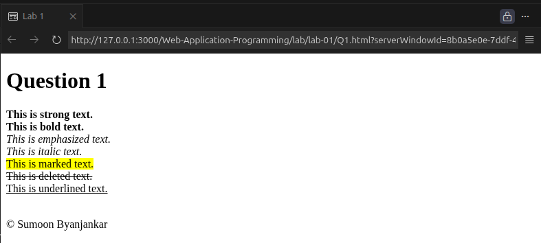
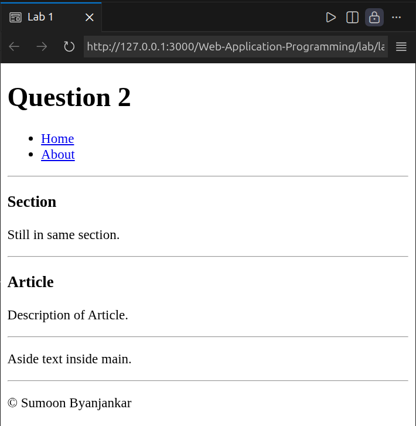
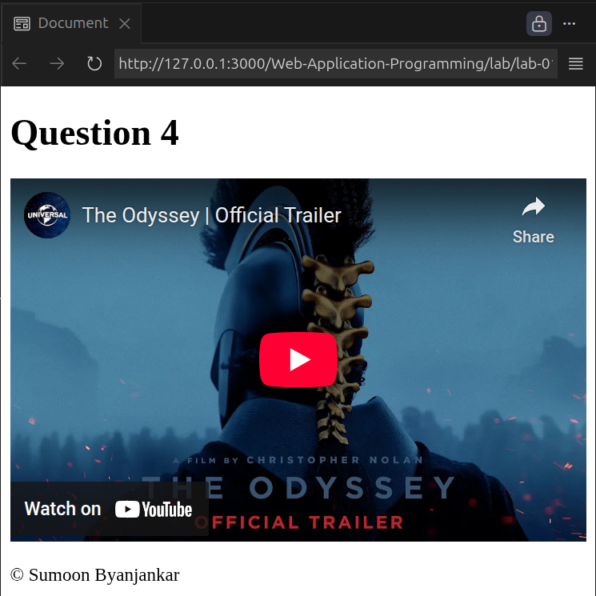
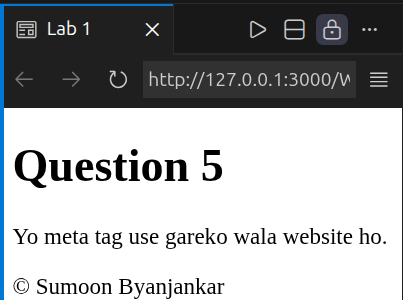
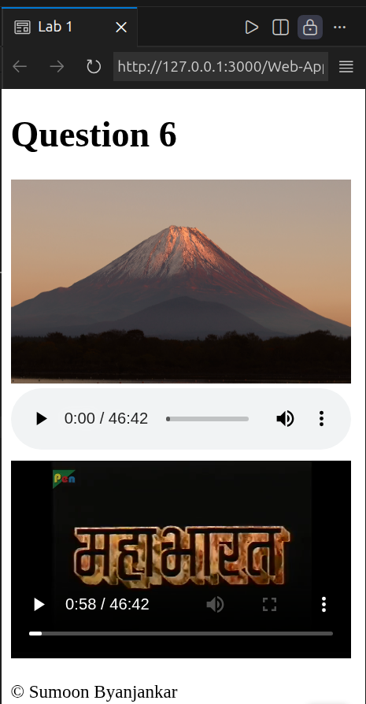
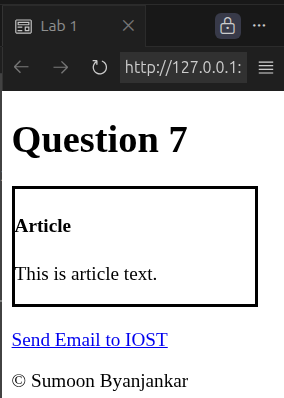
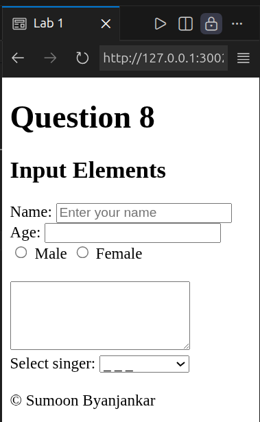
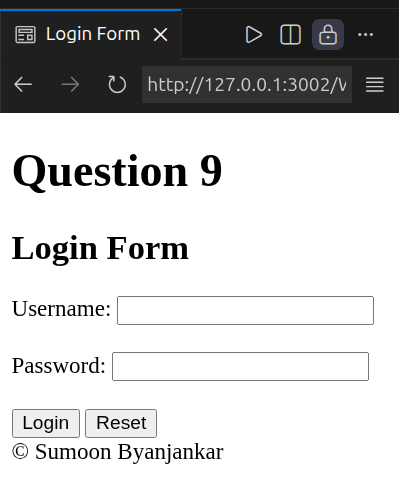

# TITLE: HTML Basics

## Objective
* To learn and use basic HTML formatting tags.
* To learn the purpose and structure of semantic HTML elements.
* To create lists and tables.
* To embed external web pages using the iframe tag.
* To learn the role of metadata.
* To learn and use different HTML input elements design basic login.

## Procedure

1. Write an HTML program to demonstrate different text formatting tags such as `<strong>`, `<b>`, `<em>`, `<i>`, `<mark>`, `<del>`, and `<ins>`.
    - [Code](Q1.html) 
    

2. Design a webpage using semantic HTML tags including `<header>`, `<nav>`, `<main>`, `<section>`, `<article>`, `<aside>`, and `<footer>`. Inside nav there should be proper list of links.
    - [Code](Q2.html) 
    

3. Create an HTML table that contains ordered and unordered lists inside table cells.
    - [Code](Q3.html) 
    

4. Write an HTML program to embed an external website using the `<iframe>` tag with appropriate attributes.
    - [Code](Q4.html) 
    

5. Create an HTML document that uses metadata like title, charset, keywords, description, author, viewport. Observe the effect of adding and removing the viewport meta tag in mobile view.
    - [Code](Q5.html) 
    

6. Write an HTML program to display an image, to play an audio and to play a video.
    - [Code](Q6.html) 
    

7. Create a HTML page with tags header, article and footer. Insert a link containing mail to info@iost.edu.np in the footer tag. Set the keywords "iost", "csit" using Meta tag in the page.
    - [Code](Q7.html) 
    

8. Write different input elements in HTML including text area and slelect.
    - [Code](Q8.html) 
    

9. Write an html code to create login form.
    - [Code](Q9.html) 
    